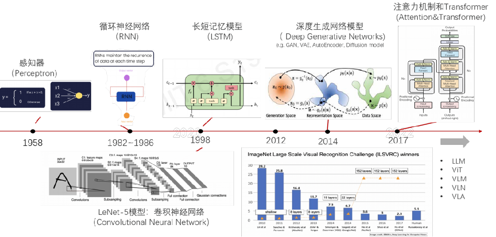
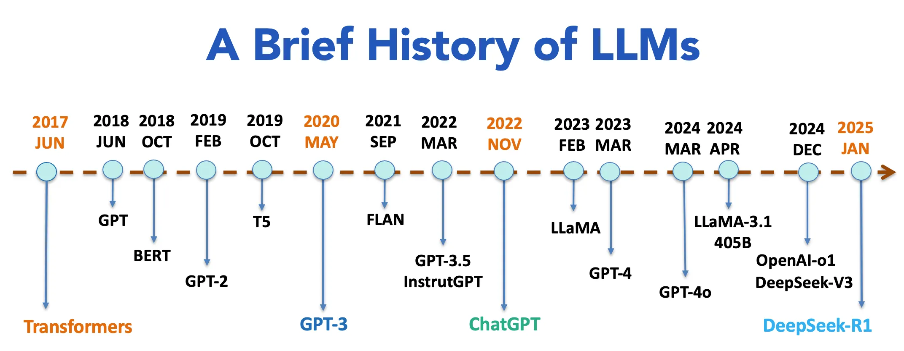
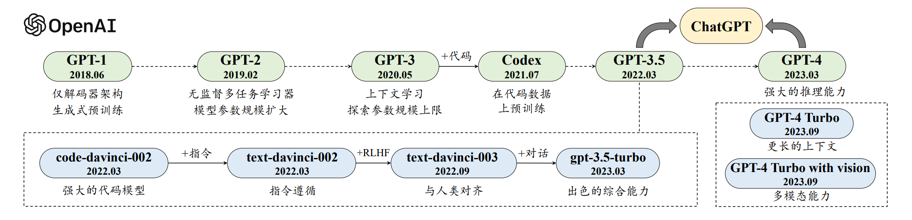
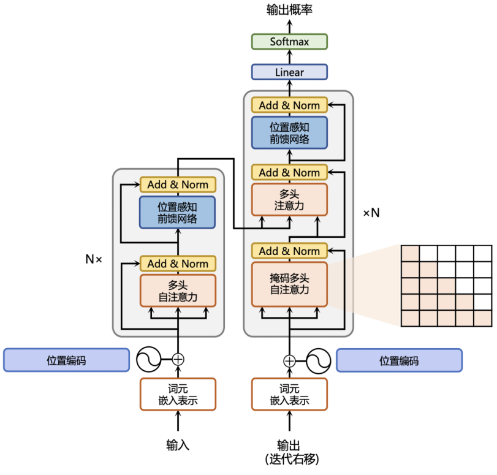

# 一、引言

当前gpt和各种大模型比较火，针对这些大模型的底层原理和应用场景进行一个整理学习

## 1. AI发展

### 深度学习

https://deeprevision.substack.com/p/a-revised-history-of-deep-learning-issue-1-1145664

### LLM

https://medium.com/@lmpo/a-brief-history-of-lmms-from-transformers-2017-to-deepseek-r1-2025-dae75dd3f59a

### GPT

https://llmbook-zh.github.io/LLMBook.pdf

## 2. 名词解释

- LLM（Large Language Model）: 大语言模型
- RNN（Recurrent Neural Network）: 循环神经网络
- FFN（Feed-Forward Networks）: 前馈网络
- Position-wise Feed-Forward Networks: 位置感知前馈网络
- Muti-Head Attention: 多头注意力机制
- Self-Attention: 自注意力机制
- Residual Connection: 残差连接
- Layer Normalization: 归一化层
- Add & Norm: 残差连接和层归一化
- Benchmark（基准测试或基准）: 是一个广泛应用于多个领域的术语，通常指用于评估、比较或验证某一物品、系统、方法或过程性能的标准测试或参考指标。其核心目的是提供客观、可重复的依据，帮助衡量优化或决策。
- LoRA（Low-Rank Adaptation）: 是一种用于模型微调（Fine-tuning）的技术，尤其在大型预训练模型中广泛应用。其核心思想是通过参数分解（Matrix Factorization）减少需要更新的参数数量，从而高效地适应新任务（如文本分类、图像识别等）。
- SFT（Supervised Fine-Tuning）: 利用标注数据集对预训练模型（如Llama、BERT、GPT）进行有监督的微调，使其在特定任务（如文本生成、分类、对话理解等）上表现更优。
- PEFT（Parameter-Efficient Fine-Tuning）: 是 参数高效微调 的缩写，是机器学习领域中用于 优化大型预训练模型微调过程 的一组技术。其核心目标是通过减少需要更新的参数数量（如仅调整少量新增参数而非全部参数），在保持模型性能的同时，降低计算资源消耗和训练成本。

# 二、Transformer架构

Transformer的出现，使大模型出现了阶段性的进展，当前大多数的大模型都是基于Transformer或其变体实现。

## 1. 整体架构

# 三、预训练

给模型读书，让模型理解并掌握对应领域的知识。但是在读新书的过程中，老的学习的知识可能会遗忘。

# 四、模型加速

# 五、模型微调

教模型如何讲已经读到的知识，在特定领域的知识应用出来，更加聚焦。
