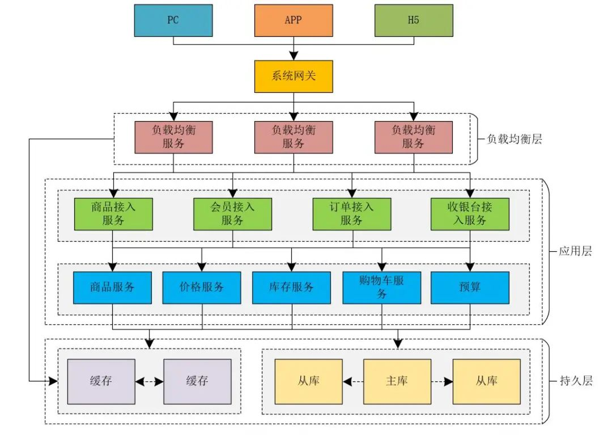
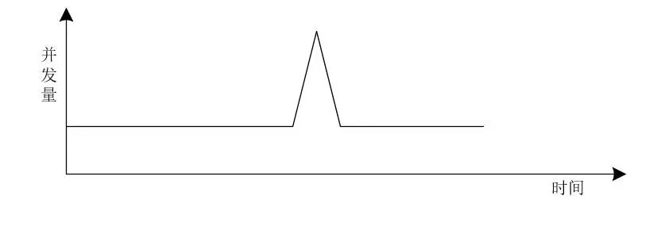
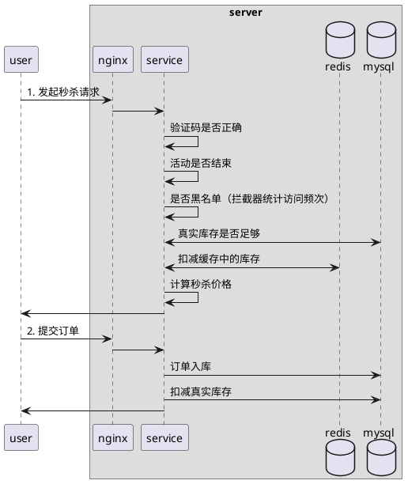
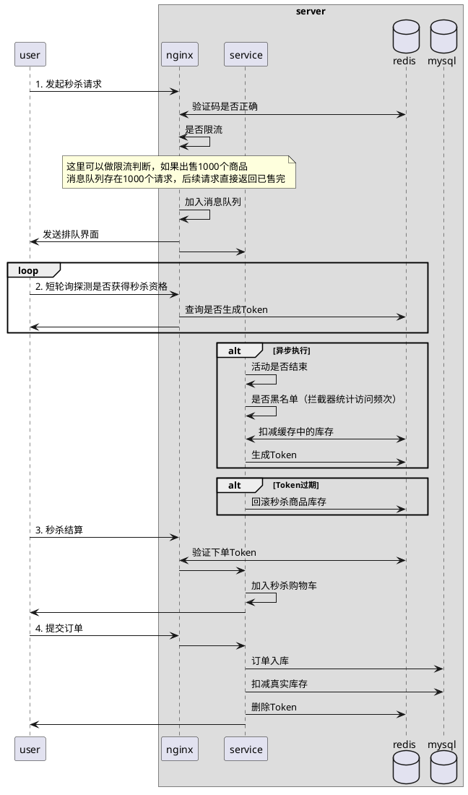

# 一、百万级并发优化实战

## 1.1. 背景

- 主场景为认证、资源列表下发、环境上报、资源访问鉴权

## 1.2. 如何优化点分析

**本地集群瓶颈**

- 模拟高峰流量，分析到是cpu占用过高，然后是数据库瓶颈，然后是内存

## 1.3. 优化过程

### 1) api级别短时效缓存

- 业务处理多个地方调用接口查询数据库，对同一个数据进行多次查询不能每一次都读io
- 对接口进行api级别缓存，业务代码可直接调用数据库接口查询，接口内部会对查询数据进行缓存

### 2) 数据预处理

- 对于每次都需要进行复杂转换和计算的大数据，提前进行预处理储存到缓存中，每次只需要读取结果即可

### 3) 运行时数据缓存（时间局部性）

- 对于登陆访问过程中通过不同api查询同样的数据，将数据和对应id进行缓存
- 第一个api调用查询数据库然后缓存，后续直接通过id查询即可，不需要再查询数据库

### 4) 非核心业务降频排队

- 非核心业务可能会占用数据库并加锁，如果是io密集型，将其隔离并进行低优先级排队处理，防止阻塞核心业务

### 5) 连接池分离

- 不同业务的redis和数据库的连接池分离，核心业务和非核心业务分离，防止非核心业务占用核心业务连接池导致无法访问

### 6) 数据库写操作有区分按不同优先级同/异步落盘

- 使用代理服务进行sql语句插入，可以进行批量插入和数据可视化
- 仅针对非强实时性要求的数据
- 可以有日志和重试可靠性处理

### 7) 合并api请求数据

- 当某个请求过程中，api可以复用下发数据，减少api调用次数
- 不止客户端到服务端的数据复用，服务端内部的链路也同样可以复用数据

### 8) 高峰期分析

- 对于真实场景高峰期的cpu分析，找到是否数据库索引存在问题
- 对于需要计算类型的，提前进行预处理缓存，防止索引没命中导致的扫表

## 1.4. 优化效果

- 一个主节点带两个工作节点，40w并发15min登陆上线完成，cpu占用不超过30%

# 二、微博场景

## 2.1. twitter推送

### 场景

- 用户发布tweet，关注者在主页可以查看到其发布的消息，按照时间线排序
- 目标，3000w关注者5s内完成发布接收

### 方案

**方案1**

- 使用关系型数据库，每个用户发tweet插入到全局tweet库
- 每个关注者查询全局tweet库，根据自己关注的用户进行查询，获取到按照时间线排序的结果

**方案2**

- 使用redis对每个用户维护一个时间线缓存，类似邮箱
- 发布者发布tweet后，查询关注者，将tweet插入到所有关注者的时间线缓存中

**对比**

|      | 方案1                         | 方案2                                                          |
| ---- | ----------------------------- | -------------------------------------------------------------- |
| 优点 | 实现简单，发布tweet写入少     | 读负载降低，只需要读取缓存即可                                 |
| 缺点 | 全局tweet的读负载压力与日俱增 | 实现复杂，发布tweet写入多个关注者缓存中，大V情况下写入负载很高 |

### 结论

- twitter最后使用方案2的稳定实现，但是对于大V，使用方案1。使用混合方案可以达到很好的表现

# 三、秒杀系统

参考 https://blog.csdn.net/flynetcn/article/details/120228586#comments_30579499

秒杀系统是针对短时间大量并发场景所考虑的系统，如果系统本身性能就存在优化点，不在这里考虑范围，参考上面的百万并发优化

## 1. 电商系统架构

- 负载均衡层使用nginx，nginx的最大并发预估为10W+，万为单位
- 应用层使用tomcat，最大并发预估为800，百为单位
- 持久层
    - redis缓存的并发预估为5W，万为单位
    - mysql的最大并发预估为1000，千为单位

### 如何扩容

1. 系统扩容，水平扩容和垂直扩容，增加设备机器数量或配置
2. 缓存，本地缓存或集中式缓存，减少网络IO
3. 读写分离，增加机器并行处理能力

## 2. 秒杀系统特点

### 2.1. 业务特点

12306举例，春运访问量特别大，平常访问量很平缓，春运期间会出现访问量瞬时激增

小米秒杀系统，10点开售商品，10点前访问量比较平缓，10点出现并发量瞬时突增的现象

所以秒杀系统的特点

1. 限时、限量、限价
2. 活动预热，开始前用户可以查看活动信息
3. 持续时间短，购买人数庞大，商品快速卖完

### 2.2. 技术特点

1. 瞬时并发量高，大量用户同一时间抢购商品
2. 读多写少，由于商品数量少，但是购买用户多，所以大量查询而购买少
3. 流程简单，下单减库存

## 3. 秒杀系统流程

1. 准备阶段，系统预热，由于用户不断刷新秒杀界面，一定程度上可以将一些数据存储到缓存中进行预热
2. 秒杀阶段，这个阶段会瞬时产生高并发流量，对系统资源造成巨大冲击，需要做好系统防护
3. 结算阶段，完成秒杀后的数据处理工作，数据一致性，异常处理，商品回仓处理等

对于这种短时间大量请求的系统来说，扩容不太合适，因为大部分场景下扩容的机器在闲置，仅部分场景下才需要这么大的流量请求

## 4. 秒杀系统方案

考虑几个措施提升系统的性能

### 4.1. 异步解耦

整体流程拆解，核心流程通过队列进行控制

### 4.2. 限流防刷

控制整体流量，提高请求门槛，防止刷单，避免系统资源耗尽

### 4.3. 资源控制

整体流程中对资源调度进行控制，扬长避短

由于应用层的并发量比缓存少很多，而且比负载均衡层也少很多，考虑在负载均衡层访问缓存，避免到应用层的损耗

并发量太高也可以将用户请求放到队列进行处理，弹出排队界面

## 5. 秒杀系统时序图

### 5.1. 同步下单流程

大部分网上的秒杀系统都是这个方案，在设备性能高且用户量不大的情况下，此方案是可以的。但是放到小米、淘宝、天猫、京东等秒杀和12306的场景，这个系统明显会被玩死

### 5.2. 异步下单流程

这里我们把限流前置，将高并发的削峰前置到请求阶段，业务层的流量就不是很高了。如果同步里面将限流放到业务层会让业务层压力大增，很有可能限流无法正常运行

## 6. 高并发“黑科技”与制胜奇招

假设使用redis做缓存，redis的并发量在5W左右，而商城需要支持并发到100W左右，全部打到redis上会导致redis挂掉，如何解决这个问题。

### 6.1. 分库

在Redis存储秒杀商品的库存数量可以分割来存储，对于每个id加上数字标识来存储。对key进行hash运算时，得到的结果不一样，大概率不在同一个槽位中。这样可以提升Redis处理请求的性能和并发量

### 6.2. 移花接木

秒杀场景中，秒杀商品被瞬间抢购一空。如果用户再进行请求，转到业务层处理，再由业务层访问缓存或数据库，而业务层并发访问量是以百为单位的，大量请求积压也会降低并发度

解决这个问题我们将商品扣减判断放到负载均衡层，使用lua脚本直接计算是否存在库存，不存在直接返回已售完，不再经过业务层处理。
