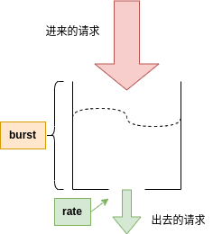

# 一、超压可靠性（过载保护）

某些情况可能导致系统面临数倍于正常容量的压力

1. 集群中某些节点故障
2. 客户突发高峰期，节假日前后

## 1. 量化指标

设备正常上线为QPS，当承受N倍压力下，保证QPS*95%的上线成功速率。上线成功速率不代表可以让95%用户都成功上线，只是保证QPS的速率

## 2. 业界实践

### 2.1. 微信过载控制机制 DAGOR

https://www.cs.columbia.edu/~ruigu/papers/socc18-final100.pdf

#### 1) 过载判断

- 在一个时间窗口中，等待队列所有请求的平均等待时间超过20ms，认为服务发生了过载

#### 2) 请求优先级

- 在请求入口处赋予每个请求两个优先级，业务优先级和用户优先级
- 优先级会携带到子调用中

#### 3) 过载处理

- 检测到发生过载后，统计上一个时间窗口的请求数量根据优先级画出直方图，计算下一个窗口的预期请求数量（降低5%），使用这个数量在直方图上找到最接近的优先级，调整准入优先级
- 检测到过载恢复，计算下一个窗口的预期请求数（增加1%），继续调整准入优先级

## 3. 第三方组件限流机制

### 3.1. nginx限流机制

#### 1) 基本配置

在 nginx 中，主要通过下面的两个配置实现限流限速：

```conf
limit_req_zone key zone=name:size rate=rate [sync];
limit_req zone=name [burst=number] [nodelay | delay=number];
例如：

http {
    limit_req_zone $binary_remote_addr zone=one:10m rate=1r/s;

    ...

    server {

        ...

        location /search/ {
            limit_req zone=one burst=5;
        }
```

一个限流配置中有几个要素：

- key 表示计算流速时根据什么来累加计数，比如 limit_req_zone $binary_remote_addr zone=one:10m rate=1r/s; 中把 key 设置为 $binary_remote_addr 意味着根据客户端 IP 进行累加计数，如果同一个 IP 在 1 秒内发起了 10 个任意请求则速率为 10r/s. 可以把 key 理解为队列编号。
- rate 表示要限速值。
- burst 是用于削峰填谷的，下面会详细介绍。
- nodelay 和 delay 是和 burst 配合使用的，下面介绍我们的限流机制时会详细解释。

#### 2) 工作原理

- 基于漏桶算法



1. rate 是这个桶的开口大小，控制出水的速度
2. burst 是这个桶的容量，如果进水的速度太快，就会存在桶里，如果桶里的水满了就溢出，即拒绝请求。

当一个请求进来时，nginx 拿当前时间减去上一个请求进来的时间，然后计算当前速率，看看当前这个请求超速多少了，然后得出这个请求应该延迟多久才能放行，接着设置定时器，定时器到了再继续处理这个请求。

#### 3) 遇到的问题

##### (1) 计算得到的超时时间很长导致无效请求占坑不释放，引发恶性循环

- 解决为添加超时机制，超过timeout值直接拒绝，不再等待

##### (2) burst参数导致所有请求变慢

- 当用户请求速率一直超过rate，所有请求等待时间就会越来越长，需要等之前的请求处理完才能处理新的请求

**解决方案**

1. 调低timeout值，可以缓解
2. 使用nodelay，桶满之前正常处理，桶满了就开始拒绝请求，保证进入的请求和处理的请求速率一致

##### (3) 动态调整rate有滞后性

**解决方案**

1. 高速路长度调短，灵敏度会高一些
2. 使用nodelay参数

