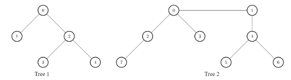
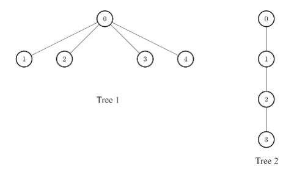

# 题目

There exist two undirected trees with n and m nodes, with distinct labels in ranges [0, n - 1] and [0, m - 1], respectively.

You are given two 2D integer arrays edges1 and edges2 of lengths n - 1 and m - 1, respectively, where edges1[i] = [ai, bi] indicates that there is an edge between nodes ai and bi in the first tree and edges2[i] = [ui, vi] indicates that there is an edge between nodes ui and vi in the second tree. You are also given an integer k.

Node u is target to node v if the number of edges on the path from u to v is less than or equal to k. Note that a node is always target to itself.

Return an array of n integers answer, where answer[i] is the maximum possible number of nodes target to node i of the first tree if you have to connect one node from the first tree to another node in the second tree.

Note that queries are independent from each other. That is, for every query you will remove the added edge before proceeding to the next query.

Example 1:



```
Input: edges1 = [[0,1],[0,2],[2,3],[2,4]], edges2 = [[0,1],[0,2],[0,3],[2,7],[1,4],[4,5],[4,6]], k = 2

Output: [9,7,9,8,8]

Explanation:

- For i = 0, connect node 0 from the first tree to node 0 from the second tree.
- For i = 1, connect node 1 from the first tree to node 0 from the second tree.
- For i = 2, connect node 2 from the first tree to node 4 from the second tree.
- For i = 3, connect node 3 from the first tree to node 4 from the second tree.
- For i = 4, connect node 4 from the first tree to node 4 from the second tree.
```

Example 2:



```
Input: edges1 = [[0,1],[0,2],[0,3],[0,4]], edges2 = [[0,1],[1,2],[2,3]], k = 1

Output: [6,3,3,3,3]

Explanation:

For every i, connect node i of the first tree with any node of the second tree.
```

Constraints:

- 2 <= n, m <= 1000
- edges1.length == n - 1
- edges2.length == m - 1
- edges1[i].length == edges2[i].length == 2
- edges1[i] = [ai, bi]
- 0 <= ai, bi < n
- edges2[i] = [ui, vi]
- 0 <= ui, vi < m
- The input is generated such that edges1 and edges2 represent valid trees.
- 0 <= k <= 1000

# 思路1 dfs

## 分析

两个树，第一棵树是用来求结果的，第二棵树是用来连接的。看题目条件，到第一棵树的每个点的距离小于等于k的，那么对于要求的一个点

- 第一棵树上直接求小于等于k的点个数
- 第二棵树，连接到此点的距离肯定是最小的，那么就是求第二棵树里面到哪个点距离小于等于k-1的点数最多

求树上任意两点之间的最小距离，使用floyd算法比较好，但是数据范围是1000，使用floyd算法就会 $O(n^3)$ 。但是这道题是求距离小于等于k的点的个数，并不需要知道任意两个点的距离。直接使用dfs的时间复杂度会更低。这道题就变成以下的步骤

1. 求出第一棵树里面到每个点的距离小于等于k的点数
2. 求出第二棵树里面到每个点的距离小于等于k-1的点数的最大值
3. 将第二步结果加到第一步的结果上即可

## 代码

```go
func maxInts(nums ...int) int {
	ans := nums[0]
	for _, v := range nums[1:] {
		ans = max(ans, v)
	}
	return ans
}

func maxTargetNodes(edges1 [][]int, edges2 [][]int, k int) []int {
	// 获取树上每个节点的其他节点到其距离小于等于k的数量数组
	getKCnt := func(edges [][]int, k int) []int {
		n := len(edges) + 1
		tree := make([][]int, n)
		for _, v := range edges {
			x, y := v[0], v[1]
			tree[x] = append(tree[x], y)
			tree[y] = append(tree[y], x)
		}

		// 到i节点距离为k的有几个点
		var dfs func(tree [][]int, i int, last int, k int) int
		dfs = func(tree [][]int, i int, last int, k int) int {
			if k < 0 {
				return 0
			}
			// 自己到自己计算为1
			ans := 1
			for _, j := range tree[i] {
				if j == last {
					// 防止回退
					continue
				}
				ans += dfs(tree, j, i, k-1)
			}
			return ans
		}

		ans := make([]int, n)
		for i := range tree {
			ans[i] = dfs(tree, i, -1, k)
		}
		return ans
	}
	tmp := getKCnt(edges2, k-1)
	maxCnt := maxInts(tmp...)
	ans := getKCnt(edges1, k)
	for i := range ans {
		ans[i] += maxCnt
	}

	return ans
}
```
