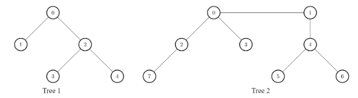
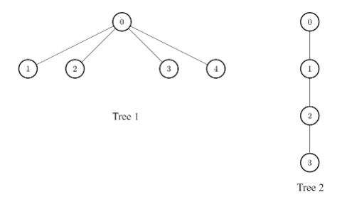

# 题目

There exist two undirected trees with n and m nodes, labeled from [0, n - 1] and [0, m - 1], respectively.

You are given two 2D integer arrays edges1 and edges2 of lengths n - 1 and m - 1, respectively, where edges1[i] = [ai, bi] indicates that there is an edge between nodes ai and bi in the first tree and edges2[i] = [ui, vi] indicates that there is an edge between nodes ui and vi in the second tree.

Node u is target to node v if the number of edges on the path from u to v is even. Note that a node is always target to itself.

Return an array of n integers answer, where answer[i] is the maximum possible number of nodes that are target to node i of the first tree if you had to connect one node from the first tree to another node in the second tree.

Note that queries are independent from each other. That is, for every query you will remove the added edge before proceeding to the next query.

Example 1:



```
Input: edges1 = [[0,1],[0,2],[2,3],[2,4]], edges2 = [[0,1],[0,2],[0,3],[2,7],[1,4],[4,5],[4,6]]

Output: [8,7,7,8,8]

Explanation:

- For i = 0, connect node 0 from the first tree to node 0 from the second tree.
- For i = 1, connect node 1 from the first tree to node 4 from the second tree.
- For i = 2, connect node 2 from the first tree to node 7 from the second tree.
- For i = 3, connect node 3 from the first tree to node 0 from the second tree.
- For i = 4, connect node 4 from the first tree to node 4 from the second tree.
```

Example 2:



```
Input: edges1 = [[0,1],[0,2],[0,3],[0,4]], edges2 = [[0,1],[1,2],[2,3]]

Output: [3,6,6,6,6]

Explanation:

For every i, connect node i of the first tree with any node of the second tree.
```

Constraints:

- 2 <= n, m <= 105
- edges1.length == n - 1
- edges2.length == m - 1
- edges1[i].length == edges2[i].length == 2
- edges1[i] = [ai, bi]
- 0 <= ai, bi < n
- edges2[i] = [ui, vi]
- 0 <= ui, vi < m
- The input is generated such that edges1 and edges2 represent valid trees.

# 思路1 标色处理奇偶

## 分析

同I里面的解析，第一棵树用于计算答案，第二棵树计算一个最大值即可。这种奇偶的计算，如果按照一个一个点计算距离就会达到 $O(n^3)$ 的时间复杂度，毕竟没有k限制深度了。那么重新思考这个问题，从某个点将距离为奇和偶标记不同的颜色，我们可以看出相同颜色的点之间的距离一定是偶数。那么这个题就分成两个组（红色/绿色），选一个点如果是某种颜色，偶数距离的点数就是同一个颜色的点的数量。

第一棵树上的点数确定了，第二棵树就可以思考，过了一个点一定距离都加一。那么连接某个颜色的点，偶数距离的点就是另一个颜色的点，最多的点就是第二棵树的两个分组中数量最多的那个。问题变成

1. 通过颜色标记将两棵树分别分为两组
2. 对第一棵树，每个点的结果就是分组的数量加上第二棵树上的最大的值之和

## 代码

```go
func maxTargetNodes(edges1 [][]int, edges2 [][]int) []int {
	tagTree := func(edges [][]int) (rMap map[int]bool, gMap map[int]bool) {
		n := len(edges) + 1
		tree := make([][]int, n)
		for _, v := range edges {
			x, y := v[0], v[1]
			tree[x] = append(tree[x], y)
			tree[y] = append(tree[y], x)
		}
		rMap = make(map[int]bool)
		gMap = make(map[int]bool)
		var dfs func(tree [][]int, i, last, deep int)
		dfs = func(tree [][]int, i, last, deep int) {
			if deep%2 == 0 {
				rMap[i] = true
			} else {
				gMap[i] = true
			}
			for _, j := range tree[i] {
				if j == last {
					continue
				}
				dfs(tree, j, i, deep+1)
			}
		}
		dfs(tree, 0, -1, 0)
		return
	}
	r, g := tagTree(edges2)
	maxCnt := max(len(r), len(g))
	r, g = tagTree(edges1)
	ans := make([]int, len(edges1)+1)
	for i := range ans {
		if r[i] {
			ans[i] = len(r) + maxCnt
		} else {
			ans[i] = len(g) + maxCnt
		}
	}
	return ans
}
```
