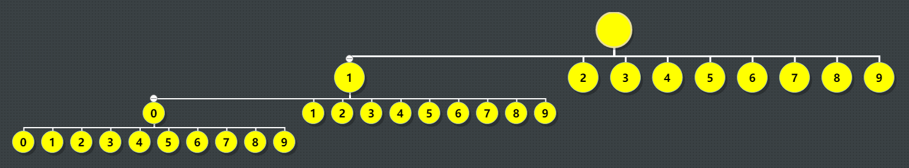

# 题目

Given two integers `n` and `k`, return the $k^{th}$ lexicographically smallest integer in the range `[1, n]`.

Example 1:

```
Input: n = 13, k = 2
Output: 10
Explanation: The lexicographical order is [1, 10, 11, 12, 13, 2, 3, 4, 5, 6, 7, 8, 9], so the second smallest number is 10.
```

Example 2:

```
Input: n = 1, k = 1
Output: 1
```

Constraints:

$1 \le k \le n \le 10^9$

# 思路1，字典树

## 分析

字典序，那么使用一个树进行整理更加清晰一些



前序遍历就是字典序

**关键点1**，第k个怎么找。从图中可以看出来，使用前序遍历

- 如果某个节点的所有子节点个数小于k，那么第k个节点一定不在此节点的子树内，找下一个兄弟节点
- 如果某个节点的所有子节点个数大于k，那么第k个节点一定在此节点的子树内，可以从此节点的子节点继续计算

**关键点2**，如何计算当前节点的子节点个数。可以一层一层计算，假设取1的子节点。

- 第一层，10-19
- 第二层，100-199
- 第三层，1000-1999

如果k是1开头的，那么在某一层，一定存在k。如果k不是1开头的，那么存在一层，起始就大于k

## 代码实现

- 因为用go写，int在64位是64位，所以不存在使用c++时需要考虑32位溢出的情况

```go
func min(a, b int) int {
	if a < b {
		return a
	}
	return b
}

// 获取当前节点的子节点个数，n为总数
func getChildCount(cur int, n int) int {
	// 假设cur为1，第一层为10-19
	//            第二层100-199
	//            第三层1000-1999
	count := 0
	start := cur * 10
	end := start + 9
	for start <= n {
		// n为13，那么这一层就是13-10+1=4个节点
		count += min(end, n) - start + 1
		start *= 10
		end = end*10 + 9
	}
	return count
}

func findKthNumber(n int, k int) int {
	cur := 1
	k-- // k为0时，cur就是所求。如果k为1，那么返回第一个也就是1，所以这里减一
	for k > 0 {
		// 获取当前节点的子节点个数
		count := getChildCount(cur, n)
		// 当k大于当前节点的子节点数，假设n为11，k为4。 1 10 11 2 3 4 5 6 7 8 9
		// 到这里k为3，count为2，计算后k为0，cur为2
		if k > count {
			k -= count + 1
			cur++
			continue
		}
		// k小于等于count
		// 小于的情况，假设n为11，k为2。 1 10 11 2 3 4 5 6 7 8 9
		//     到这里k为1，count为2，计算后k为0，cur为10
		// 等于的情况，假设k为3
		//     到这里k为2，计算后k为1，cur为10
		cur *= 10
		k--
	}
	return cur
}
```

- 考虑32位溢出的情况

```go
func min(a, b int64) int64 {
	if a < b {
		return a
	}
	return b
}

// 获取当前节点的子节点个数，n为总数
func getChildCount(cur int32, n int32) int64 {
	// 假设cur为1，第一层为10-19
	//            第二层100-199
	//            第三层1000-1999
	var count int64 = 0
	var start int64 = int64(cur * 10)
	var end int64 = start + 9
	for start <= int64(n) {
		// n为13，那么这一层就是13-10+1=4个节点
		count += min(end, int64(n)) - start + 1
		start *= 10
		end = end*10 + 9
	}
	return count
}

func findKthNumber(n int32, k int32) int32 {
	var cur int32 = 1
	k-- // k为0时，cur就是所求。如果k为1，那么返回第一个也就是1，所以这里减一
	for k > 0 {
		// 获取当前节点的子节点个数
		count := getChildCount(cur, n)
		// 当k大于当前节点的子节点数，假设n为11，k为4。 1 10 11 2 3 4 5 6 7 8 9
		// 到这里k为3，count为2，计算后k为0，cur为2
		if int64(k) > count {
			k -= int32(count + 1)
			cur++
			continue
		}
		// k小于等于count
		// 小于的情况，假设n为11，k为2。 1 10 11 2 3 4 5 6 7 8 9
		//     到这里k为1，count为2，计算后k为0，cur为10
		// 等于的情况，假设k为3
		//     到这里k为2，计算后k为1，cur为10
		cur *= 10
		k--
	}
	return cur
}
```
