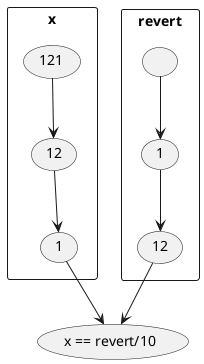
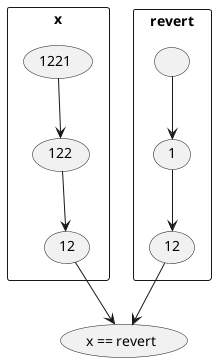

# 题目

Given an integer x, return true if x is palindrome integer.

An integer is a palindrome when it reads the same backward as forward.

- For example, 121 is a palindrome while 123 is not.


# 思路1

- 最简单直接的想法，转成字符串，然后判断

```go
func isPalindrome(x int) bool {
	s := fmt.Sprint(x)
	i := 0
	j := len(s) - 1
	for i < j {
		if s[i] != s[j] {
			return false
		}
		i++
		j--
	}
	return true
}
```

# 思路2

- 无情打脸，官方解法nb
- 转字符串太占内存，直接反转一半（位数为奇数多反转一个）的数字，然后比较

位数为奇数


位数为偶数


代码实现

```go
func isPalindrome(x int) bool {
	if x == 0 {
		return true
	}
	if x < 0 || x%10 == 0 {
		return false
	}
	revertNum := 0
	for x > revertNum {
		revertNum = revertNum*10 + x%10
		x /= 10
	}
	return x == revertNum || x == revertNum/10
}
```
