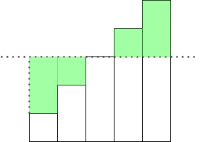

# 题目

You are given a 0-indexed integer array nums. There exists an array arr of length nums.length, where arr[i] is the sum of |i - j| over all j such that nums[j] == nums[i] and j != i. If there is no such j, set arr[i] to be 0.

Return the array arr.

Example 1:

```
Input: nums = [1,3,1,1,2]
Output: [5,0,3,4,0]
Explanation:
When i = 0, nums[0] == nums[2] and nums[0] == nums[3]. Therefore, arr[0] = |0 - 2| + |0 - 3| = 5.
When i = 1, arr[1] = 0 because there is no other index with value 3.
When i = 2, nums[2] == nums[0] and nums[2] == nums[3]. Therefore, arr[2] = |2 - 0| + |2 - 3| = 3.
When i = 3, nums[3] == nums[0] and nums[3] == nums[2]. Therefore, arr[3] = |3 - 0| + |3 - 2| = 4.
When i = 4, arr[4] = 0 because there is no other index with value 2.
```

Example 2:

```
Input: nums = [0,5,3]
Output: [0,0,0]
Explanation: Since each element in nums is distinct, arr[i] = 0 for all i.
```

Constraints:

- $1 <= nums.length <= 10^5$
- $0 <= nums[i] <= 10^9$

# 思路1 正序+倒序计算

## 分析

- 把索引的差值分成两部分，当前索引减去前面的和当前索引被后面的减去的两部分
- 那么只算作为被减数的话，只有当前减去前面的，每一个数都是前一个数的和加上 $已知相同的数的数量 \times 当前索引减去前一个索引的差值$
- 只算作为减数的部分，倒序更好计算，每一个结果都是前一个数的结果加上 $已知相同数的数量 \times 前一个计算的索引减去当前索引的差值$

## 代码

```go
func distance(nums []int) []int64 {
	res := make([]int64, len(nums))
	n := len(nums)
	// key均为值
	inMap := make(map[int]int)    // 正序的索引
	cntMap := make(map[int]int)   // 正序的数量
	// 正序遍历
	for i, v := range nums {
		if j, ok := inMap[v]; ok {
			// 前面有
			res[i] = res[j] + int64(cntMap[v] * (i - j))
		}
		cntMap[v]++
		inMap[v] = i
	}
	inMap = make(map[int]int)    // 倒序的索引
	cntMap = make(map[int]int)   // 倒序的数量
	sumMap := make(map[int]int64) // 倒序的和
	for i := range nums {
		i = n - 1 - i
		v := nums[i]
		if j, ok := inMap[v]; ok {
			// 前面有
			sumMap[v] += int64(cntMap[v] * (j - i))
			res[i] += sumMap[v]
		}
		cntMap[v]++
		inMap[v] = i
	}
	return res
}
```

# 思路2 分组+前缀和

## 分析



- 要求的其实是上图的绿色面积的和
- 分成两段，都可以用前缀和与当前数乘以n来处理
- 那么第一步先分组，将相同数分到一起，然后计算前缀和，最后合并成结果

## 代码

```go
func distance1(nums []int) []int64 {
	grp := make(map[int][]int) // 数组存放索引
	for i, v := range nums {
		t := grp[v]
		if t == nil {
			t = make([]int, 0, 1)
		}
		t = append(t, i)
		grp[v] = t
	}

	res := make([]int64, len(nums))
	// 遍历分组计算结果
	for _, v := range grp {
		n := len(v)
		if n == 1 {
			continue
		}
		s := make([]int, n) // 计算前缀和
		s[0] = v[0]
		for i := 1; i < n; i++ {
			s[i] = s[i-1] + v[i]
		}
		for i := range v {
			res[v[i]] = int64((i+1)*v[i] - s[i] + (s[n-1] - s[i]) - (n-1-i)*v[i])
		}
	}
	return res
}
```

# 思路3 分组+数学分析

## 分析

- 分组不变，想一下对每一个分组`v`来说，如果有了所有数到第一个数的距离和`a[0]`，那么有

$$
a[1] = a[0] + (v[1] - v[0]) - (n-1) * (v[1] - v[0])
$$

- 推出

$$
a[i] = a[i-1] - (n-i-i) * (v[i]-v[i-1])
$$

## 代码

```go
func distance2(nums []int) []int64 {
	grp := make(map[int][]int) // 数组存放索引
	for i, v := range nums {
		grp[v] = append(grp[v], i)
	}

	res := make([]int64, len(nums))
	// 遍历分组计算结果
	for _, v := range grp {
		n := len(v)
		if n == 1 {
			continue
		}
		var s int64 = 0
		for _, v1 := range v[1:] {
			s += int64(v1 - v[0])
		}
		res[v[0]] = s
		for i := 1; i < n; i++ {
			res[v[i]] = res[v[i-1]] - int64((n-i-i)*(v[i]-v[i-1]))
		}
	}
	return res
}
```
