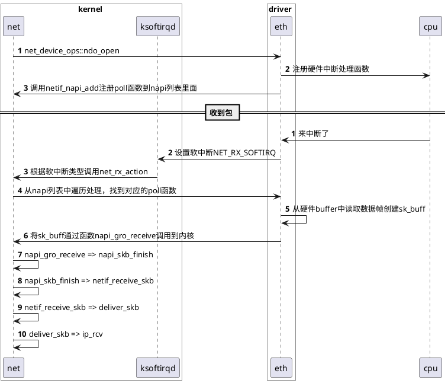

# 一、驱动到网络协议栈处理过程



# 二、驱动定义

## 1. 驱动操作结构体 net_device_ops

- 每一个网卡需要定义下面这一系列操作函数

```cpp
// include/linux/netdevice.h
/*
 * This structure defines the management hooks for network devices.
 * The following hooks can be defined; unless noted otherwise, they are
 * optional and can be filled with a null pointer.
 *
 * int (*ndo_init)(struct net_device *dev);
 *     This function is called once when a network device is registered.
 *     The network device can use this for any late stage initialization
 *     or semantic validation. It can fail with an error code which will
 *     be propagated back to register_netdev.
 *
 * void (*ndo_uninit)(struct net_device *dev);
 *     This function is called when device is unregistered or when registration
 *     fails. It is not called if init fails.
 *
 * int (*ndo_open)(struct net_device *dev);
 *     This function is called when a network device transitions to the up
 *     state.
 *
 * int (*ndo_stop)(struct net_device *dev);
 *     This function is called when a network device transitions to the down
 *     state.
 *
 * netdev_tx_t (*ndo_start_xmit)(struct sk_buff *skb,
 *                               struct net_device *dev);
 *	Called when a packet needs to be transmitted.
 *	Returns NETDEV_TX_OK.  Can return NETDEV_TX_BUSY, but you should stop
 *	the queue before that can happen; it's for obsolete devices and weird
 *	corner cases, but the stack really does a non-trivial amount
 *	of useless work if you return NETDEV_TX_BUSY.
 *	Required; cannot be NULL.
 *
 * netdev_features_t (*ndo_features_check)(struct sk_buff *skb,
 *					   struct net_device *dev
 *					   netdev_features_t features);
 *	Called by core transmit path to determine if device is capable of
 *	performing offload operations on a given packet. This is to give
 *	the device an opportunity to implement any restrictions that cannot
 *	be otherwise expressed by feature flags. The check is called with
 *	the set of features that the stack has calculated and it returns
 *	those the driver believes to be appropriate.
 *
 * u16 (*ndo_select_queue)(struct net_device *dev, struct sk_buff *skb,
 *                         struct net_device *sb_dev);
 *	Called to decide which queue to use when device supports multiple
 *	transmit queues.
 *
 * void (*ndo_change_rx_flags)(struct net_device *dev, int flags);
 *	This function is called to allow device receiver to make
 *	changes to configuration when multicast or promiscuous is enabled.
 *
 * void (*ndo_set_rx_mode)(struct net_device *dev);
 *	This function is called device changes address list filtering.
 *	If driver handles unicast address filtering, it should set
 *	IFF_UNICAST_FLT in its priv_flags.
 *
 * int (*ndo_set_mac_address)(struct net_device *dev, void *addr);
 *	This function  is called when the Media Access Control address
 *	needs to be changed. If this interface is not defined, the
 *	MAC address can not be changed.
 *
 * int (*ndo_validate_addr)(struct net_device *dev);
 *	Test if Media Access Control address is valid for the device.
 *
 * int (*ndo_do_ioctl)(struct net_device *dev, struct ifreq *ifr, int cmd);
 *	Old-style ioctl entry point. This is used internally by the
 *	appletalk and ieee802154 subsystems but is no longer called by
 *	the device ioctl handler.
 *
 * int (*ndo_siocbond)(struct net_device *dev, struct ifreq *ifr, int cmd);
 *	Used by the bonding driver for its device specific ioctls:
 *	SIOCBONDENSLAVE, SIOCBONDRELEASE, SIOCBONDSETHWADDR, SIOCBONDCHANGEACTIVE,
 *	SIOCBONDSLAVEINFOQUERY, and SIOCBONDINFOQUERY
 *
 * * int (*ndo_eth_ioctl)(struct net_device *dev, struct ifreq *ifr, int cmd);
 *	Called for ethernet specific ioctls: SIOCGMIIPHY, SIOCGMIIREG,
 *	SIOCSMIIREG, SIOCSHWTSTAMP and SIOCGHWTSTAMP.
 *
 * int (*ndo_set_config)(struct net_device *dev, struct ifmap *map);
 *	Used to set network devices bus interface parameters. This interface
 *	is retained for legacy reasons; new devices should use the bus
 *	interface (PCI) for low level management.
 *
 * int (*ndo_change_mtu)(struct net_device *dev, int new_mtu);
 *	Called when a user wants to change the Maximum Transfer Unit
 *	of a device.
 *
 * void (*ndo_tx_timeout)(struct net_device *dev, unsigned int txqueue);
 *	Callback used when the transmitter has not made any progress
 *	for dev->watchdog ticks.
 *
 * void (*ndo_get_stats64)(struct net_device *dev,
 *                         struct rtnl_link_stats64 *storage);
 * struct net_device_stats* (*ndo_get_stats)(struct net_device *dev);
 *	Called when a user wants to get the network device usage
 *	statistics. Drivers must do one of the following:
 *	1. Define @ndo_get_stats64 to fill in a zero-initialised
 *	   rtnl_link_stats64 structure passed by the caller.
 *	2. Define @ndo_get_stats to update a net_device_stats structure
 *	   (which should normally be dev->stats) and return a pointer to
 *	   it. The structure may be changed asynchronously only if each
 *	   field is written atomically.
 *	3. Update dev->stats asynchronously and atomically, and define
 *	   neither operation.
 *
 * bool (*ndo_has_offload_stats)(const struct net_device *dev, int attr_id)
 *	Return true if this device supports offload stats of this attr_id.
 *
 * int (*ndo_get_offload_stats)(int attr_id, const struct net_device *dev,
 *	void *attr_data)
 *	Get statistics for offload operations by attr_id. Write it into the
 *	attr_data pointer.
 *
 * int (*ndo_vlan_rx_add_vid)(struct net_device *dev, __be16 proto, u16 vid);
 *	If device supports VLAN filtering this function is called when a
 *	VLAN id is registered.
 *
 * int (*ndo_vlan_rx_kill_vid)(struct net_device *dev, __be16 proto, u16 vid);
 *	If device supports VLAN filtering this function is called when a
 *	VLAN id is unregistered.
 *
 * void (*ndo_poll_controller)(struct net_device *dev);
 *
 *	SR-IOV management functions.
 * int (*ndo_set_vf_mac)(struct net_device *dev, int vf, u8* mac);
 * int (*ndo_set_vf_vlan)(struct net_device *dev, int vf, u16 vlan,
 *			  u8 qos, __be16 proto);
 * int (*ndo_set_vf_rate)(struct net_device *dev, int vf, int min_tx_rate,
 *			  int max_tx_rate);
 * int (*ndo_set_vf_spoofchk)(struct net_device *dev, int vf, bool setting);
 * int (*ndo_set_vf_trust)(struct net_device *dev, int vf, bool setting);
 * int (*ndo_get_vf_config)(struct net_device *dev,
 *			    int vf, struct ifla_vf_info *ivf);
 * int (*ndo_set_vf_link_state)(struct net_device *dev, int vf, int link_state);
 * int (*ndo_set_vf_port)(struct net_device *dev, int vf,
 *			  struct nlattr *port[]);
 *
 *      Enable or disable the VF ability to query its RSS Redirection Table and
 *      Hash Key. This is needed since on some devices VF share this information
 *      with PF and querying it may introduce a theoretical security risk.
 * int (*ndo_set_vf_rss_query_en)(struct net_device *dev, int vf, bool setting);
 * int (*ndo_get_vf_port)(struct net_device *dev, int vf, struct sk_buff *skb);
 * int (*ndo_setup_tc)(struct net_device *dev, enum tc_setup_type type,
 *		       void *type_data);
 *	Called to setup any 'tc' scheduler, classifier or action on @dev.
 *	This is always called from the stack with the rtnl lock held and netif
 *	tx queues stopped. This allows the netdevice to perform queue
 *	management safely.
 *
 *	Fiber Channel over Ethernet (FCoE) offload functions.
 * int (*ndo_fcoe_enable)(struct net_device *dev);
 *	Called when the FCoE protocol stack wants to start using LLD for FCoE
 *	so the underlying device can perform whatever needed configuration or
 *	initialization to support acceleration of FCoE traffic.
 *
 * int (*ndo_fcoe_disable)(struct net_device *dev);
 *	Called when the FCoE protocol stack wants to stop using LLD for FCoE
 *	so the underlying device can perform whatever needed clean-ups to
 *	stop supporting acceleration of FCoE traffic.
 *
 * int (*ndo_fcoe_ddp_setup)(struct net_device *dev, u16 xid,
 *			     struct scatterlist *sgl, unsigned int sgc);
 *	Called when the FCoE Initiator wants to initialize an I/O that
 *	is a possible candidate for Direct Data Placement (DDP). The LLD can
 *	perform necessary setup and returns 1 to indicate the device is set up
 *	successfully to perform DDP on this I/O, otherwise this returns 0.
 *
 * int (*ndo_fcoe_ddp_done)(struct net_device *dev,  u16 xid);
 *	Called when the FCoE Initiator/Target is done with the DDPed I/O as
 *	indicated by the FC exchange id 'xid', so the underlying device can
 *	clean up and reuse resources for later DDP requests.
 *
 * int (*ndo_fcoe_ddp_target)(struct net_device *dev, u16 xid,
 *			      struct scatterlist *sgl, unsigned int sgc);
 *	Called when the FCoE Target wants to initialize an I/O that
 *	is a possible candidate for Direct Data Placement (DDP). The LLD can
 *	perform necessary setup and returns 1 to indicate the device is set up
 *	successfully to perform DDP on this I/O, otherwise this returns 0.
 *
 * int (*ndo_fcoe_get_hbainfo)(struct net_device *dev,
 *			       struct netdev_fcoe_hbainfo *hbainfo);
 *	Called when the FCoE Protocol stack wants information on the underlying
 *	device. This information is utilized by the FCoE protocol stack to
 *	register attributes with Fiber Channel management service as per the
 *	FC-GS Fabric Device Management Information(FDMI) specification.
 *
 * int (*ndo_fcoe_get_wwn)(struct net_device *dev, u64 *wwn, int type);
 *	Called when the underlying device wants to override default World Wide
 *	Name (WWN) generation mechanism in FCoE protocol stack to pass its own
 *	World Wide Port Name (WWPN) or World Wide Node Name (WWNN) to the FCoE
 *	protocol stack to use.
 *
 *	RFS acceleration.
 * int (*ndo_rx_flow_steer)(struct net_device *dev, const struct sk_buff *skb,
 *			    u16 rxq_index, u32 flow_id);
 *	Set hardware filter for RFS.  rxq_index is the target queue index;
 *	flow_id is a flow ID to be passed to rps_may_expire_flow() later.
 *	Return the filter ID on success, or a negative error code.
 *
 *	Slave management functions (for bridge, bonding, etc).
 * int (*ndo_add_slave)(struct net_device *dev, struct net_device *slave_dev);
 *	Called to make another netdev an underling.
 *
 * int (*ndo_del_slave)(struct net_device *dev, struct net_device *slave_dev);
 *	Called to release previously enslaved netdev.
 *
 * struct net_device *(*ndo_get_xmit_slave)(struct net_device *dev,
 *					    struct sk_buff *skb,
 *					    bool all_slaves);
 *	Get the xmit slave of master device. If all_slaves is true, function
 *	assume all the slaves can transmit.
 *
 *      Feature/offload setting functions.
 * netdev_features_t (*ndo_fix_features)(struct net_device *dev,
 *		netdev_features_t features);
 *	Adjusts the requested feature flags according to device-specific
 *	constraints, and returns the resulting flags. Must not modify
 *	the device state.
 *
 * int (*ndo_set_features)(struct net_device *dev, netdev_features_t features);
 *	Called to update device configuration to new features. Passed
 *	feature set might be less than what was returned by ndo_fix_features()).
 *	Must return >0 or -errno if it changed dev->features itself.
 *
 * int (*ndo_fdb_add)(struct ndmsg *ndm, struct nlattr *tb[],
 *		      struct net_device *dev,
 *		      const unsigned char *addr, u16 vid, u16 flags,
 *		      struct netlink_ext_ack *extack);
 *	Adds an FDB entry to dev for addr.
 * int (*ndo_fdb_del)(struct ndmsg *ndm, struct nlattr *tb[],
 *		      struct net_device *dev,
 *		      const unsigned char *addr, u16 vid)
 *	Deletes the FDB entry from dev coresponding to addr.
 * int (*ndo_fdb_del_bulk)(struct ndmsg *ndm, struct nlattr *tb[],
 *			   struct net_device *dev,
 *			   u16 vid,
 *			   struct netlink_ext_ack *extack);
 * int (*ndo_fdb_dump)(struct sk_buff *skb, struct netlink_callback *cb,
 *		       struct net_device *dev, struct net_device *filter_dev,
 *		       int *idx)
 *	Used to add FDB entries to dump requests. Implementers should add
 *	entries to skb and update idx with the number of entries.
 *
 * int (*ndo_bridge_setlink)(struct net_device *dev, struct nlmsghdr *nlh,
 *			     u16 flags, struct netlink_ext_ack *extack)
 * int (*ndo_bridge_getlink)(struct sk_buff *skb, u32 pid, u32 seq,
 *			     struct net_device *dev, u32 filter_mask,
 *			     int nlflags)
 * int (*ndo_bridge_dellink)(struct net_device *dev, struct nlmsghdr *nlh,
 *			     u16 flags);
 *
 * int (*ndo_change_carrier)(struct net_device *dev, bool new_carrier);
 *	Called to change device carrier. Soft-devices (like dummy, team, etc)
 *	which do not represent real hardware may define this to allow their
 *	userspace components to manage their virtual carrier state. Devices
 *	that determine carrier state from physical hardware properties (eg
 *	network cables) or protocol-dependent mechanisms (eg
 *	USB_CDC_NOTIFY_NETWORK_CONNECTION) should NOT implement this function.
 *
 * int (*ndo_get_phys_port_id)(struct net_device *dev,
 *			       struct netdev_phys_item_id *ppid);
 *	Called to get ID of physical port of this device. If driver does
 *	not implement this, it is assumed that the hw is not able to have
 *	multiple net devices on single physical port.
 *
 * int (*ndo_get_port_parent_id)(struct net_device *dev,
 *				 struct netdev_phys_item_id *ppid)
 *	Called to get the parent ID of the physical port of this device.
 *
 * void* (*ndo_dfwd_add_station)(struct net_device *pdev,
 *				 struct net_device *dev)
 *	Called by upper layer devices to accelerate switching or other
 *	station functionality into hardware. 'pdev is the lowerdev
 *	to use for the offload and 'dev' is the net device that will
 *	back the offload. Returns a pointer to the private structure
 *	the upper layer will maintain.
 * void (*ndo_dfwd_del_station)(struct net_device *pdev, void *priv)
 *	Called by upper layer device to delete the station created
 *	by 'ndo_dfwd_add_station'. 'pdev' is the net device backing
 *	the station and priv is the structure returned by the add
 *	operation.
 * int (*ndo_set_tx_maxrate)(struct net_device *dev,
 *			     int queue_index, u32 maxrate);
 *	Called when a user wants to set a max-rate limitation of specific
 *	TX queue.
 * int (*ndo_get_iflink)(const struct net_device *dev);
 *	Called to get the iflink value of this device.
 * int (*ndo_fill_metadata_dst)(struct net_device *dev, struct sk_buff *skb);
 *	This function is used to get egress tunnel information for given skb.
 *	This is useful for retrieving outer tunnel header parameters while
 *	sampling packet.
 * void (*ndo_set_rx_headroom)(struct net_device *dev, int needed_headroom);
 *	This function is used to specify the headroom that the skb must
 *	consider when allocation skb during packet reception. Setting
 *	appropriate rx headroom value allows avoiding skb head copy on
 *	forward. Setting a negative value resets the rx headroom to the
 *	default value.
 * int (*ndo_bpf)(struct net_device *dev, struct netdev_bpf *bpf);
 *	This function is used to set or query state related to XDP on the
 *	netdevice and manage BPF offload. See definition of
 *	enum bpf_netdev_command for details.
 * int (*ndo_xdp_xmit)(struct net_device *dev, int n, struct xdp_frame **xdp,
 *			u32 flags);
 *	This function is used to submit @n XDP packets for transmit on a
 *	netdevice. Returns number of frames successfully transmitted, frames
 *	that got dropped are freed/returned via xdp_return_frame().
 *	Returns negative number, means general error invoking ndo, meaning
 *	no frames were xmit'ed and core-caller will free all frames.
 * struct net_device *(*ndo_xdp_get_xmit_slave)(struct net_device *dev,
 *					        struct xdp_buff *xdp);
 *      Get the xmit slave of master device based on the xdp_buff.
 * int (*ndo_xsk_wakeup)(struct net_device *dev, u32 queue_id, u32 flags);
 *      This function is used to wake up the softirq, ksoftirqd or kthread
 *	responsible for sending and/or receiving packets on a specific
 *	queue id bound to an AF_XDP socket. The flags field specifies if
 *	only RX, only Tx, or both should be woken up using the flags
 *	XDP_WAKEUP_RX and XDP_WAKEUP_TX.
 * struct devlink_port *(*ndo_get_devlink_port)(struct net_device *dev);
 *	Get devlink port instance associated with a given netdev.
 *	Called with a reference on the netdevice and devlink locks only,
 *	rtnl_lock is not held.
 * int (*ndo_tunnel_ctl)(struct net_device *dev, struct ip_tunnel_parm *p,
 *			 int cmd);
 *	Add, change, delete or get information on an IPv4 tunnel.
 * struct net_device *(*ndo_get_peer_dev)(struct net_device *dev);
 *	If a device is paired with a peer device, return the peer instance.
 *	The caller must be under RCU read context.
 * int (*ndo_fill_forward_path)(struct net_device_path_ctx *ctx, struct net_device_path *path);
 *     Get the forwarding path to reach the real device from the HW destination address
 * ktime_t (*ndo_get_tstamp)(struct net_device *dev,
 *			     const struct skb_shared_hwtstamps *hwtstamps,
 *			     bool cycles);
 *	Get hardware timestamp based on normal/adjustable time or free running
 *	cycle counter. This function is required if physical clock supports a
 *	free running cycle counter.
 */
struct net_device_ops {
	int			(*ndo_init)(struct net_device *dev);
	void			(*ndo_uninit)(struct net_device *dev);
	int			(*ndo_open)(struct net_device *dev);
	int			(*ndo_stop)(struct net_device *dev);
	netdev_tx_t		(*ndo_start_xmit)(struct sk_buff *skb,
						  struct net_device *dev);
	netdev_features_t	(*ndo_features_check)(struct sk_buff *skb,
						      struct net_device *dev,
						      netdev_features_t features);
	u16			(*ndo_select_queue)(struct net_device *dev,
						    struct sk_buff *skb,
						    struct net_device *sb_dev);
	void			(*ndo_change_rx_flags)(struct net_device *dev,
						       int flags);
	void			(*ndo_set_rx_mode)(struct net_device *dev);
	int			(*ndo_set_mac_address)(struct net_device *dev,
						       void *addr);
	int			(*ndo_validate_addr)(struct net_device *dev);
	int			(*ndo_do_ioctl)(struct net_device *dev,
					        struct ifreq *ifr, int cmd);
	int			(*ndo_eth_ioctl)(struct net_device *dev,
						 struct ifreq *ifr, int cmd);
	int			(*ndo_siocbond)(struct net_device *dev,
						struct ifreq *ifr, int cmd);
	int			(*ndo_siocwandev)(struct net_device *dev,
						  struct if_settings *ifs);
	int			(*ndo_siocdevprivate)(struct net_device *dev,
						      struct ifreq *ifr,
						      void __user *data, int cmd);
	int			(*ndo_set_config)(struct net_device *dev,
					          struct ifmap *map);
	int			(*ndo_change_mtu)(struct net_device *dev,
						  int new_mtu);
	int			(*ndo_neigh_setup)(struct net_device *dev,
						   struct neigh_parms *);
	void			(*ndo_tx_timeout) (struct net_device *dev,
						   unsigned int txqueue);

	void			(*ndo_get_stats64)(struct net_device *dev,
						   struct rtnl_link_stats64 *storage);
	bool			(*ndo_has_offload_stats)(const struct net_device *dev, int attr_id);
	int			(*ndo_get_offload_stats)(int attr_id,
							 const struct net_device *dev,
							 void *attr_data);
	struct net_device_stats* (*ndo_get_stats)(struct net_device *dev);

	int			(*ndo_vlan_rx_add_vid)(struct net_device *dev,
						       __be16 proto, u16 vid);
	int			(*ndo_vlan_rx_kill_vid)(struct net_device *dev,
						        __be16 proto, u16 vid);
#ifdef CONFIG_NET_POLL_CONTROLLER
	void                    (*ndo_poll_controller)(struct net_device *dev);
	int			(*ndo_netpoll_setup)(struct net_device *dev,
						     struct netpoll_info *info);
	void			(*ndo_netpoll_cleanup)(struct net_device *dev);
#endif
	int			(*ndo_set_vf_mac)(struct net_device *dev,
						  int queue, u8 *mac);
	int			(*ndo_set_vf_vlan)(struct net_device *dev,
						   int queue, u16 vlan,
						   u8 qos, __be16 proto);
	int			(*ndo_set_vf_rate)(struct net_device *dev,
						   int vf, int min_tx_rate,
						   int max_tx_rate);
	int			(*ndo_set_vf_spoofchk)(struct net_device *dev,
						       int vf, bool setting);
	int			(*ndo_set_vf_trust)(struct net_device *dev,
						    int vf, bool setting);
	int			(*ndo_get_vf_config)(struct net_device *dev,
						     int vf,
						     struct ifla_vf_info *ivf);
	int			(*ndo_set_vf_link_state)(struct net_device *dev,
							 int vf, int link_state);
	int			(*ndo_get_vf_stats)(struct net_device *dev,
						    int vf,
						    struct ifla_vf_stats
						    *vf_stats);
	int			(*ndo_set_vf_port)(struct net_device *dev,
						   int vf,
						   struct nlattr *port[]);
	int			(*ndo_get_vf_port)(struct net_device *dev,
						   int vf, struct sk_buff *skb);
	int			(*ndo_get_vf_guid)(struct net_device *dev,
						   int vf,
						   struct ifla_vf_guid *node_guid,
						   struct ifla_vf_guid *port_guid);
	int			(*ndo_set_vf_guid)(struct net_device *dev,
						   int vf, u64 guid,
						   int guid_type);
	int			(*ndo_set_vf_rss_query_en)(
						   struct net_device *dev,
						   int vf, bool setting);
	int			(*ndo_setup_tc)(struct net_device *dev,
						enum tc_setup_type type,
						void *type_data);
#if IS_ENABLED(CONFIG_FCOE)
	int			(*ndo_fcoe_enable)(struct net_device *dev);
	int			(*ndo_fcoe_disable)(struct net_device *dev);
	int			(*ndo_fcoe_ddp_setup)(struct net_device *dev,
						      u16 xid,
						      struct scatterlist *sgl,
						      unsigned int sgc);
	int			(*ndo_fcoe_ddp_done)(struct net_device *dev,
						     u16 xid);
	int			(*ndo_fcoe_ddp_target)(struct net_device *dev,
						       u16 xid,
						       struct scatterlist *sgl,
						       unsigned int sgc);
	int			(*ndo_fcoe_get_hbainfo)(struct net_device *dev,
							struct netdev_fcoe_hbainfo *hbainfo);
#endif

#if IS_ENABLED(CONFIG_LIBFCOE)
#define NETDEV_FCOE_WWNN 0
#define NETDEV_FCOE_WWPN 1
	int			(*ndo_fcoe_get_wwn)(struct net_device *dev,
						    u64 *wwn, int type);
#endif

#ifdef CONFIG_RFS_ACCEL
	int			(*ndo_rx_flow_steer)(struct net_device *dev,
						     const struct sk_buff *skb,
						     u16 rxq_index,
						     u32 flow_id);
#endif
	int			(*ndo_add_slave)(struct net_device *dev,
						 struct net_device *slave_dev,
						 struct netlink_ext_ack *extack);
	int			(*ndo_del_slave)(struct net_device *dev,
						 struct net_device *slave_dev);
	struct net_device*	(*ndo_get_xmit_slave)(struct net_device *dev,
						      struct sk_buff *skb,
						      bool all_slaves);
	struct net_device*	(*ndo_sk_get_lower_dev)(struct net_device *dev,
							struct sock *sk);
	netdev_features_t	(*ndo_fix_features)(struct net_device *dev,
						    netdev_features_t features);
	int			(*ndo_set_features)(struct net_device *dev,
						    netdev_features_t features);
	int			(*ndo_neigh_construct)(struct net_device *dev,
						       struct neighbour *n);
	void			(*ndo_neigh_destroy)(struct net_device *dev,
						     struct neighbour *n);

	int			(*ndo_fdb_add)(struct ndmsg *ndm,
					       struct nlattr *tb[],
					       struct net_device *dev,
					       const unsigned char *addr,
					       u16 vid,
					       u16 flags,
					       struct netlink_ext_ack *extack);
	int			(*ndo_fdb_del)(struct ndmsg *ndm,
					       struct nlattr *tb[],
					       struct net_device *dev,
					       const unsigned char *addr,
					       u16 vid, struct netlink_ext_ack *extack);
	int			(*ndo_fdb_del_bulk)(struct ndmsg *ndm,
						    struct nlattr *tb[],
						    struct net_device *dev,
						    u16 vid,
						    struct netlink_ext_ack *extack);
	int			(*ndo_fdb_dump)(struct sk_buff *skb,
						struct netlink_callback *cb,
						struct net_device *dev,
						struct net_device *filter_dev,
						int *idx);
	int			(*ndo_fdb_get)(struct sk_buff *skb,
					       struct nlattr *tb[],
					       struct net_device *dev,
					       const unsigned char *addr,
					       u16 vid, u32 portid, u32 seq,
					       struct netlink_ext_ack *extack);
	int			(*ndo_bridge_setlink)(struct net_device *dev,
						      struct nlmsghdr *nlh,
						      u16 flags,
						      struct netlink_ext_ack *extack);
	int			(*ndo_bridge_getlink)(struct sk_buff *skb,
						      u32 pid, u32 seq,
						      struct net_device *dev,
						      u32 filter_mask,
						      int nlflags);
	int			(*ndo_bridge_dellink)(struct net_device *dev,
						      struct nlmsghdr *nlh,
						      u16 flags);
	int			(*ndo_change_carrier)(struct net_device *dev,
						      bool new_carrier);
	int			(*ndo_get_phys_port_id)(struct net_device *dev,
							struct netdev_phys_item_id *ppid);
	int			(*ndo_get_port_parent_id)(struct net_device *dev,
							  struct netdev_phys_item_id *ppid);
	int			(*ndo_get_phys_port_name)(struct net_device *dev,
							  char *name, size_t len);
	void*			(*ndo_dfwd_add_station)(struct net_device *pdev,
							struct net_device *dev);
	void			(*ndo_dfwd_del_station)(struct net_device *pdev,
							void *priv);

	int			(*ndo_set_tx_maxrate)(struct net_device *dev,
						      int queue_index,
						      u32 maxrate);
	int			(*ndo_get_iflink)(const struct net_device *dev);
	int			(*ndo_fill_metadata_dst)(struct net_device *dev,
						       struct sk_buff *skb);
	void			(*ndo_set_rx_headroom)(struct net_device *dev,
						       int needed_headroom);
	int			(*ndo_bpf)(struct net_device *dev,
					   struct netdev_bpf *bpf);
	int			(*ndo_xdp_xmit)(struct net_device *dev, int n,
						struct xdp_frame **xdp,
						u32 flags);
	struct net_device *	(*ndo_xdp_get_xmit_slave)(struct net_device *dev,
							  struct xdp_buff *xdp);
	int			(*ndo_xsk_wakeup)(struct net_device *dev,
						  u32 queue_id, u32 flags);
	struct devlink_port *	(*ndo_get_devlink_port)(struct net_device *dev);
	int			(*ndo_tunnel_ctl)(struct net_device *dev,
						  struct ip_tunnel_parm *p, int cmd);
	struct net_device *	(*ndo_get_peer_dev)(struct net_device *dev);
	int                     (*ndo_fill_forward_path)(struct net_device_path_ctx *ctx,
                                                         struct net_device_path *path);
	ktime_t			(*ndo_get_tstamp)(struct net_device *dev,
						  const struct skb_shared_hwtstamps *hwtstamps,
						  bool cycles);
};
```

# 二、软中断处理

- 在`net_dev_init`时，会将`NET_RX_SOFTIRQ`和`NET_TX_SOFTIRQ`注册两个回调函数

```cpp
// net/core/dev.c
/*
 *	Initialize the DEV module. At boot time this walks the device list and
 *	unhooks any devices that fail to initialise (normally hardware not
 *	present) and leaves us with a valid list of present and active devices.
 *
 */

/*
 *       This is called single threaded during boot, so no need
 *       to take the rtnl semaphore.
 */
static int __init net_dev_init(void)
{
    ...
	open_softirq(NET_TX_SOFTIRQ, net_tx_action);
	open_softirq(NET_RX_SOFTIRQ, net_rx_action);
    ...
}
```

## 1. 接收软中断`NET_TX_SOFTIRQ`

- 处理函数

```cpp
// net/core/dev.c
static __latent_entropy void net_rx_action(struct softirq_action *h)
{
    ...
	for (;;) {
		struct napi_struct *n;

		skb_defer_free_flush(sd);

		if (list_empty(&list)) {
			if (!sd_has_rps_ipi_waiting(sd) && list_empty(&repoll))
				goto end;
			break;
		}

		n = list_first_entry(&list, struct napi_struct, poll_list);
		budget -= napi_poll(n, &repoll);
        ...
	}
    ...
}
```

- 给到`napi_poll`找对应的poll函数调用

```cpp
// net/core/dev.c
static int napi_poll(struct napi_struct *n, struct list_head *repoll)
{
	bool do_repoll = false;
	void *have;
	int work;

	list_del_init(&n->poll_list);

	have = netpoll_poll_lock(n);

	work = __napi_poll(n, &do_repoll);

	if (do_repoll)
		list_add_tail(&n->poll_list, repoll);

	netpoll_poll_unlock(have);

	return work;
}

// net/core/dev.c
static int __napi_poll(struct napi_struct *n, bool *repoll)
{
	int work, weight;

	weight = n->weight;

	/* This NAPI_STATE_SCHED test is for avoiding a race
	 * with netpoll's poll_napi().  Only the entity which
	 * obtains the lock and sees NAPI_STATE_SCHED set will
	 * actually make the ->poll() call.  Therefore we avoid
	 * accidentally calling ->poll() when NAPI is not scheduled.
	 */
	work = 0;
	if (test_bit(NAPI_STATE_SCHED, &n->state)) {
		work = n->poll(n, weight);
		trace_napi_poll(n, work, weight);
	}

	if (unlikely(work > weight))
		netdev_err_once(n->dev, "NAPI poll function %pS returned %d, exceeding its budget of %d.\n",
				n->poll, work, weight);

	if (likely(work < weight))
		return work;

	/* Drivers must not modify the NAPI state if they
	 * consume the entire weight.  In such cases this code
	 * still "owns" the NAPI instance and therefore can
	 * move the instance around on the list at-will.
	 */
	if (unlikely(napi_disable_pending(n))) {
		napi_complete(n);
		return work;
	}

	/* The NAPI context has more processing work, but busy-polling
	 * is preferred. Exit early.
	 */
	if (napi_prefer_busy_poll(n)) {
		if (napi_complete_done(n, work)) {
			/* If timeout is not set, we need to make sure
			 * that the NAPI is re-scheduled.
			 */
			napi_schedule(n);
		}
		return work;
	}

	if (n->gro_bitmask) {
		/* flush too old packets
		 * If HZ < 1000, flush all packets.
		 */
		napi_gro_flush(n, HZ >= 1000);
	}

	gro_normal_list(n);

	/* Some drivers may have called napi_schedule
	 * prior to exhausting their budget.
	 */
	if (unlikely(!list_empty(&n->poll_list))) {
		pr_warn_once("%s: Budget exhausted after napi rescheduled\n",
			     n->dev ? n->dev->name : "backlog");
		return work;
	}

	*repoll = true;

	return work;
}
```

- 上面调用poll函数后，就到驱动里面处理，驱动里面会调用到`napi_gro_receive`

```cpp
// net/core/gro.c
gro_result_t napi_gro_receive(struct napi_struct *napi, struct sk_buff *skb)
{
	gro_result_t ret;

	skb_mark_napi_id(skb, napi);
	trace_napi_gro_receive_entry(skb);

	skb_gro_reset_offset(skb, 0);

	ret = napi_skb_finish(napi, skb, dev_gro_receive(napi, skb));
	trace_napi_gro_receive_exit(ret);

	return ret;
}
EXPORT_SYMBOL(napi_gro_receive);
```

- 调用到`napi_skb_finish`，转`netif_receive_skb`

```cpp
// net/core/gro.c
static gro_result_t napi_skb_finish(struct napi_struct *napi,
				    struct sk_buff *skb,
				    gro_result_t ret)
{
	switch (ret) {
	case GRO_NORMAL:
		gro_normal_one(napi, skb, 1);
		break;

	case GRO_MERGED_FREE:
		if (NAPI_GRO_CB(skb)->free == NAPI_GRO_FREE_STOLEN_HEAD)
			napi_skb_free_stolen_head(skb);
		else if (skb->fclone != SKB_FCLONE_UNAVAILABLE)
			__kfree_skb(skb);
		else
			__kfree_skb_defer(skb);
		break;

	case GRO_HELD:
	case GRO_MERGED:
	case GRO_CONSUMED:
		break;
	}

	return ret;
}

// include/net/gro.h
/* Queue one GRO_NORMAL SKB up for list processing. If batch size exceeded,
 * pass the whole batch up to the stack.
 */
static inline void gro_normal_one(struct napi_struct *napi, struct sk_buff *skb, int segs)
{
	list_add_tail(&skb->list, &napi->rx_list);
	napi->rx_count += segs;
	if (napi->rx_count >= gro_normal_batch)
		gro_normal_list(napi);
}

// include/net/gro.h
/* Pass the currently batched GRO_NORMAL SKBs up to the stack. */
static inline void gro_normal_list(struct napi_struct *napi)
{
	if (!napi->rx_count)
		return;
	netif_receive_skb_list_internal(&napi->rx_list);
	INIT_LIST_HEAD(&napi->rx_list);
	napi->rx_count = 0;
}

// net/core/dev.c
void netif_receive_skb_list_internal(struct list_head *head)
{
	struct sk_buff *skb, *next;
	struct list_head sublist;

	INIT_LIST_HEAD(&sublist);
	list_for_each_entry_safe(skb, next, head, list) {
		net_timestamp_check(netdev_tstamp_prequeue, skb);
		skb_list_del_init(skb);
		if (!skb_defer_rx_timestamp(skb))
			list_add_tail(&skb->list, &sublist);
	}
	list_splice_init(&sublist, head);

	rcu_read_lock();
#ifdef CONFIG_RPS
	if (static_branch_unlikely(&rps_needed)) {
		list_for_each_entry_safe(skb, next, head, list) {
			struct rps_dev_flow voidflow, *rflow = &voidflow;
			int cpu = get_rps_cpu(skb->dev, skb, &rflow);

			if (cpu >= 0) {
				/* Will be handled, remove from list */
				skb_list_del_init(skb);
				enqueue_to_backlog(skb, cpu, &rflow->last_qtail);
			}
		}
	}
#endif
	__netif_receive_skb_list(head);
	rcu_read_unlock();
}

// net/core/dev.c
static void __netif_receive_skb_list(struct list_head *head)
{
	unsigned long noreclaim_flag = 0;
	struct sk_buff *skb, *next;
	bool pfmemalloc = false; /* Is current sublist PF_MEMALLOC? */

	list_for_each_entry_safe(skb, next, head, list) {
		if ((sk_memalloc_socks() && skb_pfmemalloc(skb)) != pfmemalloc) {
			struct list_head sublist;

			/* Handle the previous sublist */
			list_cut_before(&sublist, head, &skb->list);
			if (!list_empty(&sublist))
				__netif_receive_skb_list_core(&sublist, pfmemalloc);
			pfmemalloc = !pfmemalloc;
			/* See comments in __netif_receive_skb */
			if (pfmemalloc)
				noreclaim_flag = memalloc_noreclaim_save();
			else
				memalloc_noreclaim_restore(noreclaim_flag);
		}
	}
	/* Handle the remaining sublist */
	if (!list_empty(head))
		__netif_receive_skb_list_core(head, pfmemalloc);
	/* Restore pflags */
	if (pfmemalloc)
		memalloc_noreclaim_restore(noreclaim_flag);
}

// net/core/dev.c
static void __netif_receive_skb_list_core(struct list_head *head, bool pfmemalloc)
{
	/* Fast-path assumptions:
	 * - There is no RX handler.
	 * - Only one packet_type matches.
	 * If either of these fails, we will end up doing some per-packet
	 * processing in-line, then handling the 'last ptype' for the whole
	 * sublist.  This can't cause out-of-order delivery to any single ptype,
	 * because the 'last ptype' must be constant across the sublist, and all
	 * other ptypes are handled per-packet.
	 */
	/* Current (common) ptype of sublist */
	struct packet_type *pt_curr = NULL;
	/* Current (common) orig_dev of sublist */
	struct net_device *od_curr = NULL;
	struct list_head sublist;
	struct sk_buff *skb, *next;

	INIT_LIST_HEAD(&sublist);
	list_for_each_entry_safe(skb, next, head, list) {
		struct net_device *orig_dev = skb->dev;
		struct packet_type *pt_prev = NULL;

		skb_list_del_init(skb);
		__netif_receive_skb_core(&skb, pfmemalloc, &pt_prev);
		if (!pt_prev)
			continue;
		if (pt_curr != pt_prev || od_curr != orig_dev) {
			/* dispatch old sublist */
			__netif_receive_skb_list_ptype(&sublist, pt_curr, od_curr);
			/* start new sublist */
			INIT_LIST_HEAD(&sublist);
			pt_curr = pt_prev;
			od_curr = orig_dev;
		}
		list_add_tail(&skb->list, &sublist);
	}

	/* dispatch final sublist */
	__netif_receive_skb_list_ptype(&sublist, pt_curr, od_curr);
}
```

- `netif_receive_skb_core`里面处理包，并添加了trace入口，可以从这个函数进行追踪
- tcpdump抓包同样也在这里挂载了虚拟协议，不过处理是链式，不考虑返回值，所以所有链上的设备都可以处理此包

```cpp
// net/core/dev.c
static int __netif_receive_skb_core(struct sk_buff **pskb, bool pfmemalloc,
				    struct packet_type **ppt_prev)
{
	struct packet_type *ptype, *pt_prev;
	rx_handler_func_t *rx_handler;
	struct sk_buff *skb = *pskb;
	struct net_device *orig_dev;
	bool deliver_exact = false;
	int ret = NET_RX_DROP;
	__be16 type;

	net_timestamp_check(!netdev_tstamp_prequeue, skb);

	// 这里插入的tracepoint
	trace_netif_receive_skb(skb);

	orig_dev = skb->dev;

	skb_reset_network_header(skb);
	if (!skb_transport_header_was_set(skb))
		skb_reset_transport_header(skb);
	skb_reset_mac_len(skb);

	pt_prev = NULL;

another_round:
	skb->skb_iif = skb->dev->ifindex;

	__this_cpu_inc(softnet_data.processed);

	if (static_branch_unlikely(&generic_xdp_needed_key)) {
		int ret2;

		migrate_disable();
		ret2 = do_xdp_generic(rcu_dereference(skb->dev->xdp_prog), skb);
		migrate_enable();

		if (ret2 != XDP_PASS) {
			ret = NET_RX_DROP;
			goto out;
		}
	}

	if (eth_type_vlan(skb->protocol)) {
		skb = skb_vlan_untag(skb);
		if (unlikely(!skb))
			goto out;
	}

	if (skb_skip_tc_classify(skb))
		goto skip_classify;

	if (pfmemalloc)
		goto skip_taps;

	// 这一步是tcpdump的抓包入口，tcpdump在这里挂了虚拟协议
	list_for_each_entry_rcu(ptype, &ptype_all, list) {
		if (pt_prev)
			ret = deliver_skb(skb, pt_prev, orig_dev);
		pt_prev = ptype;
	}

	list_for_each_entry_rcu(ptype, &skb->dev->ptype_all, list) {
		if (pt_prev)
			ret = deliver_skb(skb, pt_prev, orig_dev);
		pt_prev = ptype;
	}
	...
}
```

- `deliver_skb`就会调用注册的func函数

```cpp
/* 到这一步的堆栈信息
ip_rcv(struct sk_buff * skb, struct net_device * dev, struct packet_type * pt, struct net_device * orig_dev) (/net/ipv4/ip_input.c:565)
deliver_skb(struct packet_type * pt_prev) (/net/core/dev.c:2189)
deliver_ptype_list_skb(struct list_head * ptype_list, __be16 type, struct net_device * orig_dev, struct packet_type ** pt, struct sk_buff * skb) (/net/core/dev.c:2204)
__netif_receive_skb_core(struct sk_buff ** pskb, bool pfmemalloc, struct packet_type ** ppt_prev) (/net/core/dev.c:5440)
__netif_receive_skb_list_core(struct list_head * head, bool pfmemalloc) (/net/core/dev.c:5560)
__netif_receive_skb_list(struct list_head * head) (/net/core/dev.c:5627)
netif_receive_skb_list_internal(struct list_head * head) (/net/core/dev.c:5718)
gro_normal_list(struct napi_struct * napi) (/include/net/gro.h:430)
gro_normal_list(struct napi_struct * napi) (/include/net/gro.h:426)
napi_complete_done(struct napi_struct * n, int work_done) (/net/core/dev.c:6059)
e1000_clean(struct napi_struct * napi, int budget) (/drivers/net/ethernet/intel/e1000/e1000_main.c:3811)
__napi_poll(struct napi_struct * n, bool * repoll) (/net/core/dev.c:6492)
napi_poll(struct list_head * repoll, struct napi_struct * n) (/net/core/dev.c:6559)
net_rx_action(struct softirq_action * h) (/net/core/dev.c:6670)
__do_softirq() (/kernel/softirq.c:571)
invoke_softirq() (/kernel/softirq.c:445)
__irq_exit_rcu() (/kernel/softirq.c:650)
irq_exit_rcu() (/kernel/softirq.c:662)
common_interrupt(struct pt_regs * regs, unsigned long error_code) (/arch/x86/kernel/irq.c:240)
 */
// net/core/dev.c
static inline int deliver_skb(struct sk_buff *skb,
			      struct packet_type *pt_prev,
			      struct net_device *orig_dev)
{
	if (unlikely(skb_orphan_frags_rx(skb, GFP_ATOMIC)))
		return -ENOMEM;
	refcount_inc(&skb->users);
	return pt_prev->func(skb, skb->dev, pt_prev, orig_dev);
}
```

- 注册函数是下面的

```cpp
// net/core/dev.c
/**
 *	dev_add_pack - add packet handler
 *	@pt: packet type declaration
 *
 *	Add a protocol handler to the networking stack. The passed &packet_type
 *	is linked into kernel lists and may not be freed until it has been
 *	removed from the kernel lists.
 *
 *	This call does not sleep therefore it can not
 *	guarantee all CPU's that are in middle of receiving packets
 *	will see the new packet type (until the next received packet).
 */

void dev_add_pack(struct packet_type *pt)
{
	struct list_head *head = ptype_head(pt);

	spin_lock(&ptype_lock);
	list_add_rcu(&pt->list, head);
	spin_unlock(&ptype_lock);
}
EXPORT_SYMBOL(dev_add_pack);
```

- ipv4就是注册了此接口，所以ipv4包会调用到`ip_rcv`

```cpp
// net/ipv4/af_inet.c
static struct packet_type ip_packet_type __read_mostly = {
	.type = cpu_to_be16(ETH_P_IP),
	.func = ip_rcv,
	.list_func = ip_list_rcv,
};

// net/ipv4/af_inet.c
static int __init inet_init(void)
{
	...
    // 注册到dev里面
	dev_add_pack(&ip_packet_type);
	...
}

fs_initcall(inet_init);
```
