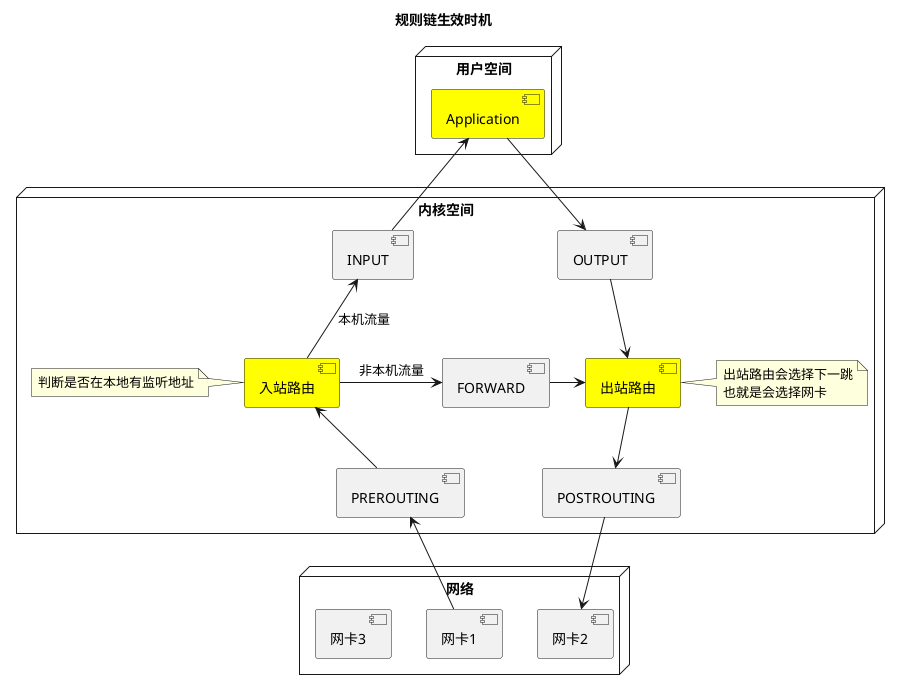

# 一、iptables的规则链

参考 [Linux-iptables 防火墙、四表五链及SNAT与DNAT的原理与应用](https://www.cnblogs.com/yhtweirdo/p/15092477.html)

## 1. 规则链图

## 2. 每个表对应的链

- 表匹配顺序: `raw -> mangle -> nat -> filter`

|        | 说明                       | PREROUTING | INPUT | FORWARD | OUTPUT | POSTROUTING |
| ------ | -------------------------- | ---------- | ----- | ------- | ------ | ----------- |
| raw    | 确定是否跟踪数据包状态     | 1          |       |         | 1      |             |
| mangle | 修改数据包内容，如设置标记 | 1          | 1     | 1       | 1      | 1           |
| nat    | 网络地址转换               | 1          |       |         | 1      | 1           |
| filter | 数据包是否放行             |            | 1     | 1       | 1      |             |

## 3. 规则匹配顺序

## 4. 常用控制类型

- `ACCEPT`: 允许数据包通过
- `DROP`: 直接丢弃数据包，不给出任何回应信息
- `REJECT`: 拒绝数据包通过，会给数据发送端一个响应信息
- `SNAT`: 修改数据包的源地址
- `DNAT`: 修改数据包的目的地址
- `MASQUERADE`: 伪装成一个非固定公网IP地址
- `LOG`: 在`/var/log/messages`文件中记录日志信息，然后将数据包传递给下一条规则。LOG只是一种辅助动作，并没有真正处理数据包

## 5. 常用的管理选项

- `-A`: 在指定链的末尾追加(--append) 一条新的规则
- `-I`: 在指定链的开头插入(--insert)一条新的规则，未指定序号时默认作为第一条规则
- `-R`: 修改、替换(--replace) 指定链中的某一条规则，可指定规则序号或具体内容
- `-P`: 设置指定链的默认策略(--policy)
- `-D`: 删除(--delete)指定链中的某一条规则，可指定规则序号或具体内容
- `-F`: 清空(--flush)指定链中的所有规则，若未指定链名，则清空表中的所有链
- `-L`：列出(--list) 指定链中所有的规则，若未指定链名，则列出表中的所有链
- `-n`: 使用数字形式(--numeric)显示输出结果，如显示IP地址而不是主机名
- `-v`: 显示详细信息，包括每条规则的匹配包数量和匹配字节数
- `--line-numbers`: 查看规则时，显示规则的序号
