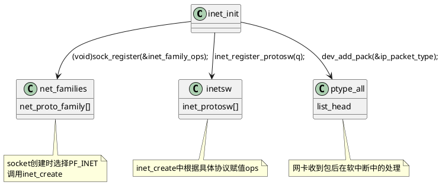

# 一、初始化注册



```cpp
// net/ipv4/af_inet.c
static int __init inet_init(void)
{
	struct inet_protosw *q;
	struct list_head *r;
	int rc;

	sock_skb_cb_check_size(sizeof(struct inet_skb_parm));

	rc = proto_register(&tcp_prot, 1);
	if (rc)
		goto out;

	rc = proto_register(&udp_prot, 1);
	if (rc)
		goto out_unregister_tcp_proto;

	rc = proto_register(&raw_prot, 1);
	if (rc)
		goto out_unregister_udp_proto;

	rc = proto_register(&ping_prot, 1);
	if (rc)
		goto out_unregister_raw_proto;

	/*
	 *	Tell SOCKET that we are alive...
	 */
	// 向socket注册协议族，这个在socket创建时有用
	(void)sock_register(&inet_family_ops);

#ifdef CONFIG_SYSCTL
	ip_static_sysctl_init();
#endif

	/*
	 *	Add all the base protocols.
	 */

	if (inet_add_protocol(&icmp_protocol, IPPROTO_ICMP) < 0)
		pr_crit("%s: Cannot add ICMP protocol\n", __func__);
	if (inet_add_protocol(&udp_protocol, IPPROTO_UDP) < 0)
		pr_crit("%s: Cannot add UDP protocol\n", __func__);
	if (inet_add_protocol(&tcp_protocol, IPPROTO_TCP) < 0)
		pr_crit("%s: Cannot add TCP protocol\n", __func__);
#ifdef CONFIG_IP_MULTICAST
	if (inet_add_protocol(&igmp_protocol, IPPROTO_IGMP) < 0)
		pr_crit("%s: Cannot add IGMP protocol\n", __func__);
#endif

	/* Register the socket-side information for inet_create. */
	for (r = &inetsw[0]; r < &inetsw[SOCK_MAX]; ++r)
		INIT_LIST_HEAD(r);

	// 注册下层协议的相关信息到inetsw中
	for (q = inetsw_array; q < &inetsw_array[INETSW_ARRAY_LEN]; ++q)
		inet_register_protosw(q);

	/*
	 *	Set the ARP module up
	 */

	arp_init();

	/*
	 *	Set the IP module up
	 */

	ip_init();

	/* Initialise per-cpu ipv4 mibs */
	if (init_ipv4_mibs())
		panic("%s: Cannot init ipv4 mibs\n", __func__);

	/* Setup TCP slab cache for open requests. */
	tcp_init();

	/* Setup UDP memory threshold */
	udp_init();

	/* Add UDP-Lite (RFC 3828) */
	udplite4_register();

	raw_init();

	ping_init();

	/*
	 *	Set the ICMP layer up
	 */

	if (icmp_init() < 0)
		panic("Failed to create the ICMP control socket.\n");

	/*
	 *	Initialise the multicast router
	 */
#if defined(CONFIG_IP_MROUTE)
	if (ip_mr_init())
		pr_crit("%s: Cannot init ipv4 mroute\n", __func__);
#endif

	if (init_inet_pernet_ops())
		pr_crit("%s: Cannot init ipv4 inet pernet ops\n", __func__);

	ipv4_proc_init();

	ipfrag_init();

    // 注册收包处理
	dev_add_pack(&ip_packet_type);

	ip_tunnel_core_init();

	rc = 0;
out:
	return rc;
out_unregister_raw_proto:
	proto_unregister(&raw_prot);
out_unregister_udp_proto:
	proto_unregister(&udp_prot);
out_unregister_tcp_proto:
	proto_unregister(&tcp_prot);
	goto out;
}

fs_initcall(inet_init);
```

# 二、ipv4收包后如何处理

## 1. ip层包入口

### 1.1. 最开始注册一个`packet_type`结构体，定义func为`ip_rcv`，被`inet_init`注册

```cpp
// net/ipv4/af_inet.c
static struct packet_type ip_packet_type __read_mostly = {
	.type = cpu_to_be16(ETH_P_IP),
	.func = ip_rcv,
	.list_func = ip_list_rcv,
};

static int __init inet_init(void)
{
	...
    // 注册到dev里面
	dev_add_pack(&ip_packet_type);
	...
}
```

### 1.2. ip_rcv 驱动在受到包之后会调用func

- 可以看到这里是netflt的`PRE_ROUTING`链的挂载点

```cpp
// net/ipv4/ip_input.c
/*
 * IP receive entry point
 */
int ip_rcv(struct sk_buff *skb, struct net_device *dev, struct packet_type *pt,
	   struct net_device *orig_dev)
{
	struct net *net = dev_net(dev);

	skb = ip_rcv_core(skb, net);
	if (skb == NULL)
		return NET_RX_DROP;

	return NF_HOOK(NFPROTO_IPV4, NF_INET_PRE_ROUTING,
		       net, NULL, skb, dev, NULL,
		       ip_rcv_finish);
}
```

#### ip_rcv_core 校验包是否是ipv4的包

- 校验ip头的版本是否为v4
- 校验ip头的checksum是否正确

```cpp
// net/ipv4/ip_input.c
/*
 * 	Main IP Receive routine.
 */
static struct sk_buff *ip_rcv_core(struct sk_buff *skb, struct net *net)
{
	const struct iphdr *iph;
	int drop_reason;
	u32 len;

	/* When the interface is in promisc. mode, drop all the crap
	 * that it receives, do not try to analyse it.
	 */
	if (skb->pkt_type == PACKET_OTHERHOST) {
		dev_core_stats_rx_otherhost_dropped_inc(skb->dev);
		drop_reason = SKB_DROP_REASON_OTHERHOST;
		goto drop;
	}

	__IP_UPD_PO_STATS(net, IPSTATS_MIB_IN, skb->len);

	skb = skb_share_check(skb, GFP_ATOMIC);
	if (!skb) {
		__IP_INC_STATS(net, IPSTATS_MIB_INDISCARDS);
		goto out;
	}

	drop_reason = SKB_DROP_REASON_NOT_SPECIFIED;
	if (!pskb_may_pull(skb, sizeof(struct iphdr)))
		goto inhdr_error;

	iph = ip_hdr(skb);

	/*
	 *	RFC1122: 3.2.1.2 MUST silently discard any IP frame that fails the checksum.
	 *
	 *	Is the datagram acceptable?
	 *
	 *	1.	Length at least the size of an ip header
	 *	2.	Version of 4
	 *	3.	Checksums correctly. [Speed optimisation for later, skip loopback checksums]
	 *	4.	Doesn't have a bogus length
	 */
	// 判断版本是否为ipv4
	if (iph->ihl < 5 || iph->version != 4)
		goto inhdr_error;

	BUILD_BUG_ON(IPSTATS_MIB_ECT1PKTS != IPSTATS_MIB_NOECTPKTS + INET_ECN_ECT_1);
	BUILD_BUG_ON(IPSTATS_MIB_ECT0PKTS != IPSTATS_MIB_NOECTPKTS + INET_ECN_ECT_0);
	BUILD_BUG_ON(IPSTATS_MIB_CEPKTS != IPSTATS_MIB_NOECTPKTS + INET_ECN_CE);
	__IP_ADD_STATS(net,
		       IPSTATS_MIB_NOECTPKTS + (iph->tos & INET_ECN_MASK),
		       max_t(unsigned short, 1, skb_shinfo(skb)->gso_segs));

	if (!pskb_may_pull(skb, iph->ihl*4))
		goto inhdr_error;

	iph = ip_hdr(skb);

	// 校验checksum，校验失败直接丢包
	if (unlikely(ip_fast_csum((u8 *)iph, iph->ihl)))
		goto csum_error;

	len = ntohs(iph->tot_len);
	if (skb->len < len) {
		drop_reason = SKB_DROP_REASON_PKT_TOO_SMALL;
		__IP_INC_STATS(net, IPSTATS_MIB_INTRUNCATEDPKTS);
		goto drop;
	} else if (len < (iph->ihl*4))
		goto inhdr_error;

	/* Our transport medium may have padded the buffer out. Now we know it
	 * is IP we can trim to the true length of the frame.
	 * Note this now means skb->len holds ntohs(iph->tot_len).
	 */
	if (pskb_trim_rcsum(skb, len)) {
		__IP_INC_STATS(net, IPSTATS_MIB_INDISCARDS);
		goto drop;
	}

	iph = ip_hdr(skb);
	skb->transport_header = skb->network_header + iph->ihl*4;

	/* Remove any debris in the socket control block */
	memset(IPCB(skb), 0, sizeof(struct inet_skb_parm));
	IPCB(skb)->iif = skb->skb_iif;

	/* Must drop socket now because of tproxy. */
	if (!skb_sk_is_prefetched(skb))
		skb_orphan(skb);

	return skb;

csum_error:
	drop_reason = SKB_DROP_REASON_IP_CSUM;
	__IP_INC_STATS(net, IPSTATS_MIB_CSUMERRORS);
inhdr_error:
	if (drop_reason == SKB_DROP_REASON_NOT_SPECIFIED)
		drop_reason = SKB_DROP_REASON_IP_INHDR;
	__IP_INC_STATS(net, IPSTATS_MIB_INHDRERRORS);
drop:
	kfree_skb_reason(skb, drop_reason);
out:
	return NULL;
}
```

### 1.3. `ip_rcv_finish`这里处理了路由，如果路由不过就进行drop

```cpp
// net/ipv4/ip_input.c
static int ip_rcv_finish(struct net *net, struct sock *sk, struct sk_buff *skb)
{
	struct net_device *dev = skb->dev;
	int ret;

	/* if ingress device is enslaved to an L3 master device pass the
	 * skb to its handler for processing
	 */
	skb = l3mdev_ip_rcv(skb);
	if (!skb)
		return NET_RX_SUCCESS;

    // 这个函数处理了路由
	ret = ip_rcv_finish_core(net, sk, skb, dev, NULL);
	if (ret != NET_RX_DROP)
		ret = dst_input(skb);
	return ret;
}
```

- `dst_input`里面就是调用`ip_local_deiver`

```cpp
// include/net/dst.h
INDIRECT_CALLABLE_DECLARE(int ip6_input(struct sk_buff *));
INDIRECT_CALLABLE_DECLARE(int ip_local_deliver(struct sk_buff *));
/* Input packet from network to transport.  */
static inline int dst_input(struct sk_buff *skb)
{
	return INDIRECT_CALL_INET(skb_dst(skb)->input,
				  ip6_input, ip_local_deliver, skb);
}
```

- 这里也是netfilter的`LOCAL_IN`挂载点，可以在这里进行过滤

```cpp
// net/ipv4/ip_input.c
/*
 * 	Deliver IP Packets to the higher protocol layers.
 */
int ip_local_deliver(struct sk_buff *skb) {
    /*
     *	Reassemble IP fragments.
     */
    struct net *net = dev_net(skb->dev);

    // 判断是否为分片包，分片包就先处理分片
    if (ip_is_fragment(ip_hdr(skb))) {
        if (ip_defrag(net, skb, IP_DEFRAG_LOCAL_DELIVER))
            return 0;
    }

    // 分片处理完毕调用ip_local_deliver_finish()
    // NF_HOOK挂载netflt
    return NF_HOOK(NFPROTO_IPV4, NF_INET_LOCAL_IN,
               net, NULL, skb, skb->dev, NULL,
               ip_local_deliver_finish);
}
```

- 根据ip包内的协议处理具体的协议

```cpp
// net/ipv4/ip_input.c
// ip_local_deliver_finish() -call-> ip_local_deliver_finish()
void ip_local_deliver_finish(struct net *net, struct sk_buff *skb, int protocol) {
    const struct net_protocol *ipprot;
    int raw, ret;

resubmit:
    raw = raw_local_deliver(skb, protocol);

    // 这里找到具体的协议的处理函数，然后调用具体的协议处理函数
    ipprot = rcu_dereference(inet_protos[protocol]);
    if (ipprot) {
        if (!ipprot->no_policy) {
            if (!xfrm4_policy_check(NULL, XFRM_POLICY_IN, skb)) {
                kfree_skb(skb);
                return;
            }
            nf_reset_ct(skb);
        }
        // 相当于调用ipprot->handler(skb)
        ret = INDIRECT_CALL_2(ipprot->handler, tcp_v4_rcv, udp_rcv,
                      skb);
        if (ret < 0) {
            protocol = -ret;
            goto resubmit;
        }
        __IP_INC_STATS(net, IPSTATS_MIB_INDELIVERS);
    } else {
        if (!raw) {
            if (xfrm4_policy_check(NULL, XFRM_POLICY_IN, skb)) {
                __IP_INC_STATS(net, IPSTATS_MIB_INUNKNOWNPROTOS);
                // 这里是服务端会回复一个icmp包，内容就是端口不可达
                icmp_send(skb, ICMP_DEST_UNREACH,
                      ICMP_PROT_UNREACH, 0);
            }
            kfree_skb(skb);
        } else {
            __IP_INC_STATS(net, IPSTATS_MIB_INDELIVERS);
            consume_skb(skb);
        }
    }
}
```

- `inet_protos[protocol]`是一个指向net_protocol结构的指针，net_protocol结构中包含了协议的处理函数
- 使用下面两个函数进行注册特定的协议

```cpp
// net/ipv4/protocol.c
int inet_add_protocol(const struct net_protocol *prot, unsigned char protocol);
EXPORT_SYMBOL(inet_add_protocol);

int inet_del_protocol(const struct net_protocol *prot, unsigned char protocol);
EXPORT_SYMBOL(inet_del_protocol);
```

## 2. 路由处理

- 上面讲了通过`ip_rcv_finish_core`来处理路由

```cpp
// net/ipv4/ip_input.c
static int ip_rcv_finish_core(struct net *net, struct sock *sk,
			      struct sk_buff *skb, struct net_device *dev,
			      const struct sk_buff *hint)
{
	const struct iphdr *iph = ip_hdr(skb);
	int err, drop_reason;
	struct rtable *rt;

	drop_reason = SKB_DROP_REASON_NOT_SPECIFIED;

	if (ip_can_use_hint(skb, iph, hint)) {
		err = ip_route_use_hint(skb, iph->daddr, iph->saddr, iph->tos,
					dev, hint);
		if (unlikely(err))
			goto drop_error;
	}

	if (READ_ONCE(net->ipv4.sysctl_ip_early_demux) &&
	    !skb_dst(skb) &&
	    !skb->sk &&
	    !ip_is_fragment(iph)) {
		switch (iph->protocol) {
		case IPPROTO_TCP:
			if (READ_ONCE(net->ipv4.sysctl_tcp_early_demux)) {
				tcp_v4_early_demux(skb);

				/* must reload iph, skb->head might have changed */
				iph = ip_hdr(skb);
			}
			break;
		case IPPROTO_UDP:
			if (READ_ONCE(net->ipv4.sysctl_udp_early_demux)) {
				err = udp_v4_early_demux(skb);
				if (unlikely(err))
					goto drop_error;

				/* must reload iph, skb->head might have changed */
				iph = ip_hdr(skb);
			}
			break;
		}
	}

	/*
	 *	Initialise the virtual path cache for the packet. It describes
	 *	how the packet travels inside Linux networking.
	 */
	if (!skb_valid_dst(skb)) {
        // 处理路由
		err = ip_route_input_noref(skb, iph->daddr, iph->saddr,
					   iph->tos, dev);
		if (unlikely(err))
			goto drop_error;
	}
    ...

drop:
	kfree_skb_reason(skb, drop_reason);
	return NET_RX_DROP;

drop_error:
	if (err == -EXDEV) {
		drop_reason = SKB_DROP_REASON_IP_RPFILTER;
		__NET_INC_STATS(net, LINUX_MIB_IPRPFILTER);
	}
	goto drop;
}
```

### 2.1. `rp_filter`如何生效

- `ip_route_input_noref`处理路由

```cpp
// net/ipv4/route.c
int ip_route_input_noref(struct sk_buff *skb, __be32 daddr, __be32 saddr,
			 u8 tos, struct net_device *dev)
{
	struct fib_result res;
	int err;

	tos &= IPTOS_RT_MASK;
	rcu_read_lock();
	err = ip_route_input_rcu(skb, daddr, saddr, tos, dev, &res);
	rcu_read_unlock();

	return err;
}
EXPORT_SYMBOL(ip_route_input_noref);

// net/ipv4/route.c
/* called with rcu_read_lock held */
int ip_route_input_rcu(struct sk_buff *skb, __be32 daddr, __be32 saddr,
		       u8 tos, struct net_device *dev, struct fib_result *res)
{
	/* Multicast recognition logic is moved from route cache to here.
	 * The problem was that too many Ethernet cards have broken/missing
	 * hardware multicast filters :-( As result the host on multicasting
	 * network acquires a lot of useless route cache entries, sort of
	 * SDR messages from all the world. Now we try to get rid of them.
	 * Really, provided software IP multicast filter is organized
	 * reasonably (at least, hashed), it does not result in a slowdown
	 * comparing with route cache reject entries.
	 * Note, that multicast routers are not affected, because
	 * route cache entry is created eventually.
	 */
    // 多播地址处理
	if (ipv4_is_multicast(daddr)) {
        ...
        return err;
	}

    // 单播处理
	return ip_route_input_slow(skb, daddr, saddr, tos, dev, res);
}
```

- `ip_route_input_slow`处理单播包

```cpp
// net/ipv4/route.c
/*
 *	NOTE. We drop all the packets that has local source
 *	addresses, because every properly looped back packet
 *	must have correct destination already attached by output routine.
 *	Changes in the enforced policies must be applied also to
 *	ip_route_use_hint().
 *
 *	Such approach solves two big problems:
 *	1. Not simplex devices are handled properly.
 *	2. IP spoofing attempts are filtered with 100% of guarantee.
 *	called with rcu_read_lock()
 */

static int ip_route_input_slow(struct sk_buff *skb, __be32 daddr, __be32 saddr,
			       u8 tos, struct net_device *dev,
			       struct fib_result *res)
{
	struct in_device *in_dev = __in_dev_get_rcu(dev);
	struct flow_keys *flkeys = NULL, _flkeys;
	struct net    *net = dev_net(dev);
	struct ip_tunnel_info *tun_info;
	int		err = -EINVAL;
	unsigned int	flags = 0;
	u32		itag = 0;
	struct rtable	*rth;
	struct flowi4	fl4;
	bool do_cache = true;
	bool no_policy;

	/* IP on this device is disabled. */

	if (!in_dev)
		goto out;

	/* Check for the most weird martians, which can be not detected
	 * by fib_lookup.
	 */

	tun_info = skb_tunnel_info(skb);
	if (tun_info && !(tun_info->mode & IP_TUNNEL_INFO_TX))
		fl4.flowi4_tun_key.tun_id = tun_info->key.tun_id;
	else
		fl4.flowi4_tun_key.tun_id = 0;
	skb_dst_drop(skb);

	if (ipv4_is_multicast(saddr) || ipv4_is_lbcast(saddr))
		goto martian_source;

	res->fi = NULL;
	res->table = NULL;
	if (ipv4_is_lbcast(daddr) || (saddr == 0 && daddr == 0))
		goto brd_input;

	/* Accept zero addresses only to limited broadcast;
	 * I even do not know to fix it or not. Waiting for complains :-)
	 */
	if (ipv4_is_zeronet(saddr))
		goto martian_source;

	if (ipv4_is_zeronet(daddr))
		goto martian_destination;

	/* Following code try to avoid calling IN_DEV_NET_ROUTE_LOCALNET(),
	 * and call it once if daddr or/and saddr are loopback addresses
	 */
	if (ipv4_is_loopback(daddr)) {
		if (!IN_DEV_NET_ROUTE_LOCALNET(in_dev, net))
			goto martian_destination;
	} else if (ipv4_is_loopback(saddr)) {
		if (!IN_DEV_NET_ROUTE_LOCALNET(in_dev, net))
			goto martian_source;
	}

	/*
	 *	Now we are ready to route packet.
	 */
	fl4.flowi4_l3mdev = 0;
	fl4.flowi4_oif = 0;
	fl4.flowi4_iif = dev->ifindex;
	fl4.flowi4_mark = skb->mark;
	fl4.flowi4_tos = tos;
	fl4.flowi4_scope = RT_SCOPE_UNIVERSE;
	fl4.flowi4_flags = 0;
	fl4.daddr = daddr;
	fl4.saddr = saddr;
	fl4.flowi4_uid = sock_net_uid(net, NULL);
	fl4.flowi4_multipath_hash = 0;

	if (fib4_rules_early_flow_dissect(net, skb, &fl4, &_flkeys)) {
		flkeys = &_flkeys;
	} else {
		fl4.flowi4_proto = 0;
		fl4.fl4_sport = 0;
		fl4.fl4_dport = 0;
	}

	err = fib_lookup(net, &fl4, res, 0);
	if (err != 0) {
		if (!IN_DEV_FORWARD(in_dev))
			err = -EHOSTUNREACH;
		goto no_route;
	}

	if (res->type == RTN_BROADCAST) {
		if (IN_DEV_BFORWARD(in_dev))
			goto make_route;
		/* not do cache if bc_forwarding is enabled */
		if (IPV4_DEVCONF_ALL(net, BC_FORWARDING))
			do_cache = false;
		goto brd_input;
	}

	if (res->type == RTN_LOCAL) {
		err = fib_validate_source(skb, saddr, daddr, tos,
					  0, dev, in_dev, &itag);
		if (err < 0)
			goto martian_source;
		goto local_input;
	}

	if (!IN_DEV_FORWARD(in_dev)) {
		err = -EHOSTUNREACH;
		goto no_route;
	}
	if (res->type != RTN_UNICAST)
		goto martian_destination;

make_route:
    // 正常包上面流程走完了会到这里
	err = ip_mkroute_input(skb, res, in_dev, daddr, saddr, tos, flkeys);
out:	return err;
    ...
}
```

- `ip_mkroute_input`

```cpp
// net/ipv4/route.c
static int ip_mkroute_input(struct sk_buff *skb,
			    struct fib_result *res,
			    struct in_device *in_dev,
			    __be32 daddr, __be32 saddr, u32 tos,
			    struct flow_keys *hkeys)
{
#ifdef CONFIG_IP_ROUTE_MULTIPATH
	if (res->fi && fib_info_num_path(res->fi) > 1) {
		int h = fib_multipath_hash(res->fi->fib_net, NULL, skb, hkeys);

		fib_select_multipath(res, h);
	}
#endif

	/* create a routing cache entry */
	return __mkroute_input(skb, res, in_dev, daddr, saddr, tos);
}

// net/ipv4/route.c
/* called in rcu_read_lock() section */
static int __mkroute_input(struct sk_buff *skb,
			   const struct fib_result *res,
			   struct in_device *in_dev,
			   __be32 daddr, __be32 saddr, u32 tos)
{
	struct fib_nh_common *nhc = FIB_RES_NHC(*res);
	struct net_device *dev = nhc->nhc_dev;
	struct fib_nh_exception *fnhe;
	struct rtable *rth;
	int err;
	struct in_device *out_dev;
	bool do_cache, no_policy;
	u32 itag = 0;

	/* get a working reference to the output device */
	out_dev = __in_dev_get_rcu(dev);
	if (!out_dev) {
		net_crit_ratelimited("Bug in ip_route_input_slow(). Please report.\n");
		return -EINVAL;
	}

    // 校验源地址是否正确
	err = fib_validate_source(skb, saddr, daddr, tos, FIB_RES_OIF(*res),
				  in_dev->dev, in_dev, &itag);
	if (err < 0) {
		ip_handle_martian_source(in_dev->dev, in_dev, skb, daddr,
					 saddr);

		goto cleanup;
	}

	do_cache = res->fi && !itag;
	if (out_dev == in_dev && err && IN_DEV_TX_REDIRECTS(out_dev) &&
	    skb->protocol == htons(ETH_P_IP)) {
		__be32 gw;

		gw = nhc->nhc_gw_family == AF_INET ? nhc->nhc_gw.ipv4 : 0;
		if (IN_DEV_SHARED_MEDIA(out_dev) ||
		    inet_addr_onlink(out_dev, saddr, gw))
			IPCB(skb)->flags |= IPSKB_DOREDIRECT;
	}

	if (skb->protocol != htons(ETH_P_IP)) {
		/* Not IP (i.e. ARP). Do not create route, if it is
		 * invalid for proxy arp. DNAT routes are always valid.
		 *
		 * Proxy arp feature have been extended to allow, ARP
		 * replies back to the same interface, to support
		 * Private VLAN switch technologies. See arp.c.
		 */
		if (out_dev == in_dev &&
		    IN_DEV_PROXY_ARP_PVLAN(in_dev) == 0) {
			err = -EINVAL;
			goto cleanup;
		}
	}

	no_policy = IN_DEV_ORCONF(in_dev, NOPOLICY);
	if (no_policy)
		IPCB(skb)->flags |= IPSKB_NOPOLICY;

	fnhe = find_exception(nhc, daddr);
	if (do_cache) {
		if (fnhe)
			rth = rcu_dereference(fnhe->fnhe_rth_input);
		else
			rth = rcu_dereference(nhc->nhc_rth_input);
		if (rt_cache_valid(rth)) {
			skb_dst_set_noref(skb, &rth->dst);
			goto out;
		}
	}

	rth = rt_dst_alloc(out_dev->dev, 0, res->type, no_policy,
			   IN_DEV_ORCONF(out_dev, NOXFRM));
	if (!rth) {
		err = -ENOBUFS;
		goto cleanup;
	}

	rth->rt_is_input = 1;
	RT_CACHE_STAT_INC(in_slow_tot);

	rth->dst.input = ip_forward;

	rt_set_nexthop(rth, daddr, res, fnhe, res->fi, res->type, itag,
		       do_cache);
	lwtunnel_set_redirect(&rth->dst);
	skb_dst_set(skb, &rth->dst);
out:
	err = 0;
 cleanup:
	return err;
}
```

- `fib_validate_source`校验源地址是否正确
- 这里会判断`rp_filter`选项，如果为1，根据对应的源地址目的地址反向查找路由，对应的网卡如果不匹配就进行丢包

```cpp
// net/ipv4/fib_frontend.c
/* Ignore rp_filter for packets protected by IPsec. */
int fib_validate_source(struct sk_buff *skb, __be32 src, __be32 dst,
			u8 tos, int oif, struct net_device *dev,
			struct in_device *idev, u32 *itag)
{
    // r就是对应网卡的rp_filter选项，使用sysctl -a | grep -i \.rp_filter可以看到
    // net.ipv4.conf.wlp0s20f0u1u2.rp_filter = 2
	int r = secpath_exists(skb) ? 0 : IN_DEV_RPFILTER(idev);
	struct net *net = dev_net(dev);

	if (!r && !fib_num_tclassid_users(net) &&
	    (dev->ifindex != oif || !IN_DEV_TX_REDIRECTS(idev))) {
		if (IN_DEV_ACCEPT_LOCAL(idev))
			goto ok;
		/* with custom local routes in place, checking local addresses
		 * only will be too optimistic, with custom rules, checking
		 * local addresses only can be too strict, e.g. due to vrf
		 */
		if (net->ipv4.fib_has_custom_local_routes ||
		    fib4_has_custom_rules(net))
			goto full_check;
		/* Within the same container, it is regarded as a martian source,
		 * and the same host but different containers are not.
		 */
		if (inet_lookup_ifaddr_rcu(net, src))
			return -EINVAL;

ok:
		*itag = 0;
		return 0;
	}

full_check:
	return __fib_validate_source(skb, src, dst, tos, oif, dev, r, idev, itag);
}

// net/ipv4/fib_frontend.c
/* Given (packet source, input interface) and optional (dst, oif, tos):
 * - (main) check, that source is valid i.e. not broadcast or our local
 *   address.
 * - figure out what "logical" interface this packet arrived
 *   and calculate "specific destination" address.
 * - check, that packet arrived from expected physical interface.
 * called with rcu_read_lock()
 */
static int __fib_validate_source(struct sk_buff *skb, __be32 src, __be32 dst,
				 u8 tos, int oif, struct net_device *dev,
				 int rpf, struct in_device *idev, u32 *itag)
{
	struct net *net = dev_net(dev);
	struct flow_keys flkeys;
	int ret, no_addr;
	struct fib_result res;
	struct flowi4 fl4;
	bool dev_match;

	fl4.flowi4_oif = 0;
	fl4.flowi4_l3mdev = l3mdev_master_ifindex_rcu(dev);
	fl4.flowi4_iif = oif ? : LOOPBACK_IFINDEX;
	fl4.daddr = src;
	fl4.saddr = dst;
	fl4.flowi4_tos = tos;
	fl4.flowi4_scope = RT_SCOPE_UNIVERSE;
	fl4.flowi4_tun_key.tun_id = 0;
	fl4.flowi4_flags = 0;
	fl4.flowi4_uid = sock_net_uid(net, NULL);
	fl4.flowi4_multipath_hash = 0;

	no_addr = idev->ifa_list == NULL;

	fl4.flowi4_mark = IN_DEV_SRC_VMARK(idev) ? skb->mark : 0;
	if (!fib4_rules_early_flow_dissect(net, skb, &fl4, &flkeys)) {
		fl4.flowi4_proto = 0;
		fl4.fl4_sport = 0;
		fl4.fl4_dport = 0;
	} else {
		swap(fl4.fl4_sport, fl4.fl4_dport);
	}

	if (fib_lookup(net, &fl4, &res, 0))
		goto last_resort;
	if (res.type != RTN_UNICAST &&
	    (res.type != RTN_LOCAL || !IN_DEV_ACCEPT_LOCAL(idev)))
		goto e_inval;
	fib_combine_itag(itag, &res);

	dev_match = fib_info_nh_uses_dev(res.fi, dev);
	/* This is not common, loopback packets retain skb_dst so normally they
	 * would not even hit this slow path.
	 */
    // 看网卡是否对应上，如果对应不上走后面流程
	dev_match = dev_match || (res.type == RTN_LOCAL &&
				  dev == net->loopback_dev);
	if (dev_match) {
		ret = FIB_RES_NHC(res)->nhc_scope >= RT_SCOPE_HOST;
		return ret;
	}
	if (no_addr)
		goto last_resort;
    // 这里判断如果rp_filter == 1就会丢包
	if (rpf == 1)
		goto e_rpf;
	fl4.flowi4_oif = dev->ifindex;

	ret = 0;
	if (fib_lookup(net, &fl4, &res, FIB_LOOKUP_IGNORE_LINKSTATE) == 0) {
		if (res.type == RTN_UNICAST)
			ret = FIB_RES_NHC(res)->nhc_scope >= RT_SCOPE_HOST;
	}
	return ret;

last_resort:
	if (rpf)
		goto e_rpf;
	*itag = 0;
	return 0;

e_inval:
	return -EINVAL;
e_rpf:
	return -EXDEV;
}
```


# 三、socket相关操作

## 1. inet_create socket创建

### 1.1. 注册协议族到socket那边，create调用`inet_create`

```cpp
// net/ipv4/af_inet.c
static const struct net_proto_family inet_family_ops = {
	.family = PF_INET,
	.create = inet_create,
	.owner	= THIS_MODULE,
};

static int __init inet_init(void) {
    ...
    (void)sock_register(&inet_family_ops);
    ...
}
```

### 1.2. 注册对应的下层协议到inet_sw中

```cpp
// net/ipv4/af_inet.c
// net/ipv4/af_inet.c
/* Upon startup we insert all the elements in inetsw_array[] into
 * the linked list inetsw.
 */
static struct inet_protosw inetsw_array[] =
{
    {
        .type =       SOCK_STREAM,
        .protocol =   IPPROTO_TCP,
        .prot =       &tcp_prot,
        .ops =        &inet_stream_ops,
        .flags =      INET_PROTOSW_PERMANENT |
                  INET_PROTOSW_ICSK,
    },

    {
        .type =       SOCK_DGRAM,
        .protocol =   IPPROTO_UDP,
        .prot =       &udp_prot,
        .ops =        &inet_dgram_ops,
        .flags =      INET_PROTOSW_PERMANENT,
    },

    {
        .type =       SOCK_DGRAM,
        .protocol =   IPPROTO_ICMP,
        .prot =       &ping_prot,
        .ops =        &inet_sockraw_ops,
        .flags =      INET_PROTOSW_REUSE,
    },

    {
        .type =       SOCK_RAW,
        .protocol =   IPPROTO_IP,	/* wild card */
        .prot =       &raw_prot,
        .ops =        &inet_sockraw_ops,
        .flags =      INET_PROTOSW_REUSE,
    }
};
...
static int __init inet_init(void)
{
...
    for (q = inetsw_array; q < &inetsw_array[INETSW_ARRAY_LEN]; ++q)
        inet_register_protosw(q);
...
}
```

### 1.3. 调用inet_create创建socket

```cpp
// net/ipv4/af_inet.c
/*
 *	Create an inet socket.
 */

static int inet_create(struct net *net, struct socket *sock, int protocol,
               int kern)
{
    struct sock *sk;
    struct inet_protosw *answer;
    struct inet_sock *inet;
    struct proto *answer_prot;
    unsigned char answer_flags;
    int try_loading_module = 0;
    int err;

    if (protocol < 0 || protocol >= IPPROTO_MAX)
        return -EINVAL;

    // 初始化状态为SS_UNCONNETED
    sock->state = SS_UNCONNECTED;

    /* Look for the requested type/protocol pair. */
lookup_protocol:
    err = -ESOCKTNOSUPPORT;
    rcu_read_lock();
    // 从inetsw中找到对应协议的结构体，赋值给answer变量
    list_for_each_entry_rcu(answer, &inetsw[sock->type], list) {

        err = 0;
        /* Check the non-wild match. */
        if (protocol == answer->protocol) {
            if (protocol != IPPROTO_IP)
                break;
        } else {
            /* Check for the two wild cases. */
            if (IPPROTO_IP == protocol) {
                protocol = answer->protocol;
                break;
            }
            if (IPPROTO_IP == answer->protocol)
                break;
        }
        err = -EPROTONOSUPPORT;
    }

    if (unlikely(err)) {
        if (try_loading_module < 2) {
            rcu_read_unlock();
            /*
             * Be more specific, e.g. net-pf-2-proto-132-type-1
             * (net-pf-PF_INET-proto-IPPROTO_SCTP-type-SOCK_STREAM)
             */
            if (++try_loading_module == 1)
                request_module("net-pf-%d-proto-%d-type-%d",
                           PF_INET, protocol, sock->type);
            /*
             * Fall back to generic, e.g. net-pf-2-proto-132
             * (net-pf-PF_INET-proto-IPPROTO_SCTP)
             */
            else
                request_module("net-pf-%d-proto-%d",
                           PF_INET, protocol);
            goto lookup_protocol;
        } else
            goto out_rcu_unlock;
    }

    err = -EPERM;
    if (sock->type == SOCK_RAW && !kern &&
        !ns_capable(net->user_ns, CAP_NET_RAW))
        goto out_rcu_unlock;

    // 将对应协议的操作放到sock里面
    sock->ops = answer->ops;
    answer_prot = answer->prot;
    answer_flags = answer->flags;
    rcu_read_unlock();

    WARN_ON(!answer_prot->slab);

    err = -ENOMEM;
    sk = sk_alloc(net, PF_INET, GFP_KERNEL, answer_prot, kern);
    if (!sk)
        goto out;

    err = 0;
    if (INET_PROTOSW_REUSE & answer_flags)
        sk->sk_reuse = SK_CAN_REUSE;

    inet = inet_sk(sk);
    inet->is_icsk = (INET_PROTOSW_ICSK & answer_flags) != 0;

    inet->nodefrag = 0;

    if (SOCK_RAW == sock->type) {
        inet->inet_num = protocol;
        if (IPPROTO_RAW == protocol)
            inet->hdrincl = 1;
    }

    if (READ_ONCE(net->ipv4.sysctl_ip_no_pmtu_disc))
        inet->pmtudisc = IP_PMTUDISC_DONT;
    else
        inet->pmtudisc = IP_PMTUDISC_WANT;

    inet->inet_id = 0;

    sock_init_data(sock, sk);

    sk->sk_destruct	   = inet_sock_destruct;
    sk->sk_protocol	   = protocol;
    sk->sk_backlog_rcv = sk->sk_prot->backlog_rcv;

    inet->uc_ttl	= -1;
    inet->mc_loop	= 1;
    inet->mc_ttl	= 1;
    inet->mc_all	= 1;
    inet->mc_index	= 0;
    inet->mc_list	= NULL;
    inet->rcv_tos	= 0;

    sk_refcnt_debug_inc(sk);

    if (inet->inet_num) {
        /* It assumes that any protocol which allows
         * the user to assign a number at socket
         * creation time automatically
         * shares.
         */
        inet->inet_sport = htons(inet->inet_num);
        /* Add to protocol hash chains. */
        err = sk->sk_prot->hash(sk);
        if (err) {
            sk_common_release(sk);
            goto out;
        }
    }

    if (sk->sk_prot->init) {
        err = sk->sk_prot->init(sk);
        if (err) {
            sk_common_release(sk);
            goto out;
        }
    }

    if (!kern) {
        err = BPF_CGROUP_RUN_PROG_INET_SOCK(sk);
        if (err) {
            sk_common_release(sk);
            goto out;
        }
    }
out:
    return err;
out_rcu_unlock:
    rcu_read_unlock();
    goto out;
}
```

## 2. bind 绑定地址

- tcp和udp的bind接口都指向`inet_bind`

```cpp
// net/ipv4/af_inet.c
const struct proto_ops inet_stream_ops = {
	...
	.bind		   = inet_bind,
	...
};

// net/ipv4/af_inet.c
const struct proto_ops inet_dgram_ops = {
	...
	.bind		   = inet_bind,
	...
};

// net/ipv4/af_inet.c
/*
 * For SOCK_RAW sockets; should be the same as inet_dgram_ops but without
 * udp_poll
 */
const struct proto_ops inet_sockraw_ops = {
	...
	.bind		   = inet_bind,
	...
};
```

### 2.1. inet_bind

```cpp
// net/ipv4/af_inet.c
int inet_bind(struct socket *sock, struct sockaddr *uaddr, int addr_len)
{
	struct sock *sk = sock->sk;
	u32 flags = BIND_WITH_LOCK;
	int err;

	/* If the socket has its own bind function then use it. (RAW) */
	if (sk->sk_prot->bind) {
		return sk->sk_prot->bind(sk, uaddr, addr_len);
	}
	if (addr_len < sizeof(struct sockaddr_in))
		return -EINVAL;

	/* BPF prog is run before any checks are done so that if the prog
	 * changes context in a wrong way it will be caught.
	 */
	err = BPF_CGROUP_RUN_PROG_INET_BIND_LOCK(sk, uaddr,
						 CGROUP_INET4_BIND, &flags);
	if (err)
		return err;

	return __inet_bind(sk, uaddr, addr_len, flags);
}
EXPORT_SYMBOL(inet_bind);
```
