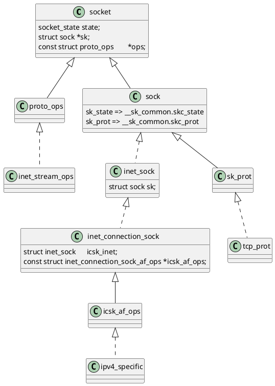
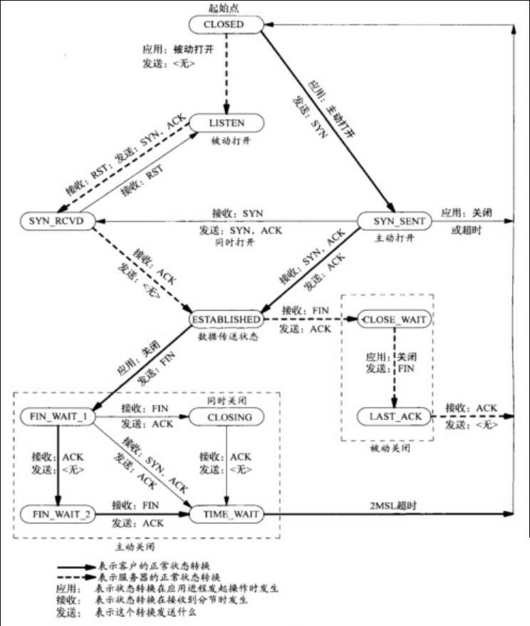
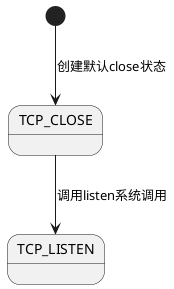
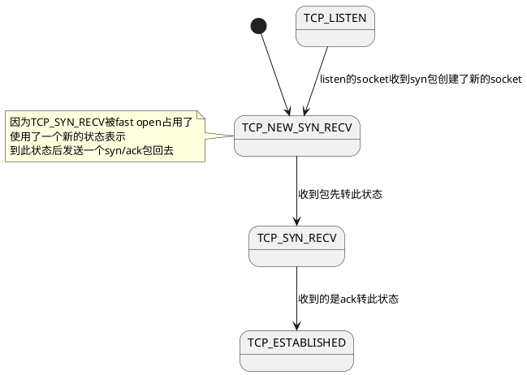

# 一、总述

## 1. 结构体关系



- `inet_connection_sock`扩展了`inet_sock`
- `inet_sock`扩展了`sock`
- 三个都使用`struct sock *sk`存放于`socket`结构体中

# 二、tcp状态图和源码

- tcp状态在`socket.sk->sk_state`里面储存

## 1. 状态图



### 1.1. 服务端监听socket accept用



#### 1) listen系统调用 进入listen状态

```cpp
// net/ipv4/inet_connection_sock.c
// listen => __sys_listen => inet_listen => inet_csk_listen_start
int inet_csk_listen_start(struct sock *sk)
{
	...
	inet_sk_state_store(sk, TCP_LISTEN);
	...
}
```

### 1.2. 服务端数据传输socket send/recv用



#### 1) listen状态收到syn包的处理

- 入口在`tcp_v4_rcv`

```cpp
// net/ipv4/tcp_ipv4.c
/*
 *	From tcp_input.c
 */

int tcp_v4_rcv(struct sk_buff *skb)
{
	...
lookup:
	// 拿到包后，根据目的地址和源地址查找有没有socket
	sk = __inet_lookup_skb(&tcp_hashinfo, skb, __tcp_hdrlen(th), th->source,
			       th->dest, sdif, &refcounted);
	...
	// 查到的socket就是服务端监听的，这里发现是listen状态直接进入tcp_v4_do_rcv
	if (sk->sk_state == TCP_LISTEN) {
		ret = tcp_v4_do_rcv(sk, skb);
		goto put_and_return;
	}
	...
}
```

```cpp
// net/ipv4/tcp_ipv4.c
int tcp_v4_do_rcv(struct sock *sk, struct sk_buff *skb)
{
	...
	if (tcp_rcv_state_process(sk, skb)) {
		rsk = sk;
		goto reset;
	}
	return 0;
	...
}

// net/ipv4/tcp_input.c
int tcp_rcv_state_process(struct sock *sk, struct sk_buff *skb)
{
	...
	switch (sk->sk_state) {
		...
	case TCP_LISTEN:
		if (th->ack)
			return 1;

		if (th->rst) {
			SKB_DR_SET(reason, TCP_RESET);
			goto discard;
		}
		// listen状态收到syn包
		if (th->syn) {
			if (th->fin) {
				SKB_DR_SET(reason, TCP_FLAGS);
				goto discard;
			}
			/* It is possible that we process SYN packets from backlog,
			 * so we need to make sure to disable BH and RCU right there.
			 */
			rcu_read_lock();
			local_bh_disable();
			// 这里进入到icsk的处理函数，处理连接状态
			acceptable = icsk->icsk_af_ops->conn_request(sk, skb) >= 0;
			local_bh_enable();
			rcu_read_unlock();

			if (!acceptable)
				return 1;
			consume_skb(skb);
			return 0;
		}
		SKB_DR_SET(reason, TCP_FLAGS);
		goto discard;

		...
	}
	...
}
```

- listen收到syn包会进入到`icsk->icsk_af_ops->conn_request`处理连接里面
- tcp的`icsk->icsk_af_ops`由下面代码注册

```cpp
// net/ipv4/tcp_ipv4.c
const struct inet_connection_sock_af_ops ipv4_specific = {
	...
	.conn_request	   = tcp_v4_conn_request,
	...
};

// net/ipv4/tcp_ipv4.c
static int tcp_v4_init_sock(struct sock *sk)
{
	struct inet_connection_sock *icsk = inet_csk(sk);

	tcp_init_sock(sk);

	icsk->icsk_af_ops = &ipv4_specific;

#ifdef CONFIG_TCP_MD5SIG
	tcp_sk(sk)->af_specific = &tcp_sock_ipv4_specific;
#endif

	return 0;
}
```

- 查看`icsk->icsk_af_ops->conn_request`也就是`tcp_v4_conn_request`

```cpp
// net/ipv4/tcp_ipv4.c
int tcp_v4_conn_request(struct sock *sk, struct sk_buff *skb)
{
	/* Never answer to SYNs send to broadcast or multicast */
	if (skb_rtable(skb)->rt_flags & (RTCF_BROADCAST | RTCF_MULTICAST))
		goto drop;

	return tcp_conn_request(&tcp_request_sock_ops,
				&tcp_request_sock_ipv4_ops, sk, skb);

drop:
	tcp_listendrop(sk);
	return 0;
}

// net/ipv4/tcp_input.c
int tcp_conn_request(struct request_sock_ops *rsk_ops,
		     const struct tcp_request_sock_ops *af_ops,
		     struct sock *sk, struct sk_buff *skb)
{
	...
	// 判断accept队列是否满了，这个要会给应用层的accept系统调用的
	if (sk_acceptq_is_full(sk)) {
		NET_INC_STATS(sock_net(sk), LINUX_MIB_LISTENOVERFLOWS);
		goto drop;
	}
	// 创建一个reqsk用于处理syn包
	req = inet_reqsk_alloc(rsk_ops, sk, !want_cookie);
	if (!req)
		goto drop;

	...
	if (fastopen_sk) {
		...
	} else {
		tcp_rsk(req)->tfo_listener = false;
		if (!want_cookie) {
			req->timeout = tcp_timeout_init((struct sock *)req);
			// 添加到requestsock队列，添加一个超时时间
			inet_csk_reqsk_queue_hash_add(sk, req, req->timeout);
		}
		// 回包syn/ack
		af_ops->send_synack(sk, dst, &fl, req, &foc,
				    !want_cookie ? TCP_SYNACK_NORMAL :
						   TCP_SYNACK_COOKIE,
				    skb);
		if (want_cookie) {
			reqsk_free(req);
			return 0;
		}
	}
	reqsk_put(req);
	return 0;
	...
}
```

- 创建的reqsk状态直接就是`TCP_NEW_SYN_RECV`

```cpp
// net/ipv4/tcp_input.c
struct request_sock *inet_reqsk_alloc(const struct request_sock_ops *ops,
				      struct sock *sk_listener,
				      bool attach_listener)
{
	struct request_sock *req = reqsk_alloc(ops, sk_listener,
					       attach_listener);

	if (req) {
		struct inet_request_sock *ireq = inet_rsk(req);

		ireq->ireq_opt = NULL;
#if IS_ENABLED(CONFIG_IPV6)
		ireq->pktopts = NULL;
#endif
		atomic64_set(&ireq->ir_cookie, 0);
		ireq->ireq_state = TCP_NEW_SYN_RECV;
		write_pnet(&ireq->ireq_net, sock_net(sk_listener));
		ireq->ireq_family = sk_listener->sk_family;
		req->timeout = TCP_TIMEOUT_INIT;
	}

	return req;
}
EXPORT_SYMBOL(inet_reqsk_alloc);
```

- `af_ops->send_synack`对应上面的`tcp_request_sock_ipv4_ops->tcp_v4_send_synack`
- 直接将IP包写到协议栈，不经过应用层

```cpp
// net/ipv4/tcp_ipv4.c
const struct tcp_request_sock_ops tcp_request_sock_ipv4_ops = {
	...
	.send_synack	=	tcp_v4_send_synack,
};

// net/ipv4/tcp_ipv4.c
/*
 *	Send a SYN-ACK after having received a SYN.
 *	This still operates on a request_sock only, not on a big
 *	socket.
 */
static int tcp_v4_send_synack(const struct sock *sk, struct dst_entry *dst,
			      struct flowi *fl,
			      struct request_sock *req,
			      struct tcp_fastopen_cookie *foc,
			      enum tcp_synack_type synack_type,
			      struct sk_buff *syn_skb)
{
	const struct inet_request_sock *ireq = inet_rsk(req);
	struct flowi4 fl4;
	int err = -1;
	struct sk_buff *skb;
	u8 tos;

	/* First, grab a route. */
	if (!dst && (dst = inet_csk_route_req(sk, &fl4, req)) == NULL)
		return -1;

	skb = tcp_make_synack(sk, dst, req, foc, synack_type, syn_skb);

	if (skb) {
		__tcp_v4_send_check(skb, ireq->ir_loc_addr, ireq->ir_rmt_addr);

		tos = READ_ONCE(sock_net(sk)->ipv4.sysctl_tcp_reflect_tos) ?
				(tcp_rsk(req)->syn_tos & ~INET_ECN_MASK) |
				(inet_sk(sk)->tos & INET_ECN_MASK) :
				inet_sk(sk)->tos;

		if (!INET_ECN_is_capable(tos) &&
		    tcp_bpf_ca_needs_ecn((struct sock *)req))
			tos |= INET_ECN_ECT_0;

		rcu_read_lock();
		err = ip_build_and_send_pkt(skb, sk, ireq->ir_loc_addr,
					    ireq->ir_rmt_addr,
					    rcu_dereference(ireq->ireq_opt),
					    tos);
		rcu_read_unlock();
		err = net_xmit_eval(err);
	}

	return err;
}
```

#### 2) TCP_NEW_SYN_RECV 发送了syn/ack后收到包处理

##### (1) 收包处理

- 入口在`tcp_v4_rcv`

```cpp
// net/ipv4/tcp_ipv4.c
int tcp_v4_rcv(struct sk_buff *skb)
{
	...
lookup:
	// 拿到包后，根据目的地址和源地址查找有没有socket
	sk = __inet_lookup_skb(&tcp_hashinfo, skb, __tcp_hdrlen(th), th->source,
			       th->dest, sdif, &refcounted);
	...
	// 查到的socket是TCP_NEW_SYN_RECV状态处理
	if (sk->sk_state == TCP_NEW_SYN_RECV) {
		// 这里是request_sock，临时用的socket
		struct request_sock *req = inet_reqsk(sk);
		bool req_stolen = false;
		struct sock *nsk;

		// sk赋值为监听的服务端socket
		sk = req->rsk_listener;
		...
		refcounted = true;
		nsk = NULL;
		if (!tcp_filter(sk, skb)) {
			th = (const struct tcphdr *)skb->data;
			iph = ip_hdr(skb);
			tcp_v4_fill_cb(skb, iph, th);
			// 这里处理一下request_sock
			nsk = tcp_check_req(sk, skb, req, false, &req_stolen);
		} else {
			drop_reason = SKB_DROP_REASON_SOCKET_FILTER;
		}
		...
	}
	...
}
```

- 进入`tcp_check_req`处理

###### 收到ack

```cpp
// net/ipv4/tcp_minisocks.c
struct sock *tcp_check_req(struct sock *sk, struct sk_buff *skb,
			   struct request_sock *req,
			   bool fastopen, bool *req_stolen)
{
	...
	/* ACK sequence verified above, just make sure ACK is
	 * set.  If ACK not set, just silently drop the packet.
	 *
	 * XXX (TFO) - if we ever allow "data after SYN", the
	 * following check needs to be removed.
	 */
	// 后面处理必须是收到了ack
	if (!(flg & TCP_FLAG_ACK))
		return NULL;
	...
	/* OK, ACK is valid, create big socket and
	 * feed this segment to it. It will repeat all
	 * the tests. THIS SEGMENT MUST MOVE SOCKET TO
	 * ESTABLISHED STATE. If it will be dropped after
	 * socket is created, wait for troubles.
	 */
	child = inet_csk(sk)->icsk_af_ops->syn_recv_sock(sk, skb, req, NULL,
							 req, &own_req);
	if (!child)
		goto listen_overflow;
	...
}
```

- 进入到`icsk_af_ops->syn_recv_sock`也就是`tcp_v4_syn_recv_sock`

```cpp
// net/ipv4/tcp_ipv4.c
const struct inet_connection_sock_af_ops ipv4_specific = {
	...
	.syn_recv_sock	   = tcp_v4_syn_recv_sock,
	...
};
```

```cpp
// net/ipv4/tcp_ipv4.c
struct sock *tcp_v4_syn_recv_sock(const struct sock *sk, struct sk_buff *skb,
				  struct request_sock *req,
				  struct dst_entry *dst,
				  struct request_sock *req_unhash,
				  bool *own_req)
{
	...
	// 再次判断一下监听的sk是否accept队列满了
	if (sk_acceptq_is_full(sk))
		goto exit_overflow;

	// 建立一个新的socket，设置新的socket为TCP_SYN_RECV
	newsk = tcp_create_openreq_child(sk, req, skb);
	if (!newsk)
		goto exit_nonewsk;
	...
}
```

- 创建新的socket替换`request_sock`

```cpp
// net/ipv4/tcp_minisocks.c
struct sock *tcp_create_openreq_child(const struct sock *sk,
				      struct request_sock *req,
				      struct sk_buff *skb)
{
	struct sock *newsk = inet_csk_clone_lock(sk, req, GFP_ATOMIC);
	...
}

// net/ipv4/inet_connection_sock.c
/* 到这一步的堆栈信息
inet_csk_clone_lock(const struct sock * sk, const struct request_sock * req, const gfp_t priority) (/net/ipv4/inet_connection_sock.c:963)
tcp_create_openreq_child(const struct sock * sk, struct request_sock * req, struct sk_buff * skb) (/net/ipv4/tcp_minisocks.c:453)
tcp_v4_syn_recv_sock(const struct sock * sk, struct sk_buff * skb, struct request_sock * req, struct dst_entry * dst, struct request_sock * req_unhash, bool * own_req) (/net/ipv4/tcp_ipv4.c:1502)
tcp_check_req(struct sock * sk, struct sk_buff * skb, struct request_sock * req, bool fastopen, bool * req_stolen) (/net/ipv4/tcp_minisocks.c:764)
tcp_v4_rcv(struct sk_buff * skb) (/net/ipv4/tcp_ipv4.c:2004)
*/
struct sock *inet_csk_clone_lock(const struct sock *sk,
				 const struct request_sock *req,
				 const gfp_t priority)
{
	struct sock *newsk = sk_clone_lock(sk, priority);

	if (newsk) {
		struct inet_connection_sock *newicsk = inet_csk(newsk);

		inet_sk_set_state(newsk, TCP_SYN_RECV);
		newicsk->icsk_bind_hash = NULL;

		inet_sk(newsk)->inet_dport = inet_rsk(req)->ir_rmt_port;
		inet_sk(newsk)->inet_num = inet_rsk(req)->ir_num;
		inet_sk(newsk)->inet_sport = htons(inet_rsk(req)->ir_num);

		/* listeners have SOCK_RCU_FREE, not the children */
		sock_reset_flag(newsk, SOCK_RCU_FREE);

		inet_sk(newsk)->mc_list = NULL;

		newsk->sk_mark = inet_rsk(req)->ir_mark;
		atomic64_set(&newsk->sk_cookie,
			     atomic64_read(&inet_rsk(req)->ir_cookie));

		newicsk->icsk_retransmits = 0;
		newicsk->icsk_backoff	  = 0;
		newicsk->icsk_probes_out  = 0;
		newicsk->icsk_probes_tstamp = 0;

		/* Deinitialize accept_queue to trap illegal accesses. */
		memset(&newicsk->icsk_accept_queue, 0, sizeof(newicsk->icsk_accept_queue));

		inet_clone_ulp(req, newsk, priority);

		security_inet_csk_clone(newsk, req);
	}
	return newsk;
}
```

- 新socket创建完之后回到`tcp_v4_rcv`处理

```cpp
// net/ipv4/tcp_ipv4.c
int tcp_v4_rcv(struct sk_buff *skb)
{
	...
lookup:
	// 拿到包后，根据目的地址和源地址查找有没有socket
	sk = __inet_lookup_skb(&tcp_hashinfo, skb, __tcp_hdrlen(th), th->source,
			       th->dest, sdif, &refcounted);
	...
	// 查到的socket是TCP_NEW_SYN_RECV状态处理
	if (sk->sk_state == TCP_NEW_SYN_RECV) {
		// 这里是request_sock，临时用的socket
		struct request_sock *req = inet_reqsk(sk);
		bool req_stolen = false;
		struct sock *nsk;

		// sk赋值为监听的服务端socket
		sk = req->rsk_listener;
		...
		refcounted = true;
		nsk = NULL;
		if (!tcp_filter(sk, skb)) {
			th = (const struct tcphdr *)skb->data;
			iph = ip_hdr(skb);
			tcp_v4_fill_cb(skb, iph, th);
			// 这里处理一下request_sock，在这里创建了新的socket返回
			nsk = tcp_check_req(sk, skb, req, false, &req_stolen);
		} else {
			drop_reason = SKB_DROP_REASON_SOCKET_FILTER;
		}
		...
		if (nsk == sk) {
			reqsk_put(req);
			tcp_v4_restore_cb(skb);
		// 进入到tcp_child_process处理包
		} else if (tcp_child_process(sk, nsk, skb)) {
			tcp_v4_send_reset(nsk, skb);
			goto discard_and_relse;
		} else {
			sock_put(sk);
			return 0;
		}
	}
	...
}
```

- 紧接着进入`tcp_child_process`

```cpp
// net/ipv4/tcp_minisocks.c
int tcp_child_process(struct sock *parent, struct sock *child,
		      struct sk_buff *skb)
	__releases(&((child)->sk_lock.slock))
{
	int ret = 0;
	int state = child->sk_state;

	/* record sk_napi_id and sk_rx_queue_mapping of child. */
	sk_mark_napi_id_set(child, skb);

	tcp_segs_in(tcp_sk(child), skb);
	if (!sock_owned_by_user(child)) {
		// 不是用户处理的socket就进入tcp_rcv_state_process
		ret = tcp_rcv_state_process(child, skb);
		/* Wakeup parent, send SIGIO */
		if (state == TCP_SYN_RECV && child->sk_state != state)
			parent->sk_data_ready(parent);
	} else {
		/* Alas, it is possible again, because we do lookup
		 * in main socket hash table and lock on listening
		 * socket does not protect us more.
		 */
		__sk_add_backlog(child, skb);
	}

	bh_unlock_sock(child);
	sock_put(child);
	return ret;
}
```

- 进入`tcp_rcv_state_process`后连接状态设置为`TCP_ESTABLISHED`

```cpp
// net/ipv4/tcp_input.c
/* 到这一步的堆栈
tcp_rcv_state_process(struct sock * sk, struct sk_buff * skb) (/net/ipv4/tcp_input.c:6541)
tcp_child_process(struct sock * parent, struct sock * child, struct sk_buff * skb) (/net/ipv4/tcp_minisocks.c:836)
tcp_v4_rcv(struct sk_buff * skb) (/net/ipv4/tcp_ipv4.c:2026)
*/
int tcp_rcv_state_process(struct sock *sk, struct sk_buff *skb)
{
	...
	if (!th->ack && !th->rst && !th->syn) {
		SKB_DR_SET(reason, TCP_FLAGS);
		goto discard;
	}
	if (!tcp_validate_incoming(sk, skb, th, 0))
		return 0;

	/* step 5: check the ACK field */
	acceptable = tcp_ack(sk, skb, FLAG_SLOWPATH |
				      FLAG_UPDATE_TS_RECENT |
				      FLAG_NO_CHALLENGE_ACK) > 0;

	if (!acceptable) {
		if (sk->sk_state == TCP_SYN_RECV)
			return 1;	/* send one RST */
		tcp_send_challenge_ack(sk);
		SKB_DR_SET(reason, TCP_OLD_ACK);
		goto discard;
	}
	switch (sk->sk_state) {
	case TCP_SYN_RECV:
		tp->delivered++; /* SYN-ACK delivery isn't tracked in tcp_ack */
		if (!tp->srtt_us)
			tcp_synack_rtt_meas(sk, req);

		if (req) {
			tcp_rcv_synrecv_state_fastopen(sk);
		} else {
			tcp_try_undo_spurious_syn(sk);
			tp->retrans_stamp = 0;
			tcp_init_transfer(sk, BPF_SOCK_OPS_PASSIVE_ESTABLISHED_CB,
					  skb);
			WRITE_ONCE(tp->copied_seq, tp->rcv_nxt);
		}
		smp_mb();
		// 将连接状态设置为TCP_ESTABLISHED
		tcp_set_state(sk, TCP_ESTABLISHED);
		sk->sk_state_change(sk);

		...
		break;

		...
	}
	...
}
```

### 1.3. 客户端

## 2. TCP_CLOSE状态

### 2.1. 初始化

```cpp
// net/core/sock.c
// socket() => __sys_socket() => sock_create() => __sock_create() => inet_create => sock_init_data
void sock_init_data(struct socket *sock, struct sock *sk)
{
	...
	sk->sk_state		=	TCP_CLOSE;
	...
}
EXPORT_SYMBOL(sock_init_data);
```

# 三、几个异常场景的源码解释

## 1. 向一个服务器没有监听的端口发送syn包，会收到rst

- 先看[ipv4收包过程](/docs/linux-kernel/net/ipv4/ipv4/#%E4%BA%8Cipv4%E6%94%B6%E5%8C%85%E5%90%8E%E5%A6%82%E4%BD%95%E5%A4%84%E7%90%86)，tcp处理函数为`tcp_v4_rcv`

```cpp
// net/ipv4/tcp_ipv4.c
/*
 *	From tcp_input.c
 */

int tcp_v4_rcv(struct sk_buff *skb)
{
	...
	// 这里根据skb里面的五元组找sock结构体，因为没有监听，所以找不到
	sk = __inet_lookup_skb(&tcp_hashinfo, skb, __tcp_hdrlen(th), th->source,
			       th->dest, sdif, &refcounted);
	if (!sk)
		// 找不到，跳no_tcp_socket
		goto no_tcp_socket;
	...
no_tcp_socket:
	drop_reason = SKB_DROP_REASON_NO_SOCKET;
	// 这里会检查策略，linux可以配置策略是丢包还是回复rst，默认配置是回复rst
	if (!xfrm4_policy_check(NULL, XFRM_POLICY_IN, skb))
		goto discard_it;

	tcp_v4_fill_cb(skb, iph, th);

	// 检查checksum，因为包合法，所以肯定成功，这里返回1是失败
	if (tcp_checksum_complete(skb)) {
csum_error:
		drop_reason = SKB_DROP_REASON_TCP_CSUM;
		trace_tcp_bad_csum(skb);
		__TCP_INC_STATS(net, TCP_MIB_CSUMERRORS);
bad_packet:
		__TCP_INC_STATS(net, TCP_MIB_INERRS);
	} else {
		// 成功就发送rst
		tcp_v4_send_reset(NULL, skb);
	}

discard_it:
	SKB_DR_OR(drop_reason, NOT_SPECIFIED);
	/* Discard frame. */
	kfree_skb_reason(skb, drop_reason);
	return 0;
	...
```

# 四、socket相关接口

## 1. 相关接口定义

```cpp
// net/ipv4/af_inet.c
/* Upon startup we insert all the elements in inetsw_array[] into
 * the linked list inetsw.
 */
static struct inet_protosw inetsw_array[] =
{
    {
        .type =       SOCK_STREAM,
        .protocol =   IPPROTO_TCP,
        .prot =       &tcp_prot,
        .ops =        &inet_stream_ops,
        .flags =      INET_PROTOSW_PERMANENT |
                  INET_PROTOSW_ICSK,
    },
    ...
}

// net/ipv4/af_inet.c
const struct proto_ops inet_stream_ops = {
	.family		   = PF_INET,
	.owner		   = THIS_MODULE,
	.release	   = inet_release,
	.bind		   = inet_bind,
	.connect	   = inet_stream_connect,
	.socketpair	   = sock_no_socketpair,
	.accept		   = inet_accept,
	.getname	   = inet_getname,
	.poll		   = tcp_poll,
	.ioctl		   = inet_ioctl,
	.gettstamp	   = sock_gettstamp,
	.listen		   = inet_listen,
	.shutdown	   = inet_shutdown,
	.setsockopt	   = sock_common_setsockopt,
	.getsockopt	   = sock_common_getsockopt,
	.sendmsg	   = inet_sendmsg,
	.recvmsg	   = inet_recvmsg,
#ifdef CONFIG_MMU
	.mmap		   = tcp_mmap,
#endif
	.sendpage	   = inet_sendpage,
	.splice_read	   = tcp_splice_read,
	.read_sock	   = tcp_read_sock,
	.sendmsg_locked    = tcp_sendmsg_locked,
	.sendpage_locked   = tcp_sendpage_locked,
	.peek_len	   = tcp_peek_len,
#ifdef CONFIG_COMPAT
	.compat_ioctl	   = inet_compat_ioctl,
#endif
	.set_rcvlowat	   = tcp_set_rcvlowat,
};
EXPORT_SYMBOL(inet_stream_ops);

// net/ipv4/tcp_ipv4.c
struct proto tcp_prot = {
	.name			= "TCP",
	.owner			= THIS_MODULE,
	.close			= tcp_close,
	.pre_connect		= tcp_v4_pre_connect,
	.connect		= tcp_v4_connect,
	.disconnect		= tcp_disconnect,
	.accept			= inet_csk_accept,
	.ioctl			= tcp_ioctl,
	.init			= tcp_v4_init_sock,
	.destroy		= tcp_v4_destroy_sock,
	.shutdown		= tcp_shutdown,
	.setsockopt		= tcp_setsockopt,
	.getsockopt		= tcp_getsockopt,
	.bpf_bypass_getsockopt	= tcp_bpf_bypass_getsockopt,
	.keepalive		= tcp_set_keepalive,
	.recvmsg		= tcp_recvmsg,
	.sendmsg		= tcp_sendmsg,
	.sendpage		= tcp_sendpage,
	.backlog_rcv		= tcp_v4_do_rcv,
	.release_cb		= tcp_release_cb,
	.hash			= inet_hash,
	.unhash			= inet_unhash,
	.get_port		= inet_csk_get_port,
	.put_port		= inet_put_port,
#ifdef CONFIG_BPF_SYSCALL
	.psock_update_sk_prot	= tcp_bpf_update_proto,
#endif
	.enter_memory_pressure	= tcp_enter_memory_pressure,
	.leave_memory_pressure	= tcp_leave_memory_pressure,
	.stream_memory_free	= tcp_stream_memory_free,
	.sockets_allocated	= &tcp_sockets_allocated,
	.orphan_count		= &tcp_orphan_count,
	.memory_allocated	= &tcp_memory_allocated,
	.memory_pressure	= &tcp_memory_pressure,
	.sysctl_mem		= sysctl_tcp_mem,
	.sysctl_wmem_offset	= offsetof(struct net, ipv4.sysctl_tcp_wmem),
	.sysctl_rmem_offset	= offsetof(struct net, ipv4.sysctl_tcp_rmem),
	.max_header		= MAX_TCP_HEADER,
	.obj_size		= sizeof(struct tcp_sock),
	.slab_flags		= SLAB_TYPESAFE_BY_RCU,
	.twsk_prot		= &tcp_timewait_sock_ops,
	.rsk_prot		= &tcp_request_sock_ops,
	.h.hashinfo		= &tcp_hashinfo,
	.no_autobind		= true,
	.diag_destroy		= tcp_abort,
};
EXPORT_SYMBOL(tcp_prot);
```

## 2. 注册到socket里面的特定结构

### 2.1. `socket.sk->sk_prot => tcp_prot`、`socket.proto_ops => inet_stream_ops`

```cpp
// net/ipv4/af_inet.c
/* Upon startup we insert all the elements in inetsw_array[] into
 * the linked list inetsw.
 */
static struct inet_protosw inetsw_array[] =
{
    {
        .type =       SOCK_STREAM,
        .protocol =   IPPROTO_TCP,
        .prot =       &tcp_prot,
        .ops =        &inet_stream_ops,
        .flags =      INET_PROTOSW_PERMANENT |
                  INET_PROTOSW_ICSK,
    },
    ...
}

// net/ipv4/af_inet.c
/*
 *	Create an inet socket.
 */
// socket => __do_sys_socket => __sys_socket => __sys_socket_create => sock_create => __sock_create => inet_create
static int inet_create(struct net *net, struct socket *sock, int protocol,
               int kern)
{
	...
    // 从inetsw中找到对应协议的结构体，赋值给answer变量
    list_for_each_entry_rcu(answer, &inetsw[sock->type], list) {

        err = 0;
        /* Check the non-wild match. */
        if (protocol == answer->protocol) {
            if (protocol != IPPROTO_IP)
                break;
        } else {
            /* Check for the two wild cases. */
            if (IPPROTO_IP == protocol) {
                protocol = answer->protocol;
                break;
            }
            if (IPPROTO_IP == answer->protocol)
                break;
        }
        err = -EPROTONOSUPPORT;
    }
	...
    // 将对应协议的操作放到sock里面
    sock->ops = answer->ops;
    answer_prot = answer->prot;
    answer_flags = answer->flags;
    rcu_read_unlock();

    WARN_ON(!answer_prot->slab);

    err = -ENOMEM;
    sk = sk_alloc(net, PF_INET, GFP_KERNEL, answer_prot, kern);
	...
}
```

### 2.2. `((inet_connection_sock *)(socket.sk))->icsk_af_ops => ipv4_specific`

- 上面注册了`tcp_prot`到`socket.sk->sk_prot`
- 在`inet_create`中调用了init

```cpp

// net/ipv4/tcp_ipv4.c
struct proto tcp_prot = {
	...
	.init			= tcp_v4_init_sock,
	...
};
EXPORT_SYMBOL(tcp_prot);

// net/ipv4/af_inet.c
/*
 *	Create an inet socket.
 */

static int inet_create(struct net *net, struct socket *sock, int protocol,
               int kern)
{
	...
    if (sk->sk_prot->init) {
		// 这里调用tcp特定的init
        err = sk->sk_prot->init(sk);
        if (err) {
            sk_common_release(sk);
            goto out;
        }
    }
	...
}
```

- init也就是`tcp_v4_init_sock`

```cpp
/* NOTE: A lot of things set to zero explicitly by call to
 *       sk_alloc() so need not be done here.
 */
static int tcp_v4_init_sock(struct sock *sk)
{
	struct inet_connection_sock *icsk = inet_csk(sk);

	tcp_init_sock(sk);

	icsk->icsk_af_ops = &ipv4_specific;

#ifdef CONFIG_TCP_MD5SIG
	tcp_sk(sk)->af_specific = &tcp_sock_ipv4_specific;
#endif

	return 0;
}
```

## 3. `bind => sk_prot->get_port` 检查端口是否可用

### 3.1. 先看定义

- 调用到`inet_csk_get_port`

```cpp
// net/ipv4/tcp_ipv4.c
struct proto tcp_prot = {
	...
	.get_port		= inet_csk_get_port,
	...
};
EXPORT_SYMBOL(tcp_prot);
```

### 3.2. inet_csk_get_port

- 没有端口，自动分配一个端口
- 有已经分配的端口就看是否可以复用，可以也可以返回
- 成功分配端口后就绑定socket和端口的关系

```cpp
/* Obtain a reference to a local port for the given sock,
 * if snum is zero it means select any available local port.
 * We try to allocate an odd port (and leave even ports for connect())
 */
int inet_csk_get_port(struct sock *sk, unsigned short snum)
{
	bool reuse = sk->sk_reuse && sk->sk_state != TCP_LISTEN;
	struct inet_hashinfo *hinfo = sk->sk_prot->h.hashinfo;
	int ret = 1, port = snum;
	struct inet_bind_hashbucket *head;
	struct net *net = sock_net(sk);
	struct inet_bind_bucket *tb = NULL;
	int l3mdev;

	l3mdev = inet_sk_bound_l3mdev(sk);

	// 没有端口，内核从合法端口内自动分配一个端口
	if (!port) {
		head = inet_csk_find_open_port(sk, &tb, &port);
		if (!head)
			return ret;
		if (!tb)
			goto tb_not_found;
		goto success;
	}

	// 从hash表查找端口信息
	head = &hinfo->bhash[inet_bhashfn(net, port,
					  hinfo->bhash_size)];
	spin_lock_bh(&head->lock);
	inet_bind_bucket_for_each(tb, &head->chain)
		if (net_eq(ib_net(tb), net) && tb->l3mdev == l3mdev &&
		    tb->port == port)
			goto tb_found;
tb_not_found:
	// 没找到，新建一个绑定，加入到hash表
	tb = inet_bind_bucket_create(hinfo->bind_bucket_cachep,
				     net, head, port, l3mdev);
	if (!tb)
		goto fail_unlock;
tb_found:
	// 找到了，如果可以复用，也成功返回
	if (!hlist_empty(&tb->owners)) {
		if (sk->sk_reuse == SK_FORCE_REUSE)
			goto success;

		if ((tb->fastreuse > 0 && reuse) ||
		    sk_reuseport_match(tb, sk))
			goto success;
		if (inet_csk_bind_conflict(sk, tb, true, true))
			goto fail_unlock;
	}
success:
	inet_csk_update_fastreuse(tb, sk);

	// 将socket和hash表上的端口绑定
	if (!inet_csk(sk)->icsk_bind_hash)
		inet_bind_hash(sk, tb, port);
	WARN_ON(inet_csk(sk)->icsk_bind_hash != tb);
	ret = 0;

fail_unlock:
	spin_unlock_bh(&head->lock);
	return ret;
}
EXPORT_SYMBOL_GPL(inet_csk_get_port);
```

# 五、tcp处理网卡收到的包

## 1. 注册tcp的recv到ip层协议栈

```cpp
// net/ipv4/af_inet.c
static const struct net_protocol tcp_protocol = {
	.handler	=	tcp_v4_rcv,
	.err_handler	=	tcp_v4_err,
	.no_policy	=	1,
	.icmp_strict_tag_validation = 1,
};
...
static int __init inet_init(void)
{
...
	if (inet_add_protocol(&tcp_protocol, IPPROTO_TCP) < 0)
		pr_crit("%s: Cannot add TCP protocol\n", __func__);
...
}
```

## 2. tcp_v4_rcv 收到包后的处理

```cpp
// net/ipv4/tcp_ipv4.c
/*
 *	From tcp_input.c
 */

int tcp_v4_rcv(struct sk_buff *skb)
{
	struct net *net = dev_net(skb->dev);
	enum skb_drop_reason drop_reason;
	int sdif = inet_sdif(skb);
	int dif = inet_iif(skb);
	const struct iphdr *iph;
	const struct tcphdr *th;
	bool refcounted;
	struct sock *sk;
	int ret;

	drop_reason = SKB_DROP_REASON_NOT_SPECIFIED;
	if (skb->pkt_type != PACKET_HOST)
		goto discard_it;

	/* Count it even if it's bad */
	__TCP_INC_STATS(net, TCP_MIB_INSEGS);

	if (!pskb_may_pull(skb, sizeof(struct tcphdr)))
		goto discard_it;

	th = (const struct tcphdr *)skb->data;

	if (unlikely(th->doff < sizeof(struct tcphdr) / 4)) {
		drop_reason = SKB_DROP_REASON_PKT_TOO_SMALL;
		goto bad_packet;
	}
	if (!pskb_may_pull(skb, th->doff * 4))
		goto discard_it;

	/* An explanation is required here, I think.
	 * Packet length and doff are validated by header prediction,
	 * provided case of th->doff==0 is eliminated.
	 * So, we defer the checks. */

	if (skb_checksum_init(skb, IPPROTO_TCP, inet_compute_pseudo))
		goto csum_error;

	th = (const struct tcphdr *)skb->data;
	iph = ip_hdr(skb);
lookup:
	// 拿到包后，根据目的地址和源地址查找有没有socket
	sk = __inet_lookup_skb(&tcp_hashinfo, skb, __tcp_hdrlen(th), th->source,
			       th->dest, sdif, &refcounted);

	// 没查到就走no_tcp_socket
	if (!sk)
		goto no_tcp_socket;

process:
	if (sk->sk_state == TCP_TIME_WAIT)
		goto do_time_wait;

	if (sk->sk_state == TCP_NEW_SYN_RECV) {
		struct request_sock *req = inet_reqsk(sk);
		bool req_stolen = false;
		struct sock *nsk;

		sk = req->rsk_listener;
		if (!xfrm4_policy_check(sk, XFRM_POLICY_IN, skb))
			drop_reason = SKB_DROP_REASON_XFRM_POLICY;
		else
			drop_reason = tcp_inbound_md5_hash(sk, skb,
						   &iph->saddr, &iph->daddr,
						   AF_INET, dif, sdif);
		if (unlikely(drop_reason)) {
			sk_drops_add(sk, skb);
			reqsk_put(req);
			goto discard_it;
		}
		if (tcp_checksum_complete(skb)) {
			reqsk_put(req);
			goto csum_error;
		}
		if (unlikely(sk->sk_state != TCP_LISTEN)) {
			nsk = reuseport_migrate_sock(sk, req_to_sk(req), skb);
			if (!nsk) {
				inet_csk_reqsk_queue_drop_and_put(sk, req);
				goto lookup;
			}
			sk = nsk;
			/* reuseport_migrate_sock() has already held one sk_refcnt
			 * before returning.
			 */
		} else {
			/* We own a reference on the listener, increase it again
			 * as we might lose it too soon.
			 */
			sock_hold(sk);
		}
		refcounted = true;
		nsk = NULL;
		if (!tcp_filter(sk, skb)) {
			th = (const struct tcphdr *)skb->data;
			iph = ip_hdr(skb);
			tcp_v4_fill_cb(skb, iph, th);
			nsk = tcp_check_req(sk, skb, req, false, &req_stolen);
		} else {
			drop_reason = SKB_DROP_REASON_SOCKET_FILTER;
		}
		if (!nsk) {
			reqsk_put(req);
			if (req_stolen) {
				/* Another cpu got exclusive access to req
				 * and created a full blown socket.
				 * Try to feed this packet to this socket
				 * instead of discarding it.
				 */
				tcp_v4_restore_cb(skb);
				sock_put(sk);
				goto lookup;
			}
			goto discard_and_relse;
		}
		nf_reset_ct(skb);
		if (nsk == sk) {
			reqsk_put(req);
			tcp_v4_restore_cb(skb);
		} else if (tcp_child_process(sk, nsk, skb)) {
			tcp_v4_send_reset(nsk, skb);
			goto discard_and_relse;
		} else {
			sock_put(sk);
			return 0;
		}
	}

	if (static_branch_unlikely(&ip4_min_ttl)) {
		/* min_ttl can be changed concurrently from do_ip_setsockopt() */
		if (unlikely(iph->ttl < READ_ONCE(inet_sk(sk)->min_ttl))) {
			__NET_INC_STATS(net, LINUX_MIB_TCPMINTTLDROP);
			goto discard_and_relse;
		}
	}

	if (!xfrm4_policy_check(sk, XFRM_POLICY_IN, skb)) {
		drop_reason = SKB_DROP_REASON_XFRM_POLICY;
		goto discard_and_relse;
	}

	drop_reason = tcp_inbound_md5_hash(sk, skb, &iph->saddr,
					   &iph->daddr, AF_INET, dif, sdif);
	if (drop_reason)
		goto discard_and_relse;

	nf_reset_ct(skb);

	if (tcp_filter(sk, skb)) {
		drop_reason = SKB_DROP_REASON_SOCKET_FILTER;
		goto discard_and_relse;
	}
	th = (const struct tcphdr *)skb->data;
	iph = ip_hdr(skb);
	tcp_v4_fill_cb(skb, iph, th);

	skb->dev = NULL;

	if (sk->sk_state == TCP_LISTEN) {
		ret = tcp_v4_do_rcv(sk, skb);
		goto put_and_return;
	}

	sk_incoming_cpu_update(sk);

	bh_lock_sock_nested(sk);
	tcp_segs_in(tcp_sk(sk), skb);
	ret = 0;
	if (!sock_owned_by_user(sk)) {
		ret = tcp_v4_do_rcv(sk, skb);
	} else {
		if (tcp_add_backlog(sk, skb, &drop_reason))
			goto discard_and_relse;
	}
	bh_unlock_sock(sk);

put_and_return:
	if (refcounted)
		sock_put(sk);

	return ret;

no_tcp_socket:
	drop_reason = SKB_DROP_REASON_NO_SOCKET;
	if (!xfrm4_policy_check(NULL, XFRM_POLICY_IN, skb))
		goto discard_it;

	tcp_v4_fill_cb(skb, iph, th);

	if (tcp_checksum_complete(skb)) {
csum_error:
		drop_reason = SKB_DROP_REASON_TCP_CSUM;
		trace_tcp_bad_csum(skb);
		__TCP_INC_STATS(net, TCP_MIB_CSUMERRORS);
bad_packet:
		__TCP_INC_STATS(net, TCP_MIB_INERRS);
	} else {
		tcp_v4_send_reset(NULL, skb);
	}

discard_it:
	SKB_DR_OR(drop_reason, NOT_SPECIFIED);
	/* Discard frame. */
	kfree_skb_reason(skb, drop_reason);
	return 0;

discard_and_relse:
	sk_drops_add(sk, skb);
	if (refcounted)
		sock_put(sk);
	goto discard_it;

do_time_wait:
	if (!xfrm4_policy_check(NULL, XFRM_POLICY_IN, skb)) {
		drop_reason = SKB_DROP_REASON_XFRM_POLICY;
		inet_twsk_put(inet_twsk(sk));
		goto discard_it;
	}

	tcp_v4_fill_cb(skb, iph, th);

	if (tcp_checksum_complete(skb)) {
		inet_twsk_put(inet_twsk(sk));
		goto csum_error;
	}
	switch (tcp_timewait_state_process(inet_twsk(sk), skb, th)) {
	case TCP_TW_SYN: {
		struct sock *sk2 = inet_lookup_listener(dev_net(skb->dev),
							&tcp_hashinfo, skb,
							__tcp_hdrlen(th),
							iph->saddr, th->source,
							iph->daddr, th->dest,
							inet_iif(skb),
							sdif);
		if (sk2) {
			inet_twsk_deschedule_put(inet_twsk(sk));
			sk = sk2;
			tcp_v4_restore_cb(skb);
			refcounted = false;
			goto process;
		}
	}
		/* to ACK */
		fallthrough;
	case TCP_TW_ACK:
		tcp_v4_timewait_ack(sk, skb);
		break;
	case TCP_TW_RST:
		tcp_v4_send_reset(sk, skb);
		inet_twsk_deschedule_put(inet_twsk(sk));
		goto discard_it;
	case TCP_TW_SUCCESS:;
	}
	goto discard_it;
}
```

## 3. tcp_v4_do_rcv socket为TCP_LISTEN状态（服务端监听socket）

```cpp
// net/ipv4/tcp_ipv4.c
INDIRECT_CALLABLE_DECLARE(struct dst_entry *ipv4_dst_check(struct dst_entry *,
							   u32));
/* The socket must have it's spinlock held when we get
 * here, unless it is a TCP_LISTEN socket.
 *
 * We have a potential double-lock case here, so even when
 * doing backlog processing we use the BH locking scheme.
 * This is because we cannot sleep with the original spinlock
 * held.
 */
int tcp_v4_do_rcv(struct sock *sk, struct sk_buff *skb)
{
	enum skb_drop_reason reason;
	struct sock *rsk;

	if (sk->sk_state == TCP_ESTABLISHED) { /* Fast path */
		struct dst_entry *dst;

		dst = rcu_dereference_protected(sk->sk_rx_dst,
						lockdep_sock_is_held(sk));

		sock_rps_save_rxhash(sk, skb);
		sk_mark_napi_id(sk, skb);
		if (dst) {
			if (sk->sk_rx_dst_ifindex != skb->skb_iif ||
			    !INDIRECT_CALL_1(dst->ops->check, ipv4_dst_check,
					     dst, 0)) {
				RCU_INIT_POINTER(sk->sk_rx_dst, NULL);
				dst_release(dst);
			}
		}
		tcp_rcv_established(sk, skb);
		return 0;
	}

	reason = SKB_DROP_REASON_NOT_SPECIFIED;
	if (tcp_checksum_complete(skb))
		goto csum_err;

	if (sk->sk_state == TCP_LISTEN) {
		struct sock *nsk = tcp_v4_cookie_check(sk, skb);

		if (!nsk)
			goto discard;
		if (nsk != sk) {
			if (tcp_child_process(sk, nsk, skb)) {
				rsk = nsk;
				goto reset;
			}
			return 0;
		}
	} else
		sock_rps_save_rxhash(sk, skb);

	if (tcp_rcv_state_process(sk, skb)) {
		rsk = sk;
		goto reset;
	}
	return 0;

reset:
	tcp_v4_send_reset(rsk, skb);
discard:
	kfree_skb_reason(skb, reason);
	/* Be careful here. If this function gets more complicated and
	 * gcc suffers from register pressure on the x86, sk (in %ebx)
	 * might be destroyed here. This current version compiles correctly,
	 * but you have been warned.
	 */
	return 0;

csum_err:
	reason = SKB_DROP_REASON_TCP_CSUM;
	trace_tcp_bad_csum(skb);
	TCP_INC_STATS(sock_net(sk), TCP_MIB_CSUMERRORS);
	TCP_INC_STATS(sock_net(sk), TCP_MIB_INERRS);
	goto discard;
}
EXPORT_SYMBOL(tcp_v4_do_rcv);
```

- tcp_rcv_state_process处理

```cpp
/*
 *	This function implements the receiving procedure of RFC 793 for
 *	all states except ESTABLISHED and TIME_WAIT.
 *	It's called from both tcp_v4_rcv and tcp_v6_rcv and should be
 *	address independent.
 */

int tcp_rcv_state_process(struct sock *sk, struct sk_buff *skb)
{
	...
	switch (sk->sk_state) {
		...
	case TCP_LISTEN:
		// TCP_LISTEN状态，说明此socket为服务端的监听socket
		// 收到客户端的ack，不合理，外部会回复rst
		if (th->ack)
			return 1;

		// 收到客户端的rst，直接丢包
		if (th->rst) {
			SKB_DR_SET(reason, TCP_RESET);
			goto discard;
		}
		// 收到syn包，说明是客户端请求连接上来
		if (th->syn) {
			if (th->fin) {
				SKB_DR_SET(reason, TCP_FLAGS);
				goto discard;
			}
			/* It is possible that we process SYN packets from backlog,
			 * so we need to make sure to disable BH and RCU right there.
			 */
			rcu_read_lock();
			local_bh_disable();
			acceptable = icsk->icsk_af_ops->conn_request(sk, skb) >= 0;
			local_bh_enable();
			rcu_read_unlock();

			if (!acceptable)
				return 1;
			consume_skb(skb);
			return 0;
		}
		SKB_DR_SET(reason, TCP_FLAGS);
		goto discard;
		...
	}
	...
discard:
		tcp_drop_reason(sk, skb, reason);
	}
	return 0;

consume:
	__kfree_skb(skb);
	return 0;
}
EXPORT_SYMBOL(tcp_rcv_state_process);
```

- 在`icsk->icsk_af_ops->conn_request`中处理，注册在下面的位置

```cpp
// net/ipv4/tcp_ipv4.c
/* 堆栈信息
tcp_v4_init_sock(struct sock * sk) (net/ipv4/tcp_ipv4.c:2213)
inet_create(int kern, int protocol, struct socket * sock, struct net * net) (net/ipv4/af_inet.c:377)
inet_create(struct net * net, struct socket * sock, int protocol, int kern) (net/ipv4/af_inet.c:245)
__sock_create(struct net * net, int family, int type, int protocol, struct socket ** res, int kern) (net/socket.c:1515)
sock_create(struct socket ** res, int protocol, int type, int family) (net/socket.c:1566)
__sys_socket_create(int protocol, int type, int family) (net/socket.c:1603)
__sys_socket(int family, int type, int protocol) (net/socket.c:1636)
__do_sys_socket(int protocol, int type, int family) (net/socket.c:1649)
socket系统调用
*/
/* NOTE: A lot of things set to zero explicitly by call to
 *       sk_alloc() so need not be done here.
 */
static int tcp_v4_init_sock(struct sock *sk)
{
	struct inet_connection_sock *icsk = inet_csk(sk);

	tcp_init_sock(sk);

	icsk->icsk_af_ops = &ipv4_specific;

#ifdef CONFIG_TCP_MD5SIG
	tcp_sk(sk)->af_specific = &tcp_sock_ipv4_specific;
#endif

	return 0;
}
```
