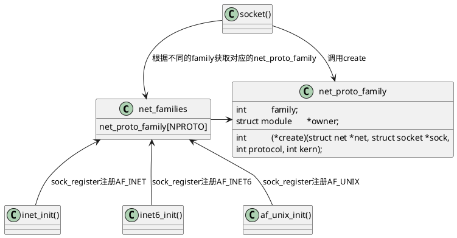

# 一、socket相关系统调用

```cpp
SYSCALL_DEFINE3(socket, int, family, int, type, int, protocol);
SYSCALL_DEFINE4(socketpair, int, family, int, type, int, protocol, int __user *, usockvec);
SYSCALL_DEFINE3(bind, int, fd, struct sockaddr __user *, umyaddr, int, addrlen);
SYSCALL_DEFINE2(listen, int, fd, int, backlog);
SYSCALL_DEFINE4(accept4, int, fd, struct sockaddr __user *, upeer_sockaddr, int __user *, upeer_addrlen, int, flags);
SYSCALL_DEFINE3(accept, int, fd, struct sockaddr __user *, upeer_sockaddr, int __user *, upeer_addrlen);
SYSCALL_DEFINE3(connect, int, fd, struct sockaddr __user *, uservaddr, int, addrlen);
SYSCALL_DEFINE3(getsockname, int, fd, struct sockaddr __user *, usockaddr, int __user *, usockaddr_len);
SYSCALL_DEFINE3(getpeername, int, fd, struct sockaddr __user *, usockaddr, int __user *, usockaddr_len);
SYSCALL_DEFINE6(sendto, int, fd, void __user *, buff, size_t, len, unsigned int, flags, struct sockaddr __user *, addr, int, addr_len);
SYSCALL_DEFINE4(send, int, fd, void __user *, buff, size_t, len, unsigned int, flags);
SYSCALL_DEFINE6(recvfrom, int, fd, void __user *, ubuf, size_t, size, unsigned int, flags, struct sockaddr __user *, addr, int __user *, addr_len);
SYSCALL_DEFINE4(recv, int, fd, void __user *, ubuf, size_t, size, unsigned int, flags);
SYSCALL_DEFINE5(setsockopt, int, fd, int, level, int, optname, char __user *, optval, int, optlen);
SYSCALL_DEFINE5(getsockopt, int, fd, int, level, int, optname, char __user *, optval, int __user *, optlen);
SYSCALL_DEFINE2(shutdown, int, fd, int, how);
SYSCALL_DEFINE3(sendmsg, int, fd, struct user_msghdr __user *, msg, unsigned int, flags);
SYSCALL_DEFINE4(sendmmsg, int, fd, struct mmsghdr __user *, mmsg, unsigned int, vlen, unsigned int, flags);
SYSCALL_DEFINE3(recvmsg, int, fd, struct user_msghdr __user *, msg, unsigned int, flags);
SYSCALL_DEFINE5(recvmmsg, int, fd, struct mmsghdr __user *, mmsg, unsigned int, vlen, unsigned int, flags, struct __kernel_timespec __user *, timeout);
SYSCALL_DEFINE5(recvmmsg_time32, int, fd, struct mmsghdr __user *, mmsg, unsigned int, vlen, unsigned int, flags, struct old_timespec32 __user *, timeout);
SYSCALL_DEFINE2(socketcall, int, call, unsigned long __user *, args);
```

# 二、socket创建过程

- socket创建需要使用family、type和protocol
- 在底层socket可以说相当于一个基类，将底层不同类型封装成统一的接口



## 1. 根据family找到对应的socket家族

- 内部使用rcu维护一个`net_families`的指针数组，每个元素是一个`net_proto_family`结构体

```cpp
// net/socket.c
static const struct net_proto_family __rcu *net_families[NPROTO] __read_mostly;
// include/linux/net.h
struct net_proto_family {
    int		family;
    int		(*create)(struct net *net, struct socket *sock,
                  int protocol, int kern);
    struct module	*owner;
};
```

- `NPROTO`暂时最大为45，后续还会拓展新的家族

```cpp
// include/uapi/linux/net.h
#define NPROTO		AF_MAX
// include/linux/socket.h
#define AF_MAX		46	/* For now.. */
```

- `net_families`由下面两个函数进行维护

```cpp
// net/socket.c
/**
 *	sock_register - add a socket protocol handler
 *	@ops: description of protocol
 *
 *	This function is called by a protocol handler that wants to
 *	advertise its address family, and have it linked into the
 *	socket interface. The value ops->family corresponds to the
 *	socket system call protocol family.
 */
int sock_register(const struct net_proto_family *ops) {
    ...
}
EXPORT_SYMBOL(sock_register);

/**
 *	sock_unregister - remove a protocol handler
 *	@family: protocol family to remove
 *
 *	This function is called by a protocol handler that wants to
 *	remove its address family, and have it unlinked from the
 *	new socket creation.
 *
 *	If protocol handler is a module, then it can use module reference
 *	counts to protect against new references. If protocol handler is not
 *	a module then it needs to provide its own protection in
 *	the ops->create routine.
 */
void sock_unregister(int family) {
    ...
}
EXPORT_SYMBOL(sock_unregister);
```

- 不同的socket家族自己进行注册，比如`AF_INET`、`AF_INET6`、`AF_UNIX`等

```cpp
// net/ipv4/af_inet.c
static int __init inet_init(void) {
    ...
    (void)sock_register(&inet_family_ops);
    ...
}

// net/ipv6/af_inet6.c
static int __init inet6_init(void) {
    ...
    err = sock_register(&inet6_family_ops);
    ...
}

// net/unix/af_unix.c
static int __init af_unix_init(void) {
    ...
    sock_register(&unix_family_ops);
    ...
}
```

- 找到自己的家族后，就调用对应的create函数进行创建socket

```cpp
// net/socket.c
// socket() -call-> __sys_socket() -call-> sock_create() -call-> __sock_create()
int __sock_create(struct net *net, int family, int type, int protocol,
             struct socket **res, int kern) {
    ...
    err = pf->create(net, sock, protocol, kern);
    if (err < 0)
        goto out_module_put;
    ...
}
```

## 2. 创建socket后，创建fd，并将socket和fd绑定

```cpp
// net/socket.c
int __sys_socket(int family, int type, int protocol) {
    ...
    return sock_map_fd(sock, flags & (O_CLOEXEC | O_NONBLOCK));
}
// sock_map_fd() -call-> sock_alloc_file()
struct file *sock_alloc_file(struct socket *sock, int flags, const char *dname) {
    ...
    sock->file = file;
    file->private_data = sock;
    stream_open(SOCK_INODE(sock), file);
    return file;
}
EXPORT_SYMBOL(sock_alloc_file);
```
