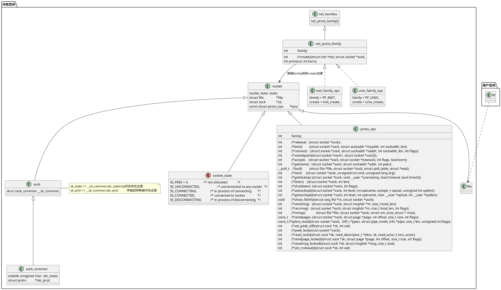
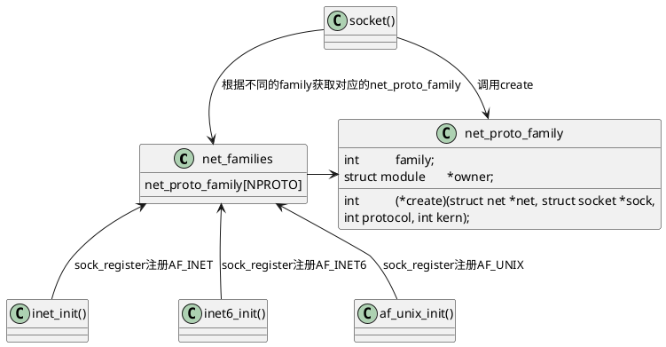

# 一、总述

## 1. 结构体



### 1.1. socket

- `socket_state`仅代表socket自己的状态，和tcp状态图没关系

```cpp
// include/linux/net.h
/**
 *  struct socket - general BSD socket
 *  @state: socket state (%SS_CONNECTED, etc)
 *  @type: socket type (%SOCK_STREAM, etc)
 *  @flags: socket flags (%SOCK_NOSPACE, etc)
 *  @ops: protocol specific socket operations
 *  @file: File back pointer for gc
 *  @sk: internal networking protocol agnostic socket representation
 *  @wq: wait queue for several uses
 */
struct socket {
	socket_state		state;

	short			type;

	unsigned long		flags;

	struct file		*file;
	struct sock		*sk;
	const struct proto_ops	*ops;

	struct socket_wq	wq;
};
```

#### proto_ops

```cpp
// include/linux/net.h
struct proto_ops {
	int		family;
	struct module	*owner;
	int		(*release)   (struct socket *sock);
	int		(*bind)	     (struct socket *sock,
				      struct sockaddr *myaddr,
				      int sockaddr_len);
	int		(*connect)   (struct socket *sock,
				      struct sockaddr *vaddr,
				      int sockaddr_len, int flags);
	int		(*socketpair)(struct socket *sock1,
				      struct socket *sock2);
	int		(*accept)    (struct socket *sock,
				      struct socket *newsock, int flags, bool kern);
	int		(*getname)   (struct socket *sock,
				      struct sockaddr *addr,
				      int peer);
	__poll_t	(*poll)	     (struct file *file, struct socket *sock,
				      struct poll_table_struct *wait);
	int		(*ioctl)     (struct socket *sock, unsigned int cmd,
				      unsigned long arg);
#ifdef CONFIG_COMPAT
	int	 	(*compat_ioctl) (struct socket *sock, unsigned int cmd,
				      unsigned long arg);
#endif
	int		(*gettstamp) (struct socket *sock, void __user *userstamp,
				      bool timeval, bool time32);
	int		(*listen)    (struct socket *sock, int len);
	int		(*shutdown)  (struct socket *sock, int flags);
	int		(*setsockopt)(struct socket *sock, int level,
				      int optname, sockptr_t optval,
				      unsigned int optlen);
	int		(*getsockopt)(struct socket *sock, int level,
				      int optname, char __user *optval, int __user *optlen);
	void		(*show_fdinfo)(struct seq_file *m, struct socket *sock);
	int		(*sendmsg)   (struct socket *sock, struct msghdr *m,
				      size_t total_len);
	/* Notes for implementing recvmsg:
	 * ===============================
	 * msg->msg_namelen should get updated by the recvmsg handlers
	 * iff msg_name != NULL. It is by default 0 to prevent
	 * returning uninitialized memory to user space.  The recvfrom
	 * handlers can assume that msg.msg_name is either NULL or has
	 * a minimum size of sizeof(struct sockaddr_storage).
	 */
	int		(*recvmsg)   (struct socket *sock, struct msghdr *m,
				      size_t total_len, int flags);
	int		(*mmap)	     (struct file *file, struct socket *sock,
				      struct vm_area_struct * vma);
	ssize_t		(*sendpage)  (struct socket *sock, struct page *page,
				      int offset, size_t size, int flags);
	ssize_t 	(*splice_read)(struct socket *sock,  loff_t *ppos,
				       struct pipe_inode_info *pipe, size_t len, unsigned int flags);
	int		(*set_peek_off)(struct sock *sk, int val);
	int		(*peek_len)(struct socket *sock);

	/* The following functions are called internally by kernel with
	 * sock lock already held.
	 */
	int		(*read_sock)(struct sock *sk, read_descriptor_t *desc,
				     sk_read_actor_t recv_actor);
	int		(*sendpage_locked)(struct sock *sk, struct page *page,
					   int offset, size_t size, int flags);
	int		(*sendmsg_locked)(struct sock *sk, struct msghdr *msg,
					  size_t size);
	int		(*set_rcvlowat)(struct sock *sk, int val);
};
```

### 1.2. sock

```cpp
// include/net/sock.h
/**
  *	struct sock - network layer representation of sockets
  *	@__sk_common: shared layout with inet_timewait_sock
  *	@sk_shutdown: mask of %SEND_SHUTDOWN and/or %RCV_SHUTDOWN
  *	@sk_userlocks: %SO_SNDBUF and %SO_RCVBUF settings
  *	@sk_lock:	synchronizer
  *	@sk_kern_sock: True if sock is using kernel lock classes
  *	@sk_rcvbuf: size of receive buffer in bytes
  *	@sk_wq: sock wait queue and async head
  *	@sk_rx_dst: receive input route used by early demux
  *	@sk_rx_dst_ifindex: ifindex for @sk_rx_dst
  *	@sk_rx_dst_cookie: cookie for @sk_rx_dst
  *	@sk_dst_cache: destination cache
  *	@sk_dst_pending_confirm: need to confirm neighbour
  *	@sk_policy: flow policy
  *	@sk_receive_queue: incoming packets
  *	@sk_wmem_alloc: transmit queue bytes committed
  *	@sk_tsq_flags: TCP Small Queues flags
  *	@sk_write_queue: Packet sending queue
  *	@sk_omem_alloc: "o" is "option" or "other"
  *	@sk_wmem_queued: persistent queue size
  *	@sk_forward_alloc: space allocated forward
  *	@sk_reserved_mem: space reserved and non-reclaimable for the socket
  *	@sk_napi_id: id of the last napi context to receive data for sk
  *	@sk_ll_usec: usecs to busypoll when there is no data
  *	@sk_allocation: allocation mode
  *	@sk_pacing_rate: Pacing rate (if supported by transport/packet scheduler)
  *	@sk_pacing_status: Pacing status (requested, handled by sch_fq)
  *	@sk_max_pacing_rate: Maximum pacing rate (%SO_MAX_PACING_RATE)
  *	@sk_sndbuf: size of send buffer in bytes
  *	@__sk_flags_offset: empty field used to determine location of bitfield
  *	@sk_padding: unused element for alignment
  *	@sk_no_check_tx: %SO_NO_CHECK setting, set checksum in TX packets
  *	@sk_no_check_rx: allow zero checksum in RX packets
  *	@sk_route_caps: route capabilities (e.g. %NETIF_F_TSO)
  *	@sk_gso_disabled: if set, NETIF_F_GSO_MASK is forbidden.
  *	@sk_gso_type: GSO type (e.g. %SKB_GSO_TCPV4)
  *	@sk_gso_max_size: Maximum GSO segment size to build
  *	@sk_gso_max_segs: Maximum number of GSO segments
  *	@sk_pacing_shift: scaling factor for TCP Small Queues
  *	@sk_lingertime: %SO_LINGER l_linger setting
  *	@sk_backlog: always used with the per-socket spinlock held
  *	@sk_callback_lock: used with the callbacks in the end of this struct
  *	@sk_error_queue: rarely used
  *	@sk_prot_creator: sk_prot of original sock creator (see ipv6_setsockopt,
  *			  IPV6_ADDRFORM for instance)
  *	@sk_err: last error
  *	@sk_err_soft: errors that don't cause failure but are the cause of a
  *		      persistent failure not just 'timed out'
  *	@sk_drops: raw/udp drops counter
  *	@sk_ack_backlog: current listen backlog
  *	@sk_max_ack_backlog: listen backlog set in listen()
  *	@sk_uid: user id of owner
  *	@sk_prefer_busy_poll: prefer busypolling over softirq processing
  *	@sk_busy_poll_budget: napi processing budget when busypolling
  *	@sk_priority: %SO_PRIORITY setting
  *	@sk_type: socket type (%SOCK_STREAM, etc)
  *	@sk_protocol: which protocol this socket belongs in this network family
  *	@sk_peer_lock: lock protecting @sk_peer_pid and @sk_peer_cred
  *	@sk_peer_pid: &struct pid for this socket's peer
  *	@sk_peer_cred: %SO_PEERCRED setting
  *	@sk_rcvlowat: %SO_RCVLOWAT setting
  *	@sk_rcvtimeo: %SO_RCVTIMEO setting
  *	@sk_sndtimeo: %SO_SNDTIMEO setting
  *	@sk_txhash: computed flow hash for use on transmit
  *	@sk_txrehash: enable TX hash rethink
  *	@sk_filter: socket filtering instructions
  *	@sk_timer: sock cleanup timer
  *	@sk_stamp: time stamp of last packet received
  *	@sk_stamp_seq: lock for accessing sk_stamp on 32 bit architectures only
  *	@sk_tsflags: SO_TIMESTAMPING flags
  *	@sk_bind_phc: SO_TIMESTAMPING bind PHC index of PTP virtual clock
  *	              for timestamping
  *	@sk_tskey: counter to disambiguate concurrent tstamp requests
  *	@sk_zckey: counter to order MSG_ZEROCOPY notifications
  *	@sk_socket: Identd and reporting IO signals
  *	@sk_user_data: RPC layer private data
  *	@sk_frag: cached page frag
  *	@sk_peek_off: current peek_offset value
  *	@sk_send_head: front of stuff to transmit
  *	@tcp_rtx_queue: TCP re-transmit queue [union with @sk_send_head]
  *	@sk_security: used by security modules
  *	@sk_mark: generic packet mark
  *	@sk_cgrp_data: cgroup data for this cgroup
  *	@sk_memcg: this socket's memory cgroup association
  *	@sk_write_pending: a write to stream socket waits to start
  *	@sk_state_change: callback to indicate change in the state of the sock
  *	@sk_data_ready: callback to indicate there is data to be processed
  *	@sk_write_space: callback to indicate there is bf sending space available
  *	@sk_error_report: callback to indicate errors (e.g. %MSG_ERRQUEUE)
  *	@sk_backlog_rcv: callback to process the backlog
  *	@sk_validate_xmit_skb: ptr to an optional validate function
  *	@sk_destruct: called at sock freeing time, i.e. when all refcnt == 0
  *	@sk_reuseport_cb: reuseport group container
  *	@sk_bpf_storage: ptr to cache and control for bpf_sk_storage
  *	@sk_rcu: used during RCU grace period
  *	@sk_clockid: clockid used by time-based scheduling (SO_TXTIME)
  *	@sk_txtime_deadline_mode: set deadline mode for SO_TXTIME
  *	@sk_txtime_report_errors: set report errors mode for SO_TXTIME
  *	@sk_txtime_unused: unused txtime flags
  *	@ns_tracker: tracker for netns reference
  */
struct sock {
	/*
	 * Now struct inet_timewait_sock also uses sock_common, so please just
	 * don't add nothing before this first member (__sk_common) --acme
	 */
	struct sock_common	__sk_common;
#define sk_node			__sk_common.skc_node
#define sk_nulls_node		__sk_common.skc_nulls_node
#define sk_refcnt		__sk_common.skc_refcnt
#define sk_tx_queue_mapping	__sk_common.skc_tx_queue_mapping
#ifdef CONFIG_SOCK_RX_QUEUE_MAPPING
#define sk_rx_queue_mapping	__sk_common.skc_rx_queue_mapping
#endif

#define sk_dontcopy_begin	__sk_common.skc_dontcopy_begin
#define sk_dontcopy_end		__sk_common.skc_dontcopy_end
#define sk_hash			__sk_common.skc_hash
#define sk_portpair		__sk_common.skc_portpair
#define sk_num			__sk_common.skc_num
#define sk_dport		__sk_common.skc_dport
#define sk_addrpair		__sk_common.skc_addrpair
#define sk_daddr		__sk_common.skc_daddr
#define sk_rcv_saddr		__sk_common.skc_rcv_saddr
#define sk_family		__sk_common.skc_family
#define sk_state		__sk_common.skc_state
#define sk_reuse		__sk_common.skc_reuse
#define sk_reuseport		__sk_common.skc_reuseport
#define sk_ipv6only		__sk_common.skc_ipv6only
#define sk_net_refcnt		__sk_common.skc_net_refcnt
#define sk_bound_dev_if		__sk_common.skc_bound_dev_if
#define sk_bind_node		__sk_common.skc_bind_node
#define sk_prot			__sk_common.skc_prot
#define sk_net			__sk_common.skc_net
#define sk_v6_daddr		__sk_common.skc_v6_daddr
#define sk_v6_rcv_saddr	__sk_common.skc_v6_rcv_saddr
#define sk_cookie		__sk_common.skc_cookie
#define sk_incoming_cpu		__sk_common.skc_incoming_cpu
#define sk_flags		__sk_common.skc_flags
#define sk_rxhash		__sk_common.skc_rxhash

	/* early demux fields */
	struct dst_entry __rcu	*sk_rx_dst;
	int			sk_rx_dst_ifindex;
	u32			sk_rx_dst_cookie;

	socket_lock_t		sk_lock;
	atomic_t		sk_drops;
	int			sk_rcvlowat;
	struct sk_buff_head	sk_error_queue;
	struct sk_buff_head	sk_receive_queue;
	/*
	 * The backlog queue is special, it is always used with
	 * the per-socket spinlock held and requires low latency
	 * access. Therefore we special case it's implementation.
	 * Note : rmem_alloc is in this structure to fill a hole
	 * on 64bit arches, not because its logically part of
	 * backlog.
	 */
	struct {
		atomic_t	rmem_alloc;
		int		len;
		struct sk_buff	*head;
		struct sk_buff	*tail;
	} sk_backlog;

#define sk_rmem_alloc sk_backlog.rmem_alloc

	int			sk_forward_alloc;
	u32			sk_reserved_mem;
#ifdef CONFIG_NET_RX_BUSY_POLL
	unsigned int		sk_ll_usec;
	/* ===== mostly read cache line ===== */
	unsigned int		sk_napi_id;
#endif
	int			sk_rcvbuf;

	struct sk_filter __rcu	*sk_filter;
	union {
		struct socket_wq __rcu	*sk_wq;
		/* private: */
		struct socket_wq	*sk_wq_raw;
		/* public: */
	};
#ifdef CONFIG_XFRM
	struct xfrm_policy __rcu *sk_policy[2];
#endif

	struct dst_entry __rcu	*sk_dst_cache;
	atomic_t		sk_omem_alloc;
	int			sk_sndbuf;

	/* ===== cache line for TX ===== */
	int			sk_wmem_queued;
	refcount_t		sk_wmem_alloc;
	unsigned long		sk_tsq_flags;
	union {
		struct sk_buff	*sk_send_head;
		struct rb_root	tcp_rtx_queue;
	};
	struct sk_buff_head	sk_write_queue;
	__s32			sk_peek_off;
	int			sk_write_pending;
	__u32			sk_dst_pending_confirm;
	u32			sk_pacing_status; /* see enum sk_pacing */
	long			sk_sndtimeo;
	struct timer_list	sk_timer;
	__u32			sk_priority;
	__u32			sk_mark;
	unsigned long		sk_pacing_rate; /* bytes per second */
	unsigned long		sk_max_pacing_rate;
	struct page_frag	sk_frag;
	netdev_features_t	sk_route_caps;
	int			sk_gso_type;
	unsigned int		sk_gso_max_size;
	gfp_t			sk_allocation;
	__u32			sk_txhash;

	/*
	 * Because of non atomicity rules, all
	 * changes are protected by socket lock.
	 */
	u8			sk_gso_disabled : 1,
				sk_kern_sock : 1,
				sk_no_check_tx : 1,
				sk_no_check_rx : 1,
				sk_userlocks : 4;
	u8			sk_pacing_shift;
	u16			sk_type;
	u16			sk_protocol;
	u16			sk_gso_max_segs;
	unsigned long	        sk_lingertime;
	struct proto		*sk_prot_creator;
	rwlock_t		sk_callback_lock;
	int			sk_err,
				sk_err_soft;
	u32			sk_ack_backlog;
	u32			sk_max_ack_backlog;
	kuid_t			sk_uid;
	u8			sk_txrehash;
#ifdef CONFIG_NET_RX_BUSY_POLL
	u8			sk_prefer_busy_poll;
	u16			sk_busy_poll_budget;
#endif
	spinlock_t		sk_peer_lock;
	int			sk_bind_phc;
	struct pid		*sk_peer_pid;
	const struct cred	*sk_peer_cred;

	long			sk_rcvtimeo;
	ktime_t			sk_stamp;
#if BITS_PER_LONG==32
	seqlock_t		sk_stamp_seq;
#endif
	u16			sk_tsflags;
	u8			sk_shutdown;
	atomic_t		sk_tskey;
	atomic_t		sk_zckey;

	u8			sk_clockid;
	u8			sk_txtime_deadline_mode : 1,
				sk_txtime_report_errors : 1,
				sk_txtime_unused : 6;

	struct socket		*sk_socket;
	void			*sk_user_data;
#ifdef CONFIG_SECURITY
	void			*sk_security;
#endif
	struct sock_cgroup_data	sk_cgrp_data;
	struct mem_cgroup	*sk_memcg;
	void			(*sk_state_change)(struct sock *sk);
	void			(*sk_data_ready)(struct sock *sk);
	void			(*sk_write_space)(struct sock *sk);
	void			(*sk_error_report)(struct sock *sk);
	int			(*sk_backlog_rcv)(struct sock *sk,
						  struct sk_buff *skb);
#ifdef CONFIG_SOCK_VALIDATE_XMIT
	struct sk_buff*		(*sk_validate_xmit_skb)(struct sock *sk,
							struct net_device *dev,
							struct sk_buff *skb);
#endif
	void                    (*sk_destruct)(struct sock *sk);
	struct sock_reuseport __rcu	*sk_reuseport_cb;
#ifdef CONFIG_BPF_SYSCALL
	struct bpf_local_storage __rcu	*sk_bpf_storage;
#endif
	struct rcu_head		sk_rcu;
	netns_tracker		ns_tracker;
};
```

#### sock_common

```cpp
// include/net/sock.h
/**
 *	struct sock_common - minimal network layer representation of sockets
 *	@skc_daddr: Foreign IPv4 addr
 *	@skc_rcv_saddr: Bound local IPv4 addr
 *	@skc_addrpair: 8-byte-aligned __u64 union of @skc_daddr & @skc_rcv_saddr
 *	@skc_hash: hash value used with various protocol lookup tables
 *	@skc_u16hashes: two u16 hash values used by UDP lookup tables
 *	@skc_dport: placeholder for inet_dport/tw_dport
 *	@skc_num: placeholder for inet_num/tw_num
 *	@skc_portpair: __u32 union of @skc_dport & @skc_num
 *	@skc_family: network address family
 *	@skc_state: Connection state
 *	@skc_reuse: %SO_REUSEADDR setting
 *	@skc_reuseport: %SO_REUSEPORT setting
 *	@skc_ipv6only: socket is IPV6 only
 *	@skc_net_refcnt: socket is using net ref counting
 *	@skc_bound_dev_if: bound device index if != 0
 *	@skc_bind_node: bind hash linkage for various protocol lookup tables
 *	@skc_portaddr_node: second hash linkage for UDP/UDP-Lite protocol
 *	@skc_prot: protocol handlers inside a network family
 *	@skc_net: reference to the network namespace of this socket
 *	@skc_v6_daddr: IPV6 destination address
 *	@skc_v6_rcv_saddr: IPV6 source address
 *	@skc_cookie: socket's cookie value
 *	@skc_node: main hash linkage for various protocol lookup tables
 *	@skc_nulls_node: main hash linkage for TCP/UDP/UDP-Lite protocol
 *	@skc_tx_queue_mapping: tx queue number for this connection
 *	@skc_rx_queue_mapping: rx queue number for this connection
 *	@skc_flags: place holder for sk_flags
 *		%SO_LINGER (l_onoff), %SO_BROADCAST, %SO_KEEPALIVE,
 *		%SO_OOBINLINE settings, %SO_TIMESTAMPING settings
 *	@skc_listener: connection request listener socket (aka rsk_listener)
 *		[union with @skc_flags]
 *	@skc_tw_dr: (aka tw_dr) ptr to &struct inet_timewait_death_row
 *		[union with @skc_flags]
 *	@skc_incoming_cpu: record/match cpu processing incoming packets
 *	@skc_rcv_wnd: (aka rsk_rcv_wnd) TCP receive window size (possibly scaled)
 *		[union with @skc_incoming_cpu]
 *	@skc_tw_rcv_nxt: (aka tw_rcv_nxt) TCP window next expected seq number
 *		[union with @skc_incoming_cpu]
 *	@skc_refcnt: reference count
 *
 *	This is the minimal network layer representation of sockets, the header
 *	for struct sock and struct inet_timewait_sock.
 */
struct sock_common {
	union {
		__addrpair	skc_addrpair;
		struct {
			__be32	skc_daddr;
			__be32	skc_rcv_saddr;
		};
	};
	union  {
		unsigned int	skc_hash;
		__u16		skc_u16hashes[2];
	};
	/* skc_dport && skc_num must be grouped as well */
	union {
		__portpair	skc_portpair;
		struct {
			__be16	skc_dport;
			__u16	skc_num;
		};
	};

	unsigned short		skc_family;
	volatile unsigned char	skc_state;
	unsigned char		skc_reuse:4;
	unsigned char		skc_reuseport:1;
	unsigned char		skc_ipv6only:1;
	unsigned char		skc_net_refcnt:1;
	int			skc_bound_dev_if;
	union {
		struct hlist_node	skc_bind_node;
		struct hlist_node	skc_portaddr_node;
	};
	struct proto		*skc_prot;
	possible_net_t		skc_net;

#if IS_ENABLED(CONFIG_IPV6)
	struct in6_addr		skc_v6_daddr;
	struct in6_addr		skc_v6_rcv_saddr;
#endif

	atomic64_t		skc_cookie;

	/* following fields are padding to force
	 * offset(struct sock, sk_refcnt) == 128 on 64bit arches
	 * assuming IPV6 is enabled. We use this padding differently
	 * for different kind of 'sockets'
	 */
	union {
		unsigned long	skc_flags;
		struct sock	*skc_listener; /* request_sock */
		struct inet_timewait_death_row *skc_tw_dr; /* inet_timewait_sock */
	};
	/*
	 * fields between dontcopy_begin/dontcopy_end
	 * are not copied in sock_copy()
	 */
	/* private: */
	int			skc_dontcopy_begin[0];
	/* public: */
	union {
		struct hlist_node	skc_node;
		struct hlist_nulls_node skc_nulls_node;
	};
	unsigned short		skc_tx_queue_mapping;
#ifdef CONFIG_SOCK_RX_QUEUE_MAPPING
	unsigned short		skc_rx_queue_mapping;
#endif
	union {
		int		skc_incoming_cpu;
		u32		skc_rcv_wnd;
		u32		skc_tw_rcv_nxt; /* struct tcp_timewait_sock  */
	};

	refcount_t		skc_refcnt;
	/* private: */
	int                     skc_dontcopy_end[0];
	union {
		u32		skc_rxhash;
		u32		skc_window_clamp;
		u32		skc_tw_snd_nxt; /* struct tcp_timewait_sock */
	};
	/* public: */
};
```

## 2. 相关系统调用

```cpp
SYSCALL_DEFINE3(socket, int, family, int, type, int, protocol);
SYSCALL_DEFINE4(socketpair, int, family, int, type, int, protocol, int __user *, usockvec);
SYSCALL_DEFINE3(bind, int, fd, struct sockaddr __user *, umyaddr, int, addrlen);
SYSCALL_DEFINE2(listen, int, fd, int, backlog);
SYSCALL_DEFINE4(accept4, int, fd, struct sockaddr __user *, upeer_sockaddr, int __user *, upeer_addrlen, int, flags);
SYSCALL_DEFINE3(accept, int, fd, struct sockaddr __user *, upeer_sockaddr, int __user *, upeer_addrlen);
SYSCALL_DEFINE3(connect, int, fd, struct sockaddr __user *, uservaddr, int, addrlen);
SYSCALL_DEFINE3(getsockname, int, fd, struct sockaddr __user *, usockaddr, int __user *, usockaddr_len);
SYSCALL_DEFINE3(getpeername, int, fd, struct sockaddr __user *, usockaddr, int __user *, usockaddr_len);
SYSCALL_DEFINE6(sendto, int, fd, void __user *, buff, size_t, len, unsigned int, flags, struct sockaddr __user *, addr, int, addr_len);
SYSCALL_DEFINE4(send, int, fd, void __user *, buff, size_t, len, unsigned int, flags);
SYSCALL_DEFINE6(recvfrom, int, fd, void __user *, ubuf, size_t, size, unsigned int, flags, struct sockaddr __user *, addr, int __user *, addr_len);
SYSCALL_DEFINE4(recv, int, fd, void __user *, ubuf, size_t, size, unsigned int, flags);
SYSCALL_DEFINE5(setsockopt, int, fd, int, level, int, optname, char __user *, optval, int, optlen);
SYSCALL_DEFINE5(getsockopt, int, fd, int, level, int, optname, char __user *, optval, int __user *, optlen);
SYSCALL_DEFINE2(shutdown, int, fd, int, how);
SYSCALL_DEFINE3(sendmsg, int, fd, struct user_msghdr __user *, msg, unsigned int, flags);
SYSCALL_DEFINE4(sendmmsg, int, fd, struct mmsghdr __user *, mmsg, unsigned int, vlen, unsigned int, flags);
SYSCALL_DEFINE3(recvmsg, int, fd, struct user_msghdr __user *, msg, unsigned int, flags);
SYSCALL_DEFINE5(recvmmsg, int, fd, struct mmsghdr __user *, mmsg, unsigned int, vlen, unsigned int, flags, struct __kernel_timespec __user *, timeout);
SYSCALL_DEFINE5(recvmmsg_time32, int, fd, struct mmsghdr __user *, mmsg, unsigned int, vlen, unsigned int, flags, struct old_timespec32 __user *, timeout);
SYSCALL_DEFINE2(socketcall, int, call, unsigned long __user *, args);
```

# 二、socket创建过程

- socket创建需要使用family、type和protocol
- 在底层socket可以说相当于一个基类，将底层不同类型封装成统一的接口



## 1. 根据family找到对应的socket家族

- 内部使用rcu维护一个`net_families`的指针数组，每个元素是一个`net_proto_family`结构体

```cpp
// net/socket.c
static const struct net_proto_family __rcu *net_families[NPROTO] __read_mostly;
// include/linux/net.h
struct net_proto_family {
    int		family;
    int		(*create)(struct net *net, struct socket *sock,
                  int protocol, int kern);
    struct module	*owner;
};
```

- `NPROTO`暂时最大为45，后续还会拓展新的家族

```cpp
// include/uapi/linux/net.h
#define NPROTO		AF_MAX
// include/linux/socket.h
#define AF_MAX		46	/* For now.. */
```

- `net_families`由下面两个函数进行维护

```cpp
// net/socket.c
/**
 *	sock_register - add a socket protocol handler
 *	@ops: description of protocol
 *
 *	This function is called by a protocol handler that wants to
 *	advertise its address family, and have it linked into the
 *	socket interface. The value ops->family corresponds to the
 *	socket system call protocol family.
 */
int sock_register(const struct net_proto_family *ops) {
    ...
}
EXPORT_SYMBOL(sock_register);

/**
 *	sock_unregister - remove a protocol handler
 *	@family: protocol family to remove
 *
 *	This function is called by a protocol handler that wants to
 *	remove its address family, and have it unlinked from the
 *	new socket creation.
 *
 *	If protocol handler is a module, then it can use module reference
 *	counts to protect against new references. If protocol handler is not
 *	a module then it needs to provide its own protection in
 *	the ops->create routine.
 */
void sock_unregister(int family) {
    ...
}
EXPORT_SYMBOL(sock_unregister);
```

- 不同的socket家族自己进行注册，比如`AF_INET`、`AF_INET6`、`AF_UNIX`等

```cpp
// net/ipv4/af_inet.c
static int __init inet_init(void) {
    ...
    (void)sock_register(&inet_family_ops);
    ...
}

// net/ipv6/af_inet6.c
static int __init inet6_init(void) {
    ...
    err = sock_register(&inet6_family_ops);
    ...
}

// net/unix/af_unix.c
static int __init af_unix_init(void) {
    ...
    sock_register(&unix_family_ops);
    ...
}
```

- 找到自己的家族后，就调用对应的create函数进行创建socket

```cpp
// net/socket.c
// socket() -call-> __sys_socket() -call-> sock_create() -call-> __sock_create()
int __sock_create(struct net *net, int family, int type, int protocol,
             struct socket **res, int kern) {
    ...
    // 使用rcu锁锁定net_families结构体，取对应家族的pf结构体
    rcu_read_lock();
	pf = rcu_dereference(net_families[family]);
	err = -EAFNOSUPPORT;
	if (!pf)
		goto out_release;

	/*
	 * We will call the ->create function, that possibly is in a loadable
	 * module, so we have to bump that loadable module refcnt first.
	 */
	if (!try_module_get(pf->owner))
		goto out_release;

	/* Now protected by module ref count */
	rcu_read_unlock();

    // 调用对应的create函数创建
    err = pf->create(net, sock, protocol, kern);
    if (err < 0)
        goto out_module_put;
    ...
}
```

- ipv4的create调用`inet_create`，查看 [ipv4创建socket](/docs/linux-kernel/net/ipv4/ipv4/#1-inet_create-socket%E5%88%9B%E5%BB%BA)
- unix看 [unix创建socket](/docs/linux-kernel/net/unix/unix/#%E4%B8%80socket%E5%88%9B%E5%BB%BA)

## 2. 创建socket后，创建fd，并将socket和fd绑定

- 设置file的操作集为`socket_file_ops`

```cpp
// net/socket.c
int __sys_socket(int family, int type, int protocol) {
    ...
    return sock_map_fd(sock, flags & (O_CLOEXEC | O_NONBLOCK));
}

// net/socket.c
// sock_map_fd() -call-> sock_alloc_file()
/**
 *	sock_alloc_file - Bind a &socket to a &file
 *	@sock: socket
 *	@flags: file status flags
 *	@dname: protocol name
 *
 *	Returns the &file bound with @sock, implicitly storing it
 *	in sock->file. If dname is %NULL, sets to "".
 *	On failure the return is a ERR pointer (see linux/err.h).
 *	This function uses GFP_KERNEL internally.
 */
struct file *sock_alloc_file(struct socket *sock, int flags, const char *dname) {
	struct file *file;

	if (!dname)
		dname = sock->sk ? sock->sk->sk_prot_creator->name : "";

	file = alloc_file_pseudo(SOCK_INODE(sock), sock_mnt, dname,
				O_RDWR | (flags & O_NONBLOCK),
				&socket_file_ops);
	if (IS_ERR(file)) {
		sock_release(sock);
		return file;
	}

	sock->file = file;
	file->private_data = sock;
	stream_open(SOCK_INODE(sock), file);
	return file;
}
EXPORT_SYMBOL(sock_alloc_file);
```

# 三、socket唤醒操作

- init时注册data_ready函数

```cpp
// net/core/sock.c
void sock_init_data(struct socket *sock, struct sock *sk)
{
    ...
	sk->sk_state_change	=	sock_def_wakeup;
	sk->sk_data_ready	=	sock_def_readable;      // 注册可读函数，当有数据时调用
	sk->sk_write_space	=	sock_def_write_space;
	sk->sk_error_report	=	sock_def_error_report;
	sk->sk_destruct		=	sock_def_destruct;
    ...
}
EXPORT_SYMBOL(sock_init_data);

// net/core/sock.c
void sock_def_readable(struct sock *sk)
{
	struct socket_wq *wq;

	rcu_read_lock();
	wq = rcu_dereference(sk->sk_wq);
    // 唤醒队列上的线程
	if (skwq_has_sleeper(wq))
		wake_up_interruptible_sync_poll(&wq->wait, EPOLLIN | EPOLLPRI |
						EPOLLRDNORM | EPOLLRDBAND);
	sk_wake_async(sk, SOCK_WAKE_WAITD, POLL_IN);
	rcu_read_unlock();
}
```

- 各自协议内部有数据后进行调用

# 四、bind 绑定地址

- 端口传0会自动分配一个没有占用的端口给socket

## 1. 系统调用定义

```cpp
// net/socket.c
/*
 *	Bind a name to a socket. Nothing much to do here since it's
 *	the protocol's responsibility to handle the local address.
 *
 *	We move the socket address to kernel space before we call
 *	the protocol layer (having also checked the address is ok).
 */

int __sys_bind(int fd, struct sockaddr __user *umyaddr, int addrlen)
{
	struct socket *sock;
	struct sockaddr_storage address;
	int err, fput_needed;

	// fd找socket结构体
	sock = sockfd_lookup_light(fd, &err, &fput_needed);
	if (sock) {
		// 地址拷贝到内核空间
		err = move_addr_to_kernel(umyaddr, addrlen, &address);
		if (!err) {
			err = security_socket_bind(sock,
						   (struct sockaddr *)&address,
						   addrlen);
			if (!err)
				// 调用真正的bind函数
				err = sock->ops->bind(sock,
						      (struct sockaddr *)
						      &address, addrlen);
		}
		fput_light(sock->file, fput_needed);
	}
	return err;
}

SYSCALL_DEFINE3(bind, int, fd, struct sockaddr __user *, umyaddr, int, addrlen)
{
	return __sys_bind(fd, umyaddr, addrlen);
}
```

- 调用ops中的bind，ops在各个协议内部进行设置
- ipv4的tcp看 [tcp处理bind]()

# 五、listen 监听

## 1. 系统调用

```cpp
/*
 *	Perform a listen. Basically, we allow the protocol to do anything
 *	necessary for a listen, and if that works, we mark the socket as
 *	ready for listening.
 */

int __sys_listen(int fd, int backlog)
{
	struct socket *sock;
	int err, fput_needed;
	int somaxconn;

	sock = sockfd_lookup_light(fd, &err, &fput_needed);
	if (sock) {
		somaxconn = sock_net(sock->sk)->core.sysctl_somaxconn;
		if ((unsigned int)backlog > somaxconn)
			backlog = somaxconn;

		err = security_socket_listen(sock, backlog);
		if (!err)
			err = sock->ops->listen(sock, backlog);

		fput_light(sock->file, fput_needed);
	}
	return err;
}

SYSCALL_DEFINE2(listen, int, fd, int, backlog)
{
	return __sys_listen(fd, backlog);
}
```

- `sock->ops->listen`调用到具体的 [ipv4调用inet_listen](/docs/linux-kernel/net/ipv4/ipv4/#3-listen) 、 [unix]() 、 [ipv6]()
