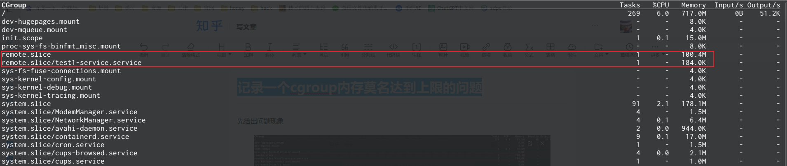
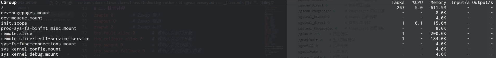

# 一、问题现象

原始问题是ssh服务，这里简化复现出问题现象



发现remote.slice下面的服务并没有占用这么高的内存，却remote.slice占用达到100MB

# 二、排查过程

查看remote.slice的内存占用情况

```shell
=> cat /sys/fs/cgroup/remote.slice/memory.stat
anon 106496         # 匿名内存
file 104857600      # 文件内存
kernel 356352       # 内核内存
kernel_stack 0      # 内核栈内存
pagetables 57344    # 页表内存
sec_pagetables 0    # 备用页表内存
percpu 24288        # 每个 CPU 的内存
sock 0              # 套接字内存
vmalloc 0           # 虚拟内存分配
shmem 104857600     # 共享内存
zswap 0             # Zswap 内存
zswapped 0          # Zswap 交换内存
file_mapped 0       # 映射文件内存
file_dirty 0        # 脏文件内存
file_writeback 0    # 写回文件内存
swapcached 0        # 交换缓存内存
anon_thp 0          # 匿名透明大页内存
file_thp 0          # 文件透明大页内存
shmem_thp 0         # 共享内存透明大页内存
inactive_anon 0         # 非活动匿名内存
active_anon 104964096   # 活动匿名内存
inactive_file 0         # 非活动文件内存
active_file 0       # 活动文件内存
unevictable 0       # 不可驱逐内存
slab_reclaimable 244224     # 可回收的 slab 内存
slab_unreclaimable 14216    # 不可回收的 slab 内存
slab 258440                 # 总 slab 内存
workingset_refault_anon 0   # 工作集引用错误（匿名）
workingset_refault_file 0   # 工作集引用错误（文件）
workingset_activate_anon 0  # 工作集激活（匿名）
workingset_activate_file 0  # 工作集激活（文件）
workingset_restore_anon 0   # 工作集恢复（匿名）
workingset_restore_file 0   # 工作集恢复（文件）
workingset_nodereclaim 0    # 工作集未回收
pgscan 0                # 页面扫描
pgsteal 0               # 页面偷取
pgscan_kswapd 0         # kswapd 页面扫描
pgscan_direct 0         # 直接页面扫描
pgscan_khugepaged 0     # khugepaged 页面扫描
pgsteal_kswapd 0        # kswapd 页面偷取
pgsteal_direct 0        # 直接页面偷取
pgsteal_khugepaged 0    # khugepaged 页面偷取
pgfault 775     # 页面错误
pgmajfault 0    # 重大页面错误
pgrefill 0      # 页面补充
pgactivate 0    # 页面激活
pgdeactivate 0  # 页面停用
pglazyfree 0    # 懒惰释放页面
pglazyfreed 0   # 已懒惰释放页面
zswpin 0        # Zswap 输入
zswpout 0       # Zswap 输出
zswpwb 0        # Zswap 写回
thp_fault_alloc 0       # 透明大页故障分配
thp_collapse_alloc 0    # 透明大页合并分配
thp_swpout 0            # 透明大页交换输出
thp_swpout_fallback 0   # 透明大页交换输出回退
```

看到file占用很高，且共享内存占用很高，差不多100MB。那么问题就是出现在这里，但是进程没有在了为什么file占用会这么高。

经过大佬提点，知道了，如果在内存目录下创建了文件，那么此文件占用的内存会属于这个进程，也就是属于这个cgroup。查找内存目录下的文件，找到这个100MB的文件（自己构造的）

```shell
=> ls -lh /run/test.img
-rw-r--r-- 1 root root 100M Dec  4 15:39 /run/test.img
=> df -h /run
Filesystem      Size  Used Avail Use% Mounted on
tmpfs           392M  102M  291M  26% /run
```

另一个构造的服务的实现

```shell
#!/bin/bash

dd if=/dev/zero of=/run/test.img bs=10240 count=10240
```

将这个文件移除，remote.slice的内存就立马下降了



# 三、总结知识点

如果一个进程在tmpfs创建了文件，所占用的内存是属于这个进程的，同时也属于这个cgroup。如果进程退出后，这个文件没有删除，则会直接占用cgroup的内存空间，并且不好找。
