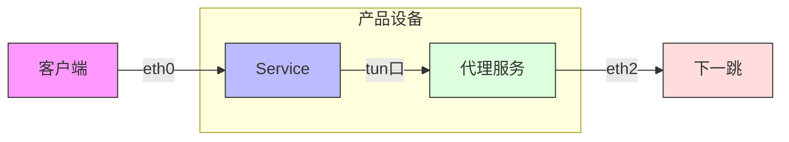

# 0x01 背景

新做了一个网络链路代理方案，测试结果发现大包吞吐比原方案下降了40%。理论上应该更加快才对，需要启动排查

```mermaid
flowchart LR
    Client[客户端] -->|eth0| App[Service]
    subgraph 产品设备
    App -->|tun口| Proxy[代理服务]
    end
    Proxy -->|eth2| NextHop[下一跳]

    style Client fill:#f9f,stroke:#333
    style App fill:#bbf,stroke:#333
    style Proxy fill:#dfd,stroke:#333
    style NextHop fill:#fdd,stroke:#333
```

