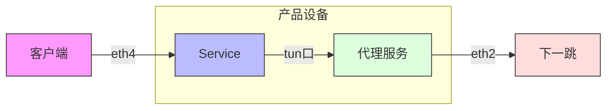
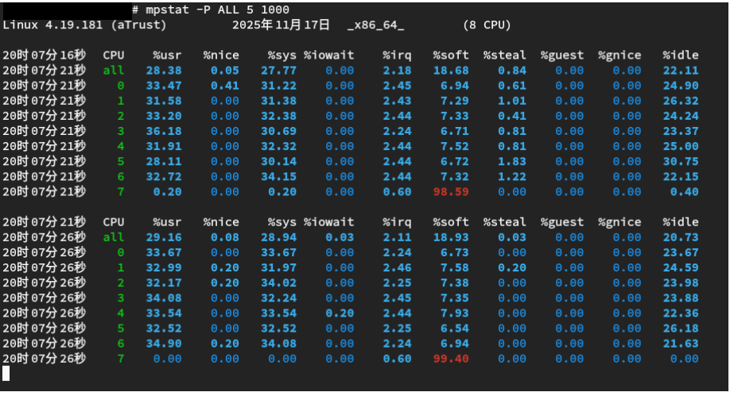
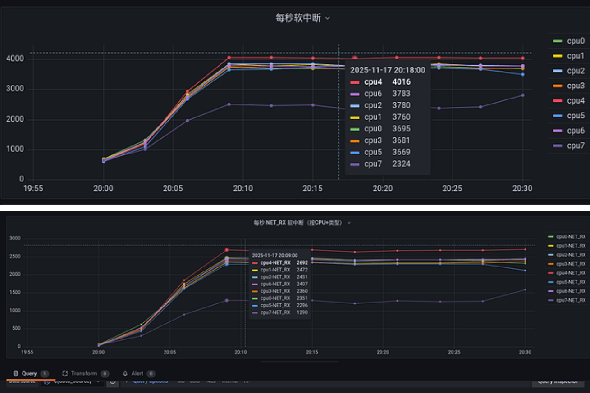
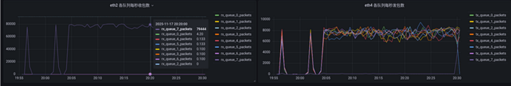

# 0x01 背景

新做了一个网络链路代理方案，测试结果发现大包吞吐比原方案下降了40%。理论上应该更加快才对，需要进行排查



# 0x02 排查

首先进行推测，下行流量打不上去，是不是cpu到达瓶颈。但是提升了设备的规格之后，cpu从4c加到8c，并没有明显的提升，各个服务进程的cpu也没有吃满。那么做以下初步推测

1. 【排除】代理服务网卡接受到达带宽瓶颈
    - 老服务可以打上去，这里排除
2. 代理服务本身处理包到达瓶颈
3. 【排除】tun口到达瓶颈
    - tun口至少1000Mbps，也就是大概100MByte/s，当前仅30MByte/s，肯定没有到瓶颈
4. 应用服务处理到达瓶颈
5. 【排除】到客户端的eth0到达瓶颈
    - 老链路可以，这里排除
6. 【排除】客户端本身处理到达瓶颈
    - 老链路可以，这里排除

有了这些猜测，先查看top命令情况，发现`ksoftirqd/7`的占用很高，但是GRE隧道的这个进程占用同样很高，这里暂时记录一下。然后查看netstat情况，查看是否有队列堆积，基于代理服务监听的端口来看

```shell
# -u 代理服务监听udp端口，所以只查看udp的
# -p 查看进程
# -n 不解析端口
# -l 列出来所有listen的
=> sudo netstat -lupn
Active Internet connections (only servers)
Proto Recv-Q Send-Q Local Address           Foreign Address         State       PID/Program name
udp        0      0 192.168.122.1:53        0.0.0.0:*                           1235/dnsmasq
udp        0      0 127.0.0.53:53           0.0.0.0:*                           726/systemd-resolve
udp        0      0 0.0.0.0:67              0.0.0.0:*                           1235/dnsmasq
udp6       0      0 :::5353                 :::*                                759/avahi-daemon: r
udp6       0      0 :::46720                :::*                                759/avahi-daemon: r
udp6       0      0 :::30600                :::*                                12354/proxy-svr
udp6  520192      0 :::30601                :::*                                12355/proxy-svr
```

可以看到最后一行，我们的代理服务接受队列满了，说明代理服务处理收包处理不过来。到这里结束了吗，并没有，因为代理服务的cpu并没有打满，说明这里还有隐情。

我们再用mpstat看一下各个CPU的具体占用



可以看到只有7号cpu的soft被打满了，这个代表的是软中断占用cpu是最多的，而且只有7号cpu。软中断占用最多，是不是网卡收包的软中断全部打到一个cpu上导致的呢，不太可能吧，这个设备启用了网卡多队列的，应该是平均收包才对。我们看看实际软中断在各个CPU的分布情况

```
说明：/proc/softirqs代表cpu的软中断数量，但是是累积值，在生产设备上我们定期采集做差值显示单位时间内的数量
```



可以看到，每个cpu的软中断分布十分均匀，但是cpu7的软中断反而是最少的。为什么软中断仅在cpu7上分布不均衡？我们看看每个网卡的情况

TODO 补充说明怎么看的



因为是下行流量上不去，所以看eth2的收包和eth4的发包。这里发现eth2是有多队列的，但是只有一个队列在收包，这个就是问题所在了，当然收包处理不过来也是一个问题。

为什么只有一个队列在收包呢？这个就要回归业务了，从下一跳到代理服务回包是包装了一层，所以5元组都是一样的。而网卡划分队列是按照5元组计算哈希选的，导致所有包都打到一个队列里面去。而这个队列又处理不过来导致性能上不去。

# 0x03 结论

到这里就已经发现了根本原因

- 因为5元组一样，下行队列达到一个队列，只有一个队列消费者处理不过来导致上限上不去

那么改动就比较简单了，多搞几个5元组，也就是多监听几个端口，让下一跳回包可以均匀分布在多个队列里面，同时让消费者也多了几个处理协程消费速度大幅提升。
