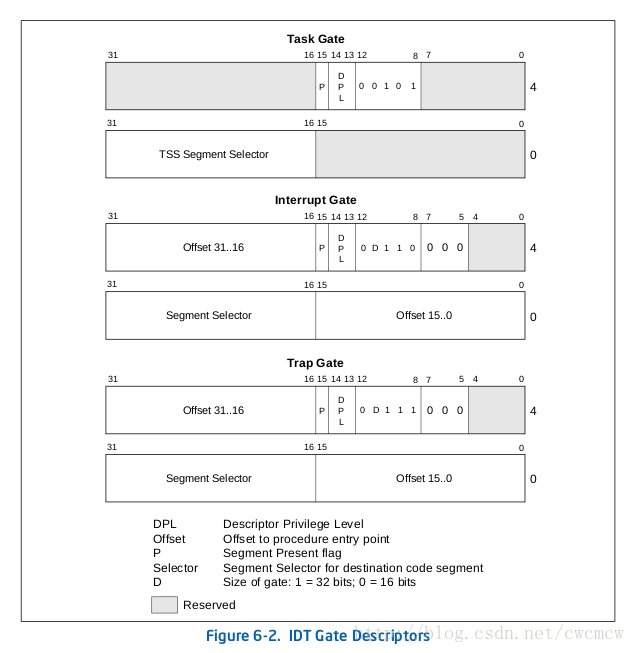
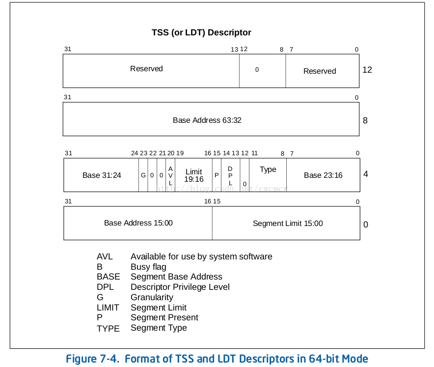

# 介绍

- GDT，IDT都是全局的。LDT是局部的（在GDT中有它的描述符）
- GDT用来存储描述符（门或非门）；系统中几个CPU,就有几个GDT
- IDT整个系统只有一个
- 系统启动时候需要初始化GDT和IDT。LDT和进程相关，并不一定必有
- TSS: Task-State Segment，任务状态段，保存任务状态信息的系统段
- TSS只能存在于GDT中
- Task-Gate Descriptor，任务门描述符，用来间接的宝玉引用任务。可以放到GDT、LDT、IDT中，里面的TSS段选择指向GDT的TSS描述符

## 1. 相关结构的cpu手册

- IDT结构



- 下图为32位TSS结构


- 下图为64位TSS或LDT结构



# 一、数据结构

## GDT&IDT

```cpp
// arch/x86/include/asm/desc_defs.h
// gdt结构
/* 8 byte segment descriptor */
struct desc_struct {
    u16 limit0;         // 段管理的内存上限low
    u16 base0;          // 段的对应的内存实际地址low
    u16 base1 : 8;      // 段的对应的内存实际地址mid
    u16 type : 4;
    u16 s : 1;          // 系统段为1，普通段为0
    u16 dpl : 2;
    u16 p : 1;
    u16 limit1 : 4;     // 段管理的内存上限low
    u16 avl : 1;
    u16 l : 1;
    u16 d : 1;
    u16 g : 1;          // 为1就是4K为单位定义上限（上限1，管理内存4K），为0则以一个字节为单位
    u16 base2 : 8;      // 段的对应的内存实际地址high
} __attribute__((packed));

#define GDT_ENTRY_INIT(flags, base, limit)			\
	{							\
		.limit0		= (u16) (limit),		\
		.limit1		= ((limit) >> 16) & 0x0F,	\
		.base0		= (u16) (base),			\
		.base1		= ((base) >> 16) & 0xFF,	\
		.base2		= ((base) >> 24) & 0xFF,	\
		.type		= (flags & 0x0f),		\
		.s		= (flags >> 4) & 0x01,		\
		.dpl		= (flags >> 5) & 0x03,		\
		.p		= (flags >> 7) & 0x01,		\
		.avl		= (flags >> 12) & 0x01,		\
		.l		= (flags >> 13) & 0x01,		\
		.d		= (flags >> 14) & 0x01,		\
		.g		= (flags >> 15) & 0x01,		\
	}

enum {
	GATE_INTERRUPT = 0xE,
	GATE_TRAP = 0xF,
	GATE_CALL = 0xC,
	GATE_TASK = 0x5,
};

enum {
	DESC_TSS = 0x9,
	DESC_LDT = 0x2,
	DESCTYPE_S = 0x10,	/* !system */
};

/* LDT or TSS descriptor in the GDT. */
struct ldttss_desc {
	u16	limit0;
	u16	base0;

	u16	base1 : 8, type : 5, dpl : 2, p : 1;
	u16	limit1 : 4, zero0 : 3, g : 1, base2 : 8;
#ifdef CONFIG_X86_64
	u32	base3;
	u32	zero1;
#endif
} __attribute__((packed));

typedef struct ldttss_desc ldt_desc;
typedef struct ldttss_desc tss_desc;

struct idt_bits {
    u16 ist : 3;
    u16 zero : 5;
    u16 type : 5;
    u16 dpl : 2;    // Descriptor Privilege Level
    u16 p : 1;
} __attribute__((packed));

struct idt_data {
	unsigned int	vector;
	unsigned int	segment;
	struct idt_bits	bits;
	const void	*addr;
};

// idt结构
struct gate_struct {
    u16 offset_low;         // 函数在段内的偏移地址low
    u16 segment;            // 段配置对应的偏移，比如第2号段，就是 2 * 8，一个段配置8个字节
    struct idt_bits bits;
    u16 offset_middle;      // 函数在段内的偏移地址mid
#ifdef CONFIG_X86_64
	u32		offset_high;
	u32		reserved;
#endif
} __attribute__((packed));

typedef struct gate_struct gate_desc;

...

#endif /* !__ASSEMBLY__ */

/* Boot IDT definitions */
#define	BOOT_IDT_ENTRIES	32
```

# 二、配置

## 1. GDT分布配置，每个cpu都有一个

```cpp
// arch/x86/include/asm/segment.h
/*
 * Number of entries in the GDT table:
 */
#define GDT_ENTRIES			32

// arch/x86/include/asm/desc.h
struct gdt_page {
	struct desc_struct gdt[GDT_ENTRIES];
} __attribute__((aligned(PAGE_SIZE)));

// arch/x86/kernel/cpu/common.c
DEFINE_PER_CPU_PAGE_ALIGNED(struct gdt_page, gdt_page) = { .gdt = {
#ifdef CONFIG_X86_64
	/*
	 * We need valid kernel segments for data and code in long mode too
	 * IRET will check the segment types  kkeil 2000/10/28
	 * Also sysret mandates a special GDT layout
	 *
	 * TLS descriptors are currently at a different place compared to i386.
	 * Hopefully nobody expects them at a fixed place (Wine?)
	 */
	[GDT_ENTRY_KERNEL32_CS]		= GDT_ENTRY_INIT(0xc09b, 0, 0xfffff),
	[GDT_ENTRY_KERNEL_CS]		= GDT_ENTRY_INIT(0xa09b, 0, 0xfffff),       // kernel代码段
	[GDT_ENTRY_KERNEL_DS]		= GDT_ENTRY_INIT(0xc093, 0, 0xfffff),       // kernel数据段
	[GDT_ENTRY_DEFAULT_USER32_CS]	= GDT_ENTRY_INIT(0xc0fb, 0, 0xfffff),
	[GDT_ENTRY_DEFAULT_USER_DS]	= GDT_ENTRY_INIT(0xc0f3, 0, 0xfffff),
	[GDT_ENTRY_DEFAULT_USER_CS]	= GDT_ENTRY_INIT(0xa0fb, 0, 0xfffff),
#else
	[GDT_ENTRY_KERNEL_CS]		= GDT_ENTRY_INIT(0xc09a, 0, 0xfffff),       // kernel代码段
	[GDT_ENTRY_KERNEL_DS]		= GDT_ENTRY_INIT(0xc092, 0, 0xfffff),       // kernel数据段
	[GDT_ENTRY_DEFAULT_USER_CS]	= GDT_ENTRY_INIT(0xc0fa, 0, 0xfffff),
	[GDT_ENTRY_DEFAULT_USER_DS]	= GDT_ENTRY_INIT(0xc0f2, 0, 0xfffff),
	/*
	 * Segments used for calling PnP BIOS have byte granularity.
	 * They code segments and data segments have fixed 64k limits,
	 * the transfer segment sizes are set at run time.
	 */
	/* 32-bit code */
	[GDT_ENTRY_PNPBIOS_CS32]	= GDT_ENTRY_INIT(0x409a, 0, 0xffff),
	/* 16-bit code */
	[GDT_ENTRY_PNPBIOS_CS16]	= GDT_ENTRY_INIT(0x009a, 0, 0xffff),
	/* 16-bit data */
	[GDT_ENTRY_PNPBIOS_DS]		= GDT_ENTRY_INIT(0x0092, 0, 0xffff),
	/* 16-bit data */
	[GDT_ENTRY_PNPBIOS_TS1]		= GDT_ENTRY_INIT(0x0092, 0, 0),
	/* 16-bit data */
	[GDT_ENTRY_PNPBIOS_TS2]		= GDT_ENTRY_INIT(0x0092, 0, 0),
	/*
	 * The APM segments have byte granularity and their bases
	 * are set at run time.  All have 64k limits.
	 */
	/* 32-bit code */
	[GDT_ENTRY_APMBIOS_BASE]	= GDT_ENTRY_INIT(0x409a, 0, 0xffff),
	/* 16-bit code */
	[GDT_ENTRY_APMBIOS_BASE+1]	= GDT_ENTRY_INIT(0x009a, 0, 0xffff),
	/* data */
	[GDT_ENTRY_APMBIOS_BASE+2]	= GDT_ENTRY_INIT(0x4092, 0, 0xffff),

	[GDT_ENTRY_ESPFIX_SS]		= GDT_ENTRY_INIT(0xc092, 0, 0xfffff),
	[GDT_ENTRY_PERCPU]		= GDT_ENTRY_INIT(0xc092, 0, 0xfffff),
#endif
} };
EXPORT_PER_CPU_SYMBOL_GPL(gdt_page);
```

- 段分布情况

```cpp
#ifdef CONFIG_X86_32
// arch/x86/include/asm/segment.h
/*
 * The layout of the per-CPU GDT under Linux:
 *
 *   0 - null								<=== cacheline #1
 *   1 - reserved
 *   2 - reserved
 *   3 - reserved
 *
 *   4 - unused								<=== cacheline #2
 *   5 - unused
 *
 *  ------- start of TLS (Thread-Local Storage) segments:
 *
 *   6 - TLS segment #1			[ glibc's TLS segment ]
 *   7 - TLS segment #2			[ Wine's %fs Win32 segment ]
 *   8 - TLS segment #3							<=== cacheline #3
 *   9 - reserved
 *  10 - reserved
 *  11 - reserved
 *
 *  ------- start of kernel segments:
 *
 *  12 - kernel code segment						<=== cacheline #4
 *  13 - kernel data segment
 *  14 - default user CS
 *  15 - default user DS
 *  16 - TSS								<=== cacheline #5
 *  17 - LDT
 *  18 - PNPBIOS support (16->32 gate)
 *  19 - PNPBIOS support
 *  20 - PNPBIOS support						<=== cacheline #6
 *  21 - PNPBIOS support
 *  22 - PNPBIOS support
 *  23 - APM BIOS support
 *  24 - APM BIOS support						<=== cacheline #7
 *  25 - APM BIOS support
 *
 *  26 - ESPFIX small SS
 *  27 - per-cpu			[ offset to per-cpu data area ]
 *  28 - unused
 *  29 - unused
 *  30 - unused
 *  31 - TSS for double fault handler
 */
#define GDT_ENTRY_TLS_MIN		6
#define GDT_ENTRY_TLS_MAX 		(GDT_ENTRY_TLS_MIN + GDT_ENTRY_TLS_ENTRIES - 1)

#define GDT_ENTRY_KERNEL_CS		12
#define GDT_ENTRY_KERNEL_DS		13
#define GDT_ENTRY_DEFAULT_USER_CS	14
#define GDT_ENTRY_DEFAULT_USER_DS	15
#define GDT_ENTRY_TSS			16
#define GDT_ENTRY_LDT			17
#define GDT_ENTRY_PNPBIOS_CS32		18
#define GDT_ENTRY_PNPBIOS_CS16		19
#define GDT_ENTRY_PNPBIOS_DS		20
#define GDT_ENTRY_PNPBIOS_TS1		21
#define GDT_ENTRY_PNPBIOS_TS2		22
#define GDT_ENTRY_APMBIOS_BASE		23

#define GDT_ENTRY_ESPFIX_SS		26
#define GDT_ENTRY_PERCPU		27

#define GDT_ENTRY_DOUBLEFAULT_TSS	31

/*
 * Number of entries in the GDT table:
 */
#define GDT_ENTRIES			32

/*
 * Segment selector values corresponding to the above entries:
 */

#define __KERNEL_CS			(GDT_ENTRY_KERNEL_CS*8)
#define __KERNEL_DS			(GDT_ENTRY_KERNEL_DS*8)
#define __USER_DS			(GDT_ENTRY_DEFAULT_USER_DS*8 + 3)
#define __USER_CS			(GDT_ENTRY_DEFAULT_USER_CS*8 + 3)
#define __ESPFIX_SS			(GDT_ENTRY_ESPFIX_SS*8)

/* segment for calling fn: */
#define PNP_CS32			(GDT_ENTRY_PNPBIOS_CS32*8)
/* code segment for BIOS: */
#define PNP_CS16			(GDT_ENTRY_PNPBIOS_CS16*8)

/* "Is this PNP code selector (PNP_CS32 or PNP_CS16)?" */
#define SEGMENT_IS_PNP_CODE(x)		(((x) & 0xf4) == PNP_CS32)

/* data segment for BIOS: */
#define PNP_DS				(GDT_ENTRY_PNPBIOS_DS*8)
/* transfer data segment: */
#define PNP_TS1				(GDT_ENTRY_PNPBIOS_TS1*8)
/* another data segment: */
#define PNP_TS2				(GDT_ENTRY_PNPBIOS_TS2*8)

#ifdef CONFIG_SMP
# define __KERNEL_PERCPU		(GDT_ENTRY_PERCPU*8)
#else
# define __KERNEL_PERCPU		0
#endif

#else /* 64-bit: */

#include <asm/cache.h>

#define GDT_ENTRY_KERNEL32_CS		1
#define GDT_ENTRY_KERNEL_CS		2
#define GDT_ENTRY_KERNEL_DS		3

/*
 * We cannot use the same code segment descriptor for user and kernel mode,
 * not even in long flat mode, because of different DPL.
 *
 * GDT layout to get 64-bit SYSCALL/SYSRET support right. SYSRET hardcodes
 * selectors:
 *
 *   if returning to 32-bit userspace: cs = STAR.SYSRET_CS,
 *   if returning to 64-bit userspace: cs = STAR.SYSRET_CS+16,
 *
 * ss = STAR.SYSRET_CS+8 (in either case)
 *
 * thus USER_DS should be between 32-bit and 64-bit code selectors:
 */
#define GDT_ENTRY_DEFAULT_USER32_CS	4
#define GDT_ENTRY_DEFAULT_USER_DS	5
#define GDT_ENTRY_DEFAULT_USER_CS	6

/* Needs two entries */
#define GDT_ENTRY_TSS			8
/* Needs two entries */
#define GDT_ENTRY_LDT			10

#define GDT_ENTRY_TLS_MIN		12
#define GDT_ENTRY_TLS_MAX		14

#define GDT_ENTRY_CPUNODE		15

/*
 * Number of entries in the GDT table:
 */
#define GDT_ENTRIES			16

/*
 * Segment selector values corresponding to the above entries:
 *
 * Note, selectors also need to have a correct RPL,
 * expressed with the +3 value for user-space selectors:
 */
#define __KERNEL32_CS			(GDT_ENTRY_KERNEL32_CS*8)
#define __KERNEL_CS			(GDT_ENTRY_KERNEL_CS*8)
#define __KERNEL_DS			(GDT_ENTRY_KERNEL_DS*8)
#define __USER32_CS			(GDT_ENTRY_DEFAULT_USER32_CS*8 + 3)
#define __USER_DS			(GDT_ENTRY_DEFAULT_USER_DS*8 + 3)
#define __USER32_DS			__USER_DS
#define __USER_CS			(GDT_ENTRY_DEFAULT_USER_CS*8 + 3)
#define __CPUNODE_SEG			(GDT_ENTRY_CPUNODE*8 + 3)

#endif
```

## 2. IDT分布配置

```cpp
// arch/x86/kernel/idt.c
/*
 * The default IDT entries which are set up in trap_init() before
 * cpu_init() is invoked. Interrupt stacks cannot be used at that point and
 * the traps which use them are reinitialized with IST after cpu_init() has
 * set up TSS.
 */
static const __initconst struct idt_data def_idts[] = {
	INTG(X86_TRAP_DE,		asm_exc_divide_error),
	ISTG(X86_TRAP_NMI,		asm_exc_nmi, IST_INDEX_NMI),
	INTG(X86_TRAP_BR,		asm_exc_bounds),
	INTG(X86_TRAP_UD,		asm_exc_invalid_op),
	INTG(X86_TRAP_NM,		asm_exc_device_not_available),
	INTG(X86_TRAP_OLD_MF,		asm_exc_coproc_segment_overrun),
	INTG(X86_TRAP_TS,		asm_exc_invalid_tss),
	INTG(X86_TRAP_NP,		asm_exc_segment_not_present),
	INTG(X86_TRAP_SS,		asm_exc_stack_segment),
	INTG(X86_TRAP_GP,		asm_exc_general_protection),
	INTG(X86_TRAP_SPURIOUS,		asm_exc_spurious_interrupt_bug),
	INTG(X86_TRAP_MF,		asm_exc_coprocessor_error),
	INTG(X86_TRAP_AC,		asm_exc_alignment_check),
	INTG(X86_TRAP_XF,		asm_exc_simd_coprocessor_error),

#ifdef CONFIG_X86_32
	TSKG(X86_TRAP_DF,		GDT_ENTRY_DOUBLEFAULT_TSS),
#else
	ISTG(X86_TRAP_DF,		asm_exc_double_fault, IST_INDEX_DF),
#endif
	ISTG(X86_TRAP_DB,		asm_exc_debug, IST_INDEX_DB),

#ifdef CONFIG_X86_MCE
	ISTG(X86_TRAP_MC,		asm_exc_machine_check, IST_INDEX_MCE),
#endif

#ifdef CONFIG_X86_KERNEL_IBT
	INTG(X86_TRAP_CP,		asm_exc_control_protection),
#endif

#ifdef CONFIG_AMD_MEM_ENCRYPT
	ISTG(X86_TRAP_VC,		asm_exc_vmm_communication, IST_INDEX_VC),
#endif

	SYSG(X86_TRAP_OF,		asm_exc_overflow),
#if defined(CONFIG_IA32_EMULATION)
	SYSG(IA32_SYSCALL_VECTOR,	entry_INT80_compat),
#elif defined(CONFIG_X86_32)
	SYSG(IA32_SYSCALL_VECTOR,	entry_INT80_32),
#endif
};
```
