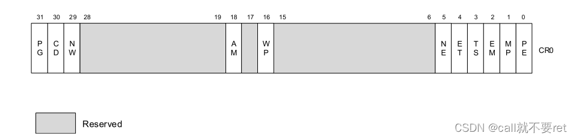

# 一、CRx 寄存器

control register 控制寄存器

## 1. CR0

- `PE`: Protection Enable（保护使能）。为0为实地址模式，为1为保护模式
- `PG`: Paging（分页）。为1启用分页模式，为0则仅用分页模式
    - 禁用分页所有线性地址被视为物理地址。
    - 禁用分页下，段机制中段基址加上偏移就是真实的物理地址。
    - 分页标志必须在PE设置为1时才能配置，否则会导致通用保护异常
