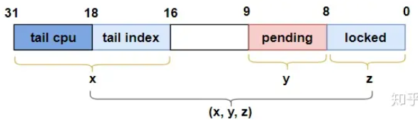

# 一、介绍

qspinlock是基于MCS lock进行改进的，将整个锁放入32位的空间中

# 二、结构体介绍

```cpp
// include/asm-generic/qspinlock_types.h
typedef struct qspinlock {
	union {
		atomic_t val;

		/*
		 * By using the whole 2nd least significant byte for the
		 * pending bit, we can allow better optimization of the lock
		 * acquisition for the pending bit holder.
		 */
#ifdef __LITTLE_ENDIAN
		struct {
			u8	locked;
			u8	pending;
		};
		struct {
			u16	locked_pending;
			u16	tail;
		};
#else
		struct {
			u16	tail;
			u16	locked_pending;
		};
		struct {
			u8	reserved[2];
			u8	pending;
			u8	locked;
		};
#endif
	};
} arch_spinlock_t;

/*
 * Initializier
 */
#define	__ARCH_SPIN_LOCK_UNLOCKED	{ { .val = ATOMIC_INIT(0) } }

/*
 * Bitfields in the atomic value:
 *
 * When NR_CPUS < 16K
 *  0- 7: locked byte
 *     8: pending
 *  9-15: not used
 * 16-17: tail index
 * 18-31: tail cpu (+1)
 *
 * When NR_CPUS >= 16K
 *  0- 7: locked byte
 *     8: pending
 *  9-10: tail index
 * 11-31: tail cpu (+1)
 */
#define	_Q_SET_MASK(type)	(((1U << _Q_ ## type ## _BITS) - 1)\
				      << _Q_ ## type ## _OFFSET)
#define _Q_LOCKED_OFFSET	0
#define _Q_LOCKED_BITS		8
#define _Q_LOCKED_MASK		_Q_SET_MASK(LOCKED)

#define _Q_PENDING_OFFSET	(_Q_LOCKED_OFFSET + _Q_LOCKED_BITS)
#if CONFIG_NR_CPUS < (1U << 14)
#define _Q_PENDING_BITS		8
#else
#define _Q_PENDING_BITS		1
#endif
#define _Q_PENDING_MASK		_Q_SET_MASK(PENDING)

#define _Q_TAIL_IDX_OFFSET	(_Q_PENDING_OFFSET + _Q_PENDING_BITS)
#define _Q_TAIL_IDX_BITS	2
#define _Q_TAIL_IDX_MASK	_Q_SET_MASK(TAIL_IDX)

#define _Q_TAIL_CPU_OFFSET	(_Q_TAIL_IDX_OFFSET + _Q_TAIL_IDX_BITS)
#define _Q_TAIL_CPU_BITS	(32 - _Q_TAIL_CPU_OFFSET)
#define _Q_TAIL_CPU_MASK	_Q_SET_MASK(TAIL_CPU)

#define _Q_TAIL_OFFSET		_Q_TAIL_IDX_OFFSET
#define _Q_TAIL_MASK		(_Q_TAIL_IDX_MASK | _Q_TAIL_CPU_MASK)

#define _Q_LOCKED_VAL		(1U << _Q_LOCKED_OFFSET)
#define _Q_PENDING_VAL		(1U << _Q_PENDING_OFFSET)
```

内存排布如下，小端序


大端序


- 其中，locked只有1个字节，代表是否上锁，只有0和1两个值
- tail中还有
    - `16-17`代表`tail index`，代表一个cpu最多同时获取4个spin lock
    - `18-31`代表`tail cpu`，针对cpu数目小于 $2^{14} = 16384$ 个的情况



# 三、相关操作及函数

## 1. native_queued_spin_lock_slowpath 上锁

```cpp
// kernel/locking/qspinlock.c
#ifdef CONFIG_PARAVIRT_SPINLOCKS
#define queued_spin_lock_slowpath	native_queued_spin_lock_slowpath
#endif
...
/**
 * queued_fetch_set_pending_acquire - fetch the whole lock value and set pending
 * @lock : Pointer to queued spinlock structure
 * Return: The previous lock value
 *
 * *,*,* -> *,1,*
 */
#ifndef queued_fetch_set_pending_acquire
static __always_inline u32 queued_fetch_set_pending_acquire(struct qspinlock *lock)
{
	return atomic_fetch_or_acquire(_Q_PENDING_VAL, &lock->val);
}
#endif
...
/**
 * queued_spin_lock_slowpath - acquire the queued spinlock
 * @lock: Pointer to queued spinlock structure
 * @val: Current value of the queued spinlock 32-bit word
 *
 * (queue tail, pending bit, lock value)
 *
 *              fast     :    slow                                  :    unlock
 *                       :                                          :
 * uncontended  (0,0,0) -:--> (0,0,1) ------------------------------:--> (*,*,0)
 *                       :       | ^--------.------.             /  :
 *                       :       v           \      \            |  :
 * pending               :    (0,1,1) +--> (0,1,0)   \           |  :
 *                       :       | ^--'              |           |  :
 *                       :       v                   |           |  :
 * uncontended           :    (n,x,y) +--> (n,0,0) --'           |  :
 *   queue               :       | ^--'                          |  :
 *                       :       v                               |  :
 * contended             :    (*,x,y) +--> (*,0,0) ---> (*,0,1) -'  :
 *   queue               :         ^--'                             :
 */
void queued_spin_lock_slowpath(struct qspinlock *lock, u32 val)
{
	struct mcs_spinlock *prev, *next, *node;
	u32 old, tail;
	int idx;

    // 确保cpu数量不超过自旋锁支持最大数量
	BUILD_BUG_ON(CONFIG_NR_CPUS >= (1U << _Q_TAIL_CPU_BITS));

	if (pv_enabled())
		goto pv_queue;

	if (virt_spin_lock(lock))
		return;

	/*
	 * Wait for in-progress pending->locked hand-overs with a bounded
	 * number of spins so that we guarantee forward progress.
	 *
	 * 0,1,0 -> 0,0,1
	 */
	if (val == _Q_PENDING_VAL) {
		int cnt = _Q_PENDING_LOOPS;
		val = atomic_cond_read_relaxed(&lock->val,
					       (VAL != _Q_PENDING_VAL) || !cnt--);
	}

	/*
	 * If we observe any contention; queue.
	 */
    // 这里发现pending或等待队列有值，说明不止我们在等，且第一顺位有cpu在等
    // 我们属于第二顺位之后的，乖乖到后面排队
	if (val & ~_Q_LOCKED_MASK)
		goto queue;

	/*
	 * trylock || pending
	 *
	 * 0,0,* -> 0,1,* -> 0,0,1 pending, trylock
	 */
    // 设置pending为1，返回是设置前的值
	val = queued_fetch_set_pending_acquire(lock);

	/*
	 * If we observe contention, there is a concurrent locker.
	 *
	 * Undo and queue; our setting of PENDING might have made the
	 * n,0,0 -> 0,0,0 transition fail and it will now be waiting
	 * on @next to become !NULL.
	 */
    // 这里发现我们设置pending前，pending或等待队列有值，说明在上面那句话执行过程中，有cpu比我们更优先设置了pending
    // 这里算是二次确认，说明我们比别人慢，不属于第一顺位，乖乖到后面排队
	if (unlikely(val & ~_Q_LOCKED_MASK)) {

		/* Undo PENDING if we set it. */
        // 如果设置pending前没有pending，说明pending是我们自己设置的，将pending清空
        // 我们设置的pending，还走到这个位置，说明第一顺位没人，但是第二顺位有人，我们放开pending，排后面去
		if (!(val & _Q_PENDING_MASK))
			clear_pending(lock);

        // 进入到排队状态
		goto queue;
	}

	/*
	 * We're pending, wait for the owner to go away.
	 *
	 * 0,1,1 -> 0,1,0
	 *
	 * this wait loop must be a load-acquire such that we match the
	 * store-release that clears the locked bit and create lock
	 * sequentiality; this is because not all
	 * clear_pending_set_locked() implementations imply full
	 * barriers.
	 */
    // 我们设置pending，其他cpu没有申请，说明我们是第一顺位
    // 只需要等待锁被释放就可以了
	if (val & _Q_LOCKED_MASK)
		atomic_cond_read_acquire(&lock->val, !(VAL & _Q_LOCKED_MASK));

	/*
	 * take ownership and clear the pending bit.
	 *
	 * 0,1,0 -> 0,0,1
	 */
    // 设置上锁，清理我们设置的pending
	clear_pending_set_locked(lock);
	lockevent_inc(lock_pending);
	return;

	/*
	 * End of pending bit optimistic spinning and beginning of MCS
	 * queuing.
	 */
queue:
	lockevent_inc(lock_slowpath);
pv_queue:
	node = this_cpu_ptr(&qnodes[0].mcs);
	idx = node->count++;
	tail = encode_tail(smp_processor_id(), idx);

	trace_contention_begin(lock, LCB_F_SPIN);

	/*
	 * 4 nodes are allocated based on the assumption that there will
	 * not be nested NMIs taking spinlocks. That may not be true in
	 * some architectures even though the chance of needing more than
	 * 4 nodes will still be extremely unlikely. When that happens,
	 * we fall back to spinning on the lock directly without using
	 * any MCS node. This is not the most elegant solution, but is
	 * simple enough.
	 */
	if (unlikely(idx >= MAX_NODES)) {
		lockevent_inc(lock_no_node);
		while (!queued_spin_trylock(lock))
			cpu_relax();
		goto release;
	}

	node = grab_mcs_node(node, idx);

	/*
	 * Keep counts of non-zero index values:
	 */
	lockevent_cond_inc(lock_use_node2 + idx - 1, idx);

	/*
	 * Ensure that we increment the head node->count before initialising
	 * the actual node. If the compiler is kind enough to reorder these
	 * stores, then an IRQ could overwrite our assignments.
	 */
	barrier();

	node->locked = 0;
	node->next = NULL;
	pv_init_node(node);

	/*
	 * We touched a (possibly) cold cacheline in the per-cpu queue node;
	 * attempt the trylock once more in the hope someone let go while we
	 * weren't watching.
	 */
	if (queued_spin_trylock(lock))
		goto release;

	/*
	 * Ensure that the initialisation of @node is complete before we
	 * publish the updated tail via xchg_tail() and potentially link
	 * @node into the waitqueue via WRITE_ONCE(prev->next, node) below.
	 */
	smp_wmb();

	/*
	 * Publish the updated tail.
	 * We have already touched the queueing cacheline; don't bother with
	 * pending stuff.
	 *
	 * p,*,* -> n,*,*
	 */
	old = xchg_tail(lock, tail);
	next = NULL;

	/*
	 * if there was a previous node; link it and wait until reaching the
	 * head of the waitqueue.
	 */
	if (old & _Q_TAIL_MASK) {
		prev = decode_tail(old);

		/* Link @node into the waitqueue. */
		WRITE_ONCE(prev->next, node);

		pv_wait_node(node, prev);
		arch_mcs_spin_lock_contended(&node->locked);

		/*
		 * While waiting for the MCS lock, the next pointer may have
		 * been set by another lock waiter. We optimistically load
		 * the next pointer & prefetch the cacheline for writing
		 * to reduce latency in the upcoming MCS unlock operation.
		 */
		next = READ_ONCE(node->next);
		if (next)
			prefetchw(next);
	}

	/*
	 * we're at the head of the waitqueue, wait for the owner & pending to
	 * go away.
	 *
	 * *,x,y -> *,0,0
	 *
	 * this wait loop must use a load-acquire such that we match the
	 * store-release that clears the locked bit and create lock
	 * sequentiality; this is because the set_locked() function below
	 * does not imply a full barrier.
	 *
	 * The PV pv_wait_head_or_lock function, if active, will acquire
	 * the lock and return a non-zero value. So we have to skip the
	 * atomic_cond_read_acquire() call. As the next PV queue head hasn't
	 * been designated yet, there is no way for the locked value to become
	 * _Q_SLOW_VAL. So both the set_locked() and the
	 * atomic_cmpxchg_relaxed() calls will be safe.
	 *
	 * If PV isn't active, 0 will be returned instead.
	 *
	 */
	if ((val = pv_wait_head_or_lock(lock, node)))
		goto locked;

	val = atomic_cond_read_acquire(&lock->val, !(VAL & _Q_LOCKED_PENDING_MASK));

locked:
	/*
	 * claim the lock:
	 *
	 * n,0,0 -> 0,0,1 : lock, uncontended
	 * *,*,0 -> *,*,1 : lock, contended
	 *
	 * If the queue head is the only one in the queue (lock value == tail)
	 * and nobody is pending, clear the tail code and grab the lock.
	 * Otherwise, we only need to grab the lock.
	 */

	/*
	 * In the PV case we might already have _Q_LOCKED_VAL set, because
	 * of lock stealing; therefore we must also allow:
	 *
	 * n,0,1 -> 0,0,1
	 *
	 * Note: at this point: (val & _Q_PENDING_MASK) == 0, because of the
	 *       above wait condition, therefore any concurrent setting of
	 *       PENDING will make the uncontended transition fail.
	 */
	if ((val & _Q_TAIL_MASK) == tail) {
		if (atomic_try_cmpxchg_relaxed(&lock->val, &val, _Q_LOCKED_VAL))
			goto release; /* No contention */
	}

	/*
	 * Either somebody is queued behind us or _Q_PENDING_VAL got set
	 * which will then detect the remaining tail and queue behind us
	 * ensuring we'll see a @next.
	 */
	set_locked(lock);

	/*
	 * contended path; wait for next if not observed yet, release.
	 */
	if (!next)
		next = smp_cond_load_relaxed(&node->next, (VAL));

	arch_mcs_spin_unlock_contended(&next->locked);
	pv_kick_node(lock, next);

release:
	trace_contention_end(lock, 0);

	/*
	 * release the node
	 */
	__this_cpu_dec(qnodes[0].mcs.count);
}
EXPORT_SYMBOL(queued_spin_lock_slowpath);
```

分段对此代码进行分析

### 1.1. 第一个cpu或第一顺位cpu获取锁的过程

```cpp
void queued_spin_lock_slowpath(struct qspinlock *lock, u32 val)
{
	struct mcs_spinlock *prev, *next, *node;
	u32 old, tail;
	int idx;
    ...
	/*
	 * If we observe any contention; queue.
	 */
    // 这里发现pending或等待队列有值，说明不止我们在等，且第一顺位有cpu在等
    // 我们属于第二顺位之后的，乖乖到后面排队
	if (val & ~_Q_LOCKED_MASK)
		goto queue;

	/*
	 * trylock || pending
	 *
	 * 0,0,* -> 0,1,* -> 0,0,1 pending, trylock
	 */
    // 设置pending为1，返回是设置前的值
	val = queued_fetch_set_pending_acquire(lock);

	/*
	 * If we observe contention, there is a concurrent locker.
	 *
	 * Undo and queue; our setting of PENDING might have made the
	 * n,0,0 -> 0,0,0 transition fail and it will now be waiting
	 * on @next to become !NULL.
	 */
    // 这里发现我们设置pending前，pending或等待队列有值，说明在上面那句话执行过程中，有cpu比我们更优先设置了pending
    // 这里算是二次确认，说明我们比别人慢，不属于第一顺位，乖乖到后面排队
	if (unlikely(val & ~_Q_LOCKED_MASK)) {

		/* Undo PENDING if we set it. */
        // 如果设置pending前没有pending，说明pending是我们自己设置的，将pending清空
        // 我们设置的pending，还走到这个位置，说明第一顺位没人，但是第二顺位有人，我们放开pending，排后面去
		if (!(val & _Q_PENDING_MASK))
			clear_pending(lock);

        // 进入到排队状态
		goto queue;
	}

	/*
	 * We're pending, wait for the owner to go away.
	 *
	 * 0,1,1 -> 0,1,0
	 *
	 * this wait loop must be a load-acquire such that we match the
	 * store-release that clears the locked bit and create lock
	 * sequentiality; this is because not all
	 * clear_pending_set_locked() implementations imply full
	 * barriers.
	 */
    // 我们设置pending，其他cpu没有申请，说明我们是第一顺位
    // 只需要等待锁被释放就可以了
	if (val & _Q_LOCKED_MASK)
		atomic_cond_read_acquire(&lock->val, !(VAL & _Q_LOCKED_MASK));

	/*
	 * take ownership and clear the pending bit.
	 *
	 * 0,1,0 -> 0,0,1
	 */
    // 设置上锁，清理我们设置的pending
	clear_pending_set_locked(lock);
	lockevent_inc(lock_pending);
	return;
    ...
}
```

### 1.2. 第二顺位及以后的cpu获取锁过程

```cpp

```
