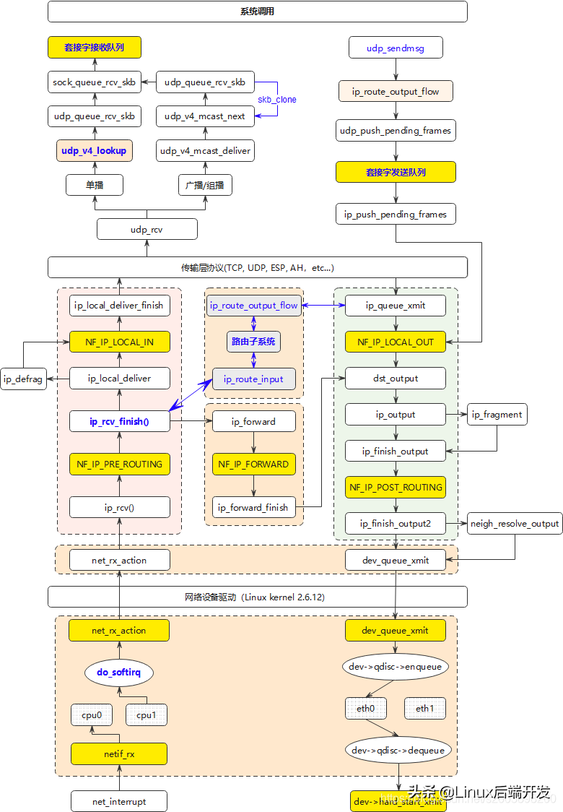

参考一个比较好的帖子 [理解 Linux 网络栈（1）：Linux 网络协议栈简单总结](https://www.cnblogs.com/sammyliu/p/5225623.html)

# 一、从驱动来的包处理流程

图取自 [linux内核协议栈 UDP之数据报接收过程](https://blog.csdn.net/daocaokafei/article/details/117968065)



堆栈信息，从软中断到`ip_rcv_finish`

```
ip_rcv_finish(struct net * net, struct sock * sk, struct sk_buff * skb) (/net/ipv4/ip_input.c:449)
NF_HOOK(uint8_t pf, unsigned int hook, struct net_device * in, struct net_device * out, int (*)(struct net *, struct sock *, struct sk_buff *) okfn, struct sk_buff * skb, struct sock * sk, struct net * net) (/include/linux/netfilter.h:307)
__netif_receive_skb_one_core(struct sk_buff * skb, bool pfmemalloc) (/net/core/dev.c:5484)
netif_receive_skb_internal(struct sk_buff * skb) (/net/core/dev.c:5684)
netif_receive_skb(struct sk_buff * skb) (/net/core/dev.c:5743)
[Unknown/Just-In-Time compiled code] (Unknown Source:0)
fixed_percpu_data (Unknown Source:0)
[Unknown/Just-In-Time compiled code] (Unknown Source:0)
fixed_percpu_data (Unknown Source:0)
[Unknown/Just-In-Time compiled code] (Unknown Source:0)
```
