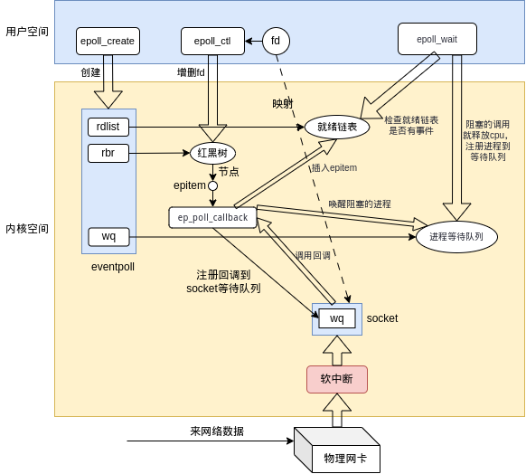

- 参考[从linux5.9看网络层的设计](https://mp.weixin.qq.com/s/OmRdUgO1guMX76EdZn11UQ)

# 一、总述

- epoll本身使用红黑树处理fd的存储，主要是用于`epoll_ctl`可以快速插入删除某个fd
- epoll加入一个fd时会将自身的一个回调函数插入到此socket的就绪队列的回调上
- 回调函数中可以直接拿到epoll红黑树上的节点，然后将对应事件加入到链表中，通知上面进行收消息



# 二、数据结构

## 1. eventpoll

- epoll的主结构体，存放到file的`private_data`中
- epoll对于fd的储存使用的是红黑树
- 使用链表保存处于就绪状态的fd

```cpp
// fs/eventpoll.c
/*
 * This structure is stored inside the "private_data" member of the file
 * structure and represents the main data structure for the eventpoll
 * interface.
 */
struct eventpoll {
	/*
	 * This mutex is used to ensure that files are not removed
	 * while epoll is using them. This is held during the event
	 * collection loop, the file cleanup path, the epoll file exit
	 * code and the ctl operations.
	 */
	struct mutex mtx;

	/* Wait queue used by sys_epoll_wait() */
	wait_queue_head_t wq;

	/* Wait queue used by file->poll() */
	wait_queue_head_t poll_wait;

	/* List of ready file descriptors */
	struct list_head rdllist;	// 就绪队列，epoll收事件是从这里收取

	/* Lock which protects rdllist and ovflist */
	rwlock_t lock;

	/* RB tree root used to store monitored fd structs */
	struct rb_root_cached rbr;	// 存储要监听的fd结构体，实际是epitem结构体

	/*
	 * This is a single linked list that chains all the "struct epitem" that
	 * happened while transferring ready events to userspace w/out
	 * holding ->lock.
	 */
	struct epitem *ovflist;

	/* wakeup_source used when ep_scan_ready_list is running */
	struct wakeup_source *ws;

	/* The user that created the eventpoll descriptor */
	struct user_struct *user;

	struct file *file;

	/* used to optimize loop detection check */
	u64 gen;
	struct hlist_head refs;

#ifdef CONFIG_NET_RX_BUSY_POLL
	/* used to track busy poll napi_id */
	unsigned int napi_id;
#endif

#ifdef CONFIG_DEBUG_LOCK_ALLOC
	/* tracks wakeup nests for lockdep validation */
	u8 nests;
#endif
};
```

## 2. epitem

- 每个fd存到epitem中，epitem在epoll中使用红黑树存储

```cpp
// fs/eventpoll.c
/*
 * Each file descriptor added to the eventpoll interface will
 * have an entry of this type linked to the "rbr" RB tree.
 * Avoid increasing the size of this struct, there can be many thousands
 * of these on a server and we do not want this to take another cache line.
 */
struct epitem {
	union {
		/* RB tree node links this structure to the eventpoll RB tree */
		struct rb_node rbn;
		/* Used to free the struct epitem */
		struct rcu_head rcu;
	};

	/* List header used to link this structure to the eventpoll ready list */
	struct list_head rdllink;

	/*
	 * Works together "struct eventpoll"->ovflist in keeping the
	 * single linked chain of items.
	 */
	struct epitem *next;

	/* The file descriptor information this item refers to */
	struct epoll_filefd ffd;

	/* List containing poll wait queues */
	struct eppoll_entry *pwqlist;

	/* The "container" of this item */
	struct eventpoll *ep;

	/* List header used to link this item to the "struct file" items list */
	struct hlist_node fllink;

	/* wakeup_source used when EPOLLWAKEUP is set */
	struct wakeup_source __rcu *ws;

	/* The structure that describe the interested events and the source fd */
	struct epoll_event event;
};
```

### 2.1. epoll_filefd

```cpp
// fs/eventpoll.c
struct epoll_filefd {
	struct file *file;
	int fd;
} __packed;
```

# 三、epoll_create调用

## 1. 接口定义

```cpp
// fs/eventpoll.c
SYSCALL_DEFINE1(epoll_create, int, size)
{
	if (size <= 0)
		return -EINVAL;

	return do_epoll_create(0);
}
```

## 2. do_epoll_create

- 就是创建一个epoll结构体，然后将file结构体和epoll关联
- 对应epoll本身的相关文件操作

```cpp
// fs/eventpoll.c
/*
 * Open an eventpoll file descriptor.
 */
static int do_epoll_create(int flags)
{
	int error, fd;
	struct eventpoll *ep = NULL;
	struct file *file;

	/* Check the EPOLL_* constant for consistency.  */
	BUILD_BUG_ON(EPOLL_CLOEXEC != O_CLOEXEC);

	if (flags & ~EPOLL_CLOEXEC)
		return -EINVAL;
	/*
	 * Create the internal data structure ("struct eventpoll").
	 */
	error = ep_alloc(&ep);
	if (error < 0)
		return error;
	/*
	 * Creates all the items needed to setup an eventpoll file. That is,
	 * a file structure and a free file descriptor.
	 */
	// 获取一个未使用的fd
	fd = get_unused_fd_flags(O_RDWR | (flags & O_CLOEXEC));
	if (fd < 0) {
		error = fd;
		goto out_free_ep;
	}
	// 创建epoll类型的file结构体
	file = anon_inode_getfile("[eventpoll]", &eventpoll_fops, ep,
				 O_RDWR | (flags & O_CLOEXEC));
	if (IS_ERR(file)) {
		error = PTR_ERR(file);
		goto out_free_fd;
	}
	ep->file = file;
	// fd和file绑定
	fd_install(fd, file);
	return fd;

out_free_fd:
	put_unused_fd(fd);
out_free_ep:
	ep_free(ep);
	return error;
}
```

## 3. anon_inode_getfile

- ep结构体存到file的private_data中

```cpp
// fs/anon_inodes.c
/**
 * anon_inode_getfile - creates a new file instance by hooking it up to an
 *                      anonymous inode, and a dentry that describe the "class"
 *                      of the file
 *
 * @name:    [in]    name of the "class" of the new file
 * @fops:    [in]    file operations for the new file
 * @priv:    [in]    private data for the new file (will be file's private_data)
 * @flags:   [in]    flags
 *
 * Creates a new file by hooking it on a single inode. This is useful for files
 * that do not need to have a full-fledged inode in order to operate correctly.
 * All the files created with anon_inode_getfile() will share a single inode,
 * hence saving memory and avoiding code duplication for the file/inode/dentry
 * setup.  Returns the newly created file* or an error pointer.
 */
struct file *anon_inode_getfile(const char *name,
				const struct file_operations *fops,
				void *priv, int flags)
{
	return __anon_inode_getfile(name, fops, priv, flags, NULL, false);
}
EXPORT_SYMBOL_GPL(anon_inode_getfile);

// fs/anon_inodes.c
static struct file *__anon_inode_getfile(const char *name,
					 const struct file_operations *fops,
					 void *priv, int flags,
					 const struct inode *context_inode,
					 bool secure)
{
	struct inode *inode;
	struct file *file;

	if (fops->owner && !try_module_get(fops->owner))
		return ERR_PTR(-ENOENT);

	if (secure) {
		inode =	anon_inode_make_secure_inode(name, context_inode);
		if (IS_ERR(inode)) {
			file = ERR_CAST(inode);
			goto err;
		}
	} else {
		inode =	anon_inode_inode;
		if (IS_ERR(inode)) {
			file = ERR_PTR(-ENODEV);
			goto err;
		}
		/*
		 * We know the anon_inode inode count is always
		 * greater than zero, so ihold() is safe.
		 */
		ihold(inode);
	}

	file = alloc_file_pseudo(inode, anon_inode_mnt, name,
				 flags & (O_ACCMODE | O_NONBLOCK), fops);
	if (IS_ERR(file))
		goto err_iput;

	file->f_mapping = inode->i_mapping;
	// 将priv存到file的private_data
	file->private_data = priv;

	return file;

err_iput:
	iput(inode);
err:
	module_put(fops->owner);
	return file;
}
```

# 四、epoll_ctl

## 1. 系统调用定义

```cpp
// fs/eventpoll.c
/*
 * The following function implements the controller interface for
 * the eventpoll file that enables the insertion/removal/change of
 * file descriptors inside the interest set.
 */
SYSCALL_DEFINE4(epoll_ctl, int, epfd, int, op, int, fd,
		struct epoll_event __user *, event)
{
	struct epoll_event epds;

	if (ep_op_has_event(op) &&
	    copy_from_user(&epds, event, sizeof(struct epoll_event)))
		return -EFAULT;

	return do_epoll_ctl(epfd, op, fd, &epds, false);
}
```

## 2. do_epoll_ctl

```cpp
// fs/eventpoll.c
int do_epoll_ctl(int epfd, int op, int fd, struct epoll_event *epds,
		 bool nonblock)
{
	int error;
	int full_check = 0;
	struct fd f, tf;
	struct eventpoll *ep;
	struct epitem *epi;
	struct eventpoll *tep = NULL;

	error = -EBADF;
	f = fdget(epfd);
	if (!f.file)
		goto error_return;

	/* Get the "struct file *" for the target file */
	tf = fdget(fd);
	if (!tf.file)
		goto error_fput;

	/* The target file descriptor must support poll */
	error = -EPERM;
	if (!file_can_poll(tf.file))
		goto error_tgt_fput;

	/* Check if EPOLLWAKEUP is allowed */
	if (ep_op_has_event(op))
		ep_take_care_of_epollwakeup(epds);

	/*
	 * We have to check that the file structure underneath the file descriptor
	 * the user passed to us _is_ an eventpoll file. And also we do not permit
	 * adding an epoll file descriptor inside itself.
	 */
	error = -EINVAL;
	if (f.file == tf.file || !is_file_epoll(f.file))
		goto error_tgt_fput;

	/*
	 * epoll adds to the wakeup queue at EPOLL_CTL_ADD time only,
	 * so EPOLLEXCLUSIVE is not allowed for a EPOLL_CTL_MOD operation.
	 * Also, we do not currently supported nested exclusive wakeups.
	 */
	if (ep_op_has_event(op) && (epds->events & EPOLLEXCLUSIVE)) {
		if (op == EPOLL_CTL_MOD)
			goto error_tgt_fput;
		if (op == EPOLL_CTL_ADD && (is_file_epoll(tf.file) ||
				(epds->events & ~EPOLLEXCLUSIVE_OK_BITS)))
			goto error_tgt_fput;
	}

	/*
	 * At this point it is safe to assume that the "private_data" contains
	 * our own data structure.
	 */
	// fd找到file结构体后，从private_data取出epoll的主结构体
	ep = f.file->private_data;

	/*
	 * When we insert an epoll file descriptor inside another epoll file
	 * descriptor, there is the chance of creating closed loops, which are
	 * better be handled here, than in more critical paths. While we are
	 * checking for loops we also determine the list of files reachable
	 * and hang them on the tfile_check_list, so we can check that we
	 * haven't created too many possible wakeup paths.
	 *
	 * We do not need to take the global 'epumutex' on EPOLL_CTL_ADD when
	 * the epoll file descriptor is attaching directly to a wakeup source,
	 * unless the epoll file descriptor is nested. The purpose of taking the
	 * 'epmutex' on add is to prevent complex toplogies such as loops and
	 * deep wakeup paths from forming in parallel through multiple
	 * EPOLL_CTL_ADD operations.
	 */
	error = epoll_mutex_lock(&ep->mtx, 0, nonblock);
	if (error)
		goto error_tgt_fput;
	if (op == EPOLL_CTL_ADD) {
		if (READ_ONCE(f.file->f_ep) || ep->gen == loop_check_gen ||
		    is_file_epoll(tf.file)) {
			mutex_unlock(&ep->mtx);
			error = epoll_mutex_lock(&epmutex, 0, nonblock);
			if (error)
				goto error_tgt_fput;
			loop_check_gen++;
			full_check = 1;
			if (is_file_epoll(tf.file)) {
				tep = tf.file->private_data;
				error = -ELOOP;
				if (ep_loop_check(ep, tep) != 0)
					goto error_tgt_fput;
			}
			error = epoll_mutex_lock(&ep->mtx, 0, nonblock);
			if (error)
				goto error_tgt_fput;
		}
	}

	/*
	 * Try to lookup the file inside our RB tree. Since we grabbed "mtx"
	 * above, we can be sure to be able to use the item looked up by
	 * ep_find() till we release the mutex.
	 */
	epi = ep_find(ep, tf.file, fd);

	error = -EINVAL;
	switch (op) {
	case EPOLL_CTL_ADD:
		if (!epi) {
			epds->events |= EPOLLERR | EPOLLHUP;
			error = ep_insert(ep, epds, tf.file, fd, full_check);
		} else
			error = -EEXIST;
		break;
	case EPOLL_CTL_DEL:
		if (epi)
			error = ep_remove(ep, epi);
		else
			error = -ENOENT;
		break;
	case EPOLL_CTL_MOD:
		if (epi) {
			if (!(epi->event.events & EPOLLEXCLUSIVE)) {
				epds->events |= EPOLLERR | EPOLLHUP;
				error = ep_modify(ep, epi, epds);
			}
		} else
			error = -ENOENT;
		break;
	}
	mutex_unlock(&ep->mtx);

error_tgt_fput:
	if (full_check) {
		clear_tfile_check_list();
		loop_check_gen++;
		mutex_unlock(&epmutex);
	}

	fdput(tf);
error_fput:
	fdput(f);
error_return:

	return error;
}
```

## 3. EPOLL_CTL_ADD 添加fd监听

### 3.1. ep_insert

- 先插入fd到epitem
- 再将epitem插入到epoll的红黑树中
- 然后将epoll的回调设置到socket中

```cpp
// fs/eventpoll.c
/*
 * Must be called with "mtx" held.
 */
static int ep_insert(struct eventpoll *ep, const struct epoll_event *event,
		     struct file *tfile, int fd, int full_check)
{
	int error, pwake = 0;
	__poll_t revents;
	struct epitem *epi;
	struct ep_pqueue epq;
	struct eventpoll *tep = NULL;

	if (is_file_epoll(tfile))
		tep = tfile->private_data;

	lockdep_assert_irqs_enabled();

	if (unlikely(percpu_counter_compare(&ep->user->epoll_watches,
					    max_user_watches) >= 0))
		return -ENOSPC;
	percpu_counter_inc(&ep->user->epoll_watches);

	if (!(epi = kmem_cache_zalloc(epi_cache, GFP_KERNEL))) {
		percpu_counter_dec(&ep->user->epoll_watches);
		return -ENOMEM;
	}

	/* Item initialization follow here ... */
	INIT_LIST_HEAD(&epi->rdllink);
	epi->ep = ep;
	ep_set_ffd(&epi->ffd, tfile, fd);	// 设置fd到epitem中
	epi->event = *event;
	epi->next = EP_UNACTIVE_PTR;

	if (tep)
		mutex_lock_nested(&tep->mtx, 1);
	/* Add the current item to the list of active epoll hook for this file */
	if (unlikely(attach_epitem(tfile, epi) < 0)) {
		if (tep)
			mutex_unlock(&tep->mtx);
		kmem_cache_free(epi_cache, epi);
		percpu_counter_dec(&ep->user->epoll_watches);
		return -ENOMEM;
	}

	if (full_check && !tep)
		list_file(tfile);

	/*
	 * Add the current item to the RB tree. All RB tree operations are
	 * protected by "mtx", and ep_insert() is called with "mtx" held.
	 */
	// epitem插入到红黑树中
	ep_rbtree_insert(ep, epi);
	if (tep)
		mutex_unlock(&tep->mtx);

	/* now check if we've created too many backpaths */
	if (unlikely(full_check && reverse_path_check())) {
		ep_remove(ep, epi);
		return -EINVAL;
	}

	if (epi->event.events & EPOLLWAKEUP) {
		error = ep_create_wakeup_source(epi);
		if (error) {
			ep_remove(ep, epi);
			return error;
		}
	}

	/* Initialize the poll table using the queue callback */
	epq.epi = epi;
	// 将ep_ptable_queue_proc设置为_qproc，加入等待队列的操作函数
	init_poll_funcptr(&epq.pt, ep_ptable_queue_proc);

	/*
	 * Attach the item to the poll hooks and get current event bits.
	 * We can safely use the file* here because its usage count has
	 * been increased by the caller of this function. Note that after
	 * this operation completes, the poll callback can start hitting
	 * the new item.
	 */
	revents = ep_item_poll(epi, &epq.pt, 1);

	/*
	 * We have to check if something went wrong during the poll wait queue
	 * install process. Namely an allocation for a wait queue failed due
	 * high memory pressure.
	 */
	if (unlikely(!epq.epi)) {
		ep_remove(ep, epi);
		return -ENOMEM;
	}

	/* We have to drop the new item inside our item list to keep track of it */
	write_lock_irq(&ep->lock);

	/* record NAPI ID of new item if present */
	ep_set_busy_poll_napi_id(epi);

	/* If the file is already "ready" we drop it inside the ready list */
	if (revents && !ep_is_linked(epi)) {
		list_add_tail(&epi->rdllink, &ep->rdllist);
		ep_pm_stay_awake(epi);

		/* Notify waiting tasks that events are available */
		if (waitqueue_active(&ep->wq))
			wake_up(&ep->wq);
		if (waitqueue_active(&ep->poll_wait))
			pwake++;
	}

	write_unlock_irq(&ep->lock);

	/* We have to call this outside the lock */
	if (pwake)
		ep_poll_safewake(ep, NULL);

	return 0;
}
```

#### 1) init_poll_funcptr 初始化插入等待队列的操作函数指针

- 将`_qproc`设置为上面的`ep_ptable_queue_proc`
- 记住下面的操作，后面插入等待队列会使用

```cpp
// include/linux/poll.h
static inline void init_poll_funcptr(poll_table *pt, poll_queue_proc qproc)
{
	pt->_qproc = qproc;
	pt->_key   = ~(__poll_t)0; /* all events enabled */
}
```

#### 2) ep_rbtree_insert 插入epitem

```cpp
// fs/eventpoll.c
static void ep_rbtree_insert(struct eventpoll *ep, struct epitem *epi)
{
	int kcmp;
	struct rb_node **p = &ep->rbr.rb_root.rb_node, *parent = NULL;
	struct epitem *epic;
	bool leftmost = true;

	while (*p) {
		parent = *p;
		epic = rb_entry(parent, struct epitem, rbn);
		// 使用fd的比较进行红黑树的查找
		kcmp = ep_cmp_ffd(&epi->ffd, &epic->ffd);
		if (kcmp > 0) {
			p = &parent->rb_right;
			leftmost = false;
		} else
			p = &parent->rb_left;
	}
	// 将epi的节点插入到红黑树中
	rb_link_node(&epi->rbn, parent, p);
	// 着色
	rb_insert_color_cached(&epi->rbn, &ep->rbr, leftmost);
}
```

#### 3) ep_item_poll 插入epoll的回调到socket上

```cpp
// fs/eventpoll.c
/*
 * Differs from ep_eventpoll_poll() in that internal callers already have
 * the ep->mtx so we need to start from depth=1, such that mutex_lock_nested()
 * is correctly annotated.
 */
static __poll_t ep_item_poll(const struct epitem *epi, poll_table *pt,
				 int depth)
{
	struct file *file = epi->ffd.file;
	__poll_t res;

	pt->_key = epi->event.events;
	if (!is_file_epoll(file))
		res = vfs_poll(file, pt);
	else
		res = __ep_eventpoll_poll(file, pt, depth);
	return res & epi->event.events;
}
```

- 插入socket的情况调用`vfs_poll`
- 这里对应socket的poll调用

```cpp
// include/linux/poll.h
static inline __poll_t vfs_poll(struct file *file, struct poll_table_struct *pt)
{
	if (unlikely(!file->f_op->poll))
		return DEFAULT_POLLMASK;
	return file->f_op->poll(file, pt);
}
```

#### 4) socket的poll处理

##### (1) 先看poll的定义位置

```cpp
// net/socket.c
/*
 *	Socket files have a set of 'special' operations as well as the generic file ones. These don't appear
 *	in the operation structures but are done directly via the socketcall() multiplexor.
 */
static const struct file_operations socket_file_ops = {
	.owner =	THIS_MODULE,
	.llseek =	no_llseek,
	.read_iter =	sock_read_iter,
	.write_iter =	sock_write_iter,
	.poll =		sock_poll,
	.unlocked_ioctl = sock_ioctl,
#ifdef CONFIG_COMPAT
	.compat_ioctl = compat_sock_ioctl,
#endif
	.mmap =		sock_mmap,
	.release =	sock_close,
	.fasync =	sock_fasync,
	.sendpage =	sock_sendpage,
	.splice_write = generic_splice_sendpage,
	.splice_read =	sock_splice_read,
	.show_fdinfo =	sock_show_fdinfo,
};
```

##### (2) sock_poll

- 这里又调用到对应的协议的poll函数

```cpp
/* No kernel lock held - perfect */
static __poll_t sock_poll(struct file *file, poll_table *wait)
{
	struct socket *sock = file->private_data;
	__poll_t events = poll_requested_events(wait), flag = 0;

	if (!sock->ops->poll)
		return 0;

	if (sk_can_busy_loop(sock->sk)) {
		/* poll once if requested by the syscall */
		if (events & POLL_BUSY_LOOP)
			sk_busy_loop(sock->sk, 1);

		/* if this socket can poll_ll, tell the system call */
		flag = POLL_BUSY_LOOP;
	}

	return sock->ops->poll(file, sock, wait) | flag;
}
```

###### unix套接字的udp操作

- 定义

```cpp
static const struct proto_ops unix_dgram_ops = {
	.family =	PF_UNIX,
	.owner =	THIS_MODULE,
	.release =	unix_release,
	.bind =		unix_bind,
	.connect =	unix_dgram_connect,
	.socketpair =	unix_socketpair,
	.accept =	sock_no_accept,
	.getname =	unix_getname,
	.poll =		unix_dgram_poll,
	.ioctl =	unix_ioctl,
#ifdef CONFIG_COMPAT
	.compat_ioctl =	unix_compat_ioctl,
#endif
	.listen =	sock_no_listen,
	.shutdown =	unix_shutdown,
	.sendmsg =	unix_dgram_sendmsg,
	.read_sock =	unix_read_sock,
	.recvmsg =	unix_dgram_recvmsg,
	.mmap =		sock_no_mmap,
	.sendpage =	sock_no_sendpage,
	.set_peek_off =	unix_set_peek_off,
	.show_fdinfo =	unix_show_fdinfo,
};
```

- unix_dgram_poll

```cpp
static __poll_t unix_dgram_poll(struct file *file, struct socket *sock,
				    poll_table *wait)
{
	struct sock *sk = sock->sk, *other;
	unsigned int writable;
	__poll_t mask;

	// 这里插入到等待队列
	sock_poll_wait(file, sock, wait);
	mask = 0;

	/* exceptional events? */
	if (sk->sk_err || !skb_queue_empty_lockless(&sk->sk_error_queue))
		mask |= EPOLLERR |
			(sock_flag(sk, SOCK_SELECT_ERR_QUEUE) ? EPOLLPRI : 0);

	if (sk->sk_shutdown & RCV_SHUTDOWN)
		mask |= EPOLLRDHUP | EPOLLIN | EPOLLRDNORM;
	if (sk->sk_shutdown == SHUTDOWN_MASK)
		mask |= EPOLLHUP;

	/* readable? */
	if (!skb_queue_empty_lockless(&sk->sk_receive_queue))
		mask |= EPOLLIN | EPOLLRDNORM;
	if (sk_is_readable(sk))
		mask |= EPOLLIN | EPOLLRDNORM;

	/* Connection-based need to check for termination and startup */
	if (sk->sk_type == SOCK_SEQPACKET) {
		if (sk->sk_state == TCP_CLOSE)
			mask |= EPOLLHUP;
		/* connection hasn't started yet? */
		if (sk->sk_state == TCP_SYN_SENT)
			return mask;
	}

	/* No write status requested, avoid expensive OUT tests. */
	if (!(poll_requested_events(wait) & (EPOLLWRBAND|EPOLLWRNORM|EPOLLOUT)))
		return mask;

	writable = unix_writable(sk);
	if (writable) {
		unix_state_lock(sk);

		other = unix_peer(sk);
		if (other && unix_peer(other) != sk &&
		    unix_recvq_full_lockless(other) &&
		    unix_dgram_peer_wake_me(sk, other))
			writable = 0;

		unix_state_unlock(sk);
	}

	if (writable)
		mask |= EPOLLOUT | EPOLLWRNORM | EPOLLWRBAND;
	else
		sk_set_bit(SOCKWQ_ASYNC_NOSPACE, sk);

	return mask;
}
```

- sock_poll_wait中取到等待队列的头部，调用poll_wait

```cpp
// include/net/sock.h
/**
 * sock_poll_wait - place memory barrier behind the poll_wait call.
 * @filp:           file
 * @sock:           socket to wait on
 * @p:              poll_table
 *
 * See the comments in the wq_has_sleeper function.
 */
static inline void sock_poll_wait(struct file *filp, struct socket *sock,
				  poll_table *p)
{
	if (!poll_does_not_wait(p)) {
		poll_wait(filp, &sock->wq.wait, p);
		/* We need to be sure we are in sync with the
		 * socket flags modification.
		 *
		 * This memory barrier is paired in the wq_has_sleeper.
		 */
		smp_mb();
	}
}
```

- poll_wait拿到等待队列的头部后，调用`_qproc`将p插入进去
- 这里的`_qproc`其实是上面epoll中设置的`ep_ptable_queue_proc`

```cpp
// include/linux/poll.h
static inline void poll_wait(struct file * filp, wait_queue_head_t * wait_address, poll_table *p)
{
	if (p && p->_qproc && wait_address)
		p->_qproc(filp, wait_address, p);
}
```

- `ep_ptable_queue_proc`，插入`ep_poll_callback`到socket的等待队列中

```cpp
// fs/eventpoll.c
/*
 * This is the callback that is used to add our wait queue to the
 * target file wakeup lists.
 */
static void ep_ptable_queue_proc(struct file *file, wait_queue_head_t *whead,
				 poll_table *pt)
{
	struct ep_pqueue *epq = container_of(pt, struct ep_pqueue, pt);
	struct epitem *epi = epq->epi;
	struct eppoll_entry *pwq;

	if (unlikely(!epi))	// an earlier allocation has failed
		return;

	pwq = kmem_cache_alloc(pwq_cache, GFP_KERNEL);
	if (unlikely(!pwq)) {
		epq->epi = NULL;
		return;
	}

	init_waitqueue_func_entry(&pwq->wait, ep_poll_callback);
	pwq->whead = whead;
	pwq->base = epi;
	// 这里插入到等待队列头部，插入的是ep_poll_callback函数
	if (epi->event.events & EPOLLEXCLUSIVE)
		add_wait_queue_exclusive(whead, &pwq->wait);
	else
		add_wait_queue(whead, &pwq->wait);
	pwq->next = epi->pwqlist;
	epi->pwqlist = pwq;
}
```

- ep_poll_callback函数，当回调调用时，将对应的epitem插入到epoll主结构体的链表尾部，通知唤醒

```cpp
// fs/eventpoll.c
/*
 * This is the callback that is passed to the wait queue wakeup
 * mechanism. It is called by the stored file descriptors when they
 * have events to report.
 *
 * This callback takes a read lock in order not to contend with concurrent
 * events from another file descriptor, thus all modifications to ->rdllist
 * or ->ovflist are lockless.  Read lock is paired with the write lock from
 * ep_scan_ready_list(), which stops all list modifications and guarantees
 * that lists state is seen correctly.
 *
 * Another thing worth to mention is that ep_poll_callback() can be called
 * concurrently for the same @epi from different CPUs if poll table was inited
 * with several wait queues entries.  Plural wakeup from different CPUs of a
 * single wait queue is serialized by wq.lock, but the case when multiple wait
 * queues are used should be detected accordingly.  This is detected using
 * cmpxchg() operation.
 */
static int ep_poll_callback(wait_queue_entry_t *wait, unsigned mode, int sync, void *key)
{
	int pwake = 0;
	struct epitem *epi = ep_item_from_wait(wait);
	struct eventpoll *ep = epi->ep;
	__poll_t pollflags = key_to_poll(key);
	unsigned long flags;
	int ewake = 0;

	read_lock_irqsave(&ep->lock, flags);

	ep_set_busy_poll_napi_id(epi);

	/*
	 * If the event mask does not contain any poll(2) event, we consider the
	 * descriptor to be disabled. This condition is likely the effect of the
	 * EPOLLONESHOT bit that disables the descriptor when an event is received,
	 * until the next EPOLL_CTL_MOD will be issued.
	 */
	if (!(epi->event.events & ~EP_PRIVATE_BITS))
		goto out_unlock;

	/*
	 * Check the events coming with the callback. At this stage, not
	 * every device reports the events in the "key" parameter of the
	 * callback. We need to be able to handle both cases here, hence the
	 * test for "key" != NULL before the event match test.
	 */
	if (pollflags && !(pollflags & epi->event.events))
		goto out_unlock;

	/*
	 * If we are transferring events to userspace, we can hold no locks
	 * (because we're accessing user memory, and because of linux f_op->poll()
	 * semantics). All the events that happen during that period of time are
	 * chained in ep->ovflist and requeued later on.
	 */
	// 这里插入epi到eventpoll的就绪队列
	if (READ_ONCE(ep->ovflist) != EP_UNACTIVE_PTR) {
		if (chain_epi_lockless(epi))
			ep_pm_stay_awake_rcu(epi);
	} else if (!ep_is_linked(epi)) {
		/* In the usual case, add event to ready list. */
		if (list_add_tail_lockless(&epi->rdllink, &ep->rdllist))
			ep_pm_stay_awake_rcu(epi);
	}

	/*
	 * Wake up ( if active ) both the eventpoll wait list and the ->poll()
	 * wait list.
	 */
	if (waitqueue_active(&ep->wq)) {
		if ((epi->event.events & EPOLLEXCLUSIVE) &&
					!(pollflags & POLLFREE)) {
			switch (pollflags & EPOLLINOUT_BITS) {
			case EPOLLIN:
				if (epi->event.events & EPOLLIN)
					ewake = 1;
				break;
			case EPOLLOUT:
				if (epi->event.events & EPOLLOUT)
					ewake = 1;
				break;
			case 0:
				ewake = 1;
				break;
			}
		}
		wake_up(&ep->wq);
	}
	if (waitqueue_active(&ep->poll_wait))
		pwake++;

out_unlock:
	read_unlock_irqrestore(&ep->lock, flags);

	/* We have to call this outside the lock */
	if (pwake)
		ep_poll_safewake(ep, epi);

	if (!(epi->event.events & EPOLLEXCLUSIVE))
		ewake = 1;

	if (pollflags & POLLFREE) {
		/*
		 * If we race with ep_remove_wait_queue() it can miss
		 * ->whead = NULL and do another remove_wait_queue() after
		 * us, so we can't use __remove_wait_queue().
		 */
		list_del_init(&wait->entry);
		/*
		 * ->whead != NULL protects us from the race with ep_free()
		 * or ep_remove(), ep_remove_wait_queue() takes whead->lock
		 * held by the caller. Once we nullify it, nothing protects
		 * ep/epi or even wait.
		 */
		smp_store_release(&ep_pwq_from_wait(wait)->whead, NULL);
	}

	return ewake;
}
```

#### 总结

- 将socket插入到epoll中最中会将epoll的处理函数插入到socket的等待队列中，socket来消息后会调用

# 五、epoll_wait

## 1. 主体逻辑

- 从系统定义开始

```cpp
// fs/eventpoll.c
SYSCALL_DEFINE4(epoll_wait, int, epfd, struct epoll_event __user *, events,
		int, maxevents, int, timeout)
{
	struct timespec64 to;

	return do_epoll_wait(epfd, events, maxevents,
			     ep_timeout_to_timespec(&to, timeout));
}

// fs/eventpoll.c
/*
 * Implement the event wait interface for the eventpoll file. It is the kernel
 * part of the user space epoll_wait(2).
 */
static int do_epoll_wait(int epfd, struct epoll_event __user *events,
			 int maxevents, struct timespec64 *to)
{
	int error;
	struct fd f;
	struct eventpoll *ep;

	/* The maximum number of event must be greater than zero */
	if (maxevents <= 0 || maxevents > EP_MAX_EVENTS)
		return -EINVAL;

	/* Verify that the area passed by the user is writeable */
	if (!access_ok(events, maxevents * sizeof(struct epoll_event)))
		return -EFAULT;

	/* Get the "struct file *" for the eventpoll file */
	f = fdget(epfd);
	if (!f.file)
		return -EBADF;

	/*
	 * We have to check that the file structure underneath the fd
	 * the user passed to us _is_ an eventpoll file.
	 */
	error = -EINVAL;
	if (!is_file_epoll(f.file))
		goto error_fput;

	/*
	 * At this point it is safe to assume that the "private_data" contains
	 * our own data structure.
	 */
	ep = f.file->private_data;

	/* Time to fish for events ... */
	error = ep_poll(ep, events, maxevents, to);

error_fput:
	fdput(f);
	return error;
}
```

- 主要逻辑在`ep_poll`

```cpp
// fs/eventpoll.c
/**
 * ep_poll - Retrieves ready events, and delivers them to the caller-supplied
 *           event buffer.
 *
 * @ep: Pointer to the eventpoll context.
 * @events: Pointer to the userspace buffer where the ready events should be
 *          stored.
 * @maxevents: Size (in terms of number of events) of the caller event buffer.
 * @timeout: Maximum timeout for the ready events fetch operation, in
 *           timespec. If the timeout is zero, the function will not block,
 *           while if the @timeout ptr is NULL, the function will block
 *           until at least one event has been retrieved (or an error
 *           occurred).
 *
 * Return: the number of ready events which have been fetched, or an
 *          error code, in case of error.
 */
static int ep_poll(struct eventpoll *ep, struct epoll_event __user *events,
		   int maxevents, struct timespec64 *timeout)
{
	int res, eavail, timed_out = 0;
	u64 slack = 0;
	wait_queue_entry_t wait;
	ktime_t expires, *to = NULL;

	lockdep_assert_irqs_enabled();

	if (timeout && (timeout->tv_sec | timeout->tv_nsec)) {
		slack = select_estimate_accuracy(timeout);
		to = &expires;
		*to = timespec64_to_ktime(*timeout);
	} else if (timeout) {
		/*
		 * Avoid the unnecessary trip to the wait queue loop, if the
		 * caller specified a non blocking operation.
		 */
		timed_out = 1;
	}

	/*
	 * This call is racy: We may or may not see events that are being added
	 * to the ready list under the lock (e.g., in IRQ callbacks). For cases
	 * with a non-zero timeout, this thread will check the ready list under
	 * lock and will add to the wait queue.  For cases with a zero
	 * timeout, the user by definition should not care and will have to
	 * recheck again.
	 */
	// 获取是否有事件
	eavail = ep_events_available(ep);

	while (1) {
		if (eavail) {
			// 有事件就把事件发给用户空间
			/*
			 * Try to transfer events to user space. In case we get
			 * 0 events and there's still timeout left over, we go
			 * trying again in search of more luck.
			 */
			res = ep_send_events(ep, events, maxevents);
			if (res)
				return res;
		}

		// 超时时间处理
		if (timed_out)
			return 0;

		eavail = ep_busy_loop(ep, timed_out);
		if (eavail)
			continue;

		if (signal_pending(current))
			return -EINTR;

		/*
		 * Internally init_wait() uses autoremove_wake_function(),
		 * thus wait entry is removed from the wait queue on each
		 * wakeup. Why it is important? In case of several waiters
		 * each new wakeup will hit the next waiter, giving it the
		 * chance to harvest new event. Otherwise wakeup can be
		 * lost. This is also good performance-wise, because on
		 * normal wakeup path no need to call __remove_wait_queue()
		 * explicitly, thus ep->lock is not taken, which halts the
		 * event delivery.
		 */
		init_wait(&wait);

		write_lock_irq(&ep->lock);
		/*
		 * Barrierless variant, waitqueue_active() is called under
		 * the same lock on wakeup ep_poll_callback() side, so it
		 * is safe to avoid an explicit barrier.
		 */
		__set_current_state(TASK_INTERRUPTIBLE);

		/*
		 * Do the final check under the lock. ep_scan_ready_list()
		 * plays with two lists (->rdllist and ->ovflist) and there
		 * is always a race when both lists are empty for short
		 * period of time although events are pending, so lock is
		 * important.
		 */
		// 最后检查一次是否有事件，没有事件就把自己加入到wq中
		eavail = ep_events_available(ep);
		if (!eavail)
			__add_wait_queue_exclusive(&ep->wq, &wait);

		write_unlock_irq(&ep->lock);

		// 这里进入睡眠，带超时时间的睡眠
		if (!eavail)
			timed_out = !schedule_hrtimeout_range(to, slack,
							      HRTIMER_MODE_ABS);
		// 这里唤醒后，设置进程状态为running
		__set_current_state(TASK_RUNNING);

		/*
		 * We were woken up, thus go and try to harvest some events.
		 * If timed out and still on the wait queue, recheck eavail
		 * carefully under lock, below.
		 */
		eavail = 1;

		// 等待队列不为空，就从等待队列移除等待项
		if (!list_empty_careful(&wait.entry)) {
			write_lock_irq(&ep->lock);
			/*
			 * If the thread timed out and is not on the wait queue,
			 * it means that the thread was woken up after its
			 * timeout expired before it could reacquire the lock.
			 * Thus, when wait.entry is empty, it needs to harvest
			 * events.
			 */
			if (timed_out)
				eavail = list_empty(&wait.entry);
			__remove_wait_queue(&ep->wq, &wait);
			write_unlock_irq(&ep->lock);
		}
	}
}
```

- `ep_events_available`主要检查rdllist是否为空

```cpp
// fs/eventpoll.c
/**
 * ep_events_available - Checks if ready events might be available.
 *
 * @ep: Pointer to the eventpoll context.
 *
 * Return: a value different than %zero if ready events are available,
 *          or %zero otherwise.
 */
static inline int ep_events_available(struct eventpoll *ep)
{
	return !list_empty_careful(&ep->rdllist) ||
		READ_ONCE(ep->ovflist) != EP_UNACTIVE_PTR;
}
```

- 水平触发和边沿触发主要逻辑在`ep_send_events`
- 水平触发就是有事件还是加回就绪队列，同时返回。下一次`epoll_wait`会检查就绪队列被加回的这个事件是否读完了，没读完继续返回，读完了就移除

```cpp
static int ep_send_events(struct eventpoll *ep,
			  struct epoll_event __user *events, int maxevents)
{
	struct epitem *epi, *tmp;
	LIST_HEAD(txlist);
	poll_table pt;
	int res = 0;

	/*
	 * Always short-circuit for fatal signals to allow threads to make a
	 * timely exit without the chance of finding more events available and
	 * fetching repeatedly.
	 */
	if (fatal_signal_pending(current))
		return -EINTR;

	init_poll_funcptr(&pt, NULL);

	mutex_lock(&ep->mtx);
	// 把ep->rdlist全部转移到txlist中，清空rdlist
	ep_start_scan(ep, &txlist);

	// 遍历txlist链表，将所有就绪队列事件取出检查，取出的元素为epi
	/*
	 * We can loop without lock because we are passed a task private list.
	 * Items cannot vanish during the loop we are holding ep->mtx.
	 */
	list_for_each_entry_safe(epi, tmp, &txlist, rdllink) {
		struct wakeup_source *ws;
		__poll_t revents;

		if (res >= maxevents)
			break;

		/*
		 * Activate ep->ws before deactivating epi->ws to prevent
		 * triggering auto-suspend here (in case we reactive epi->ws
		 * below).
		 *
		 * This could be rearranged to delay the deactivation of epi->ws
		 * instead, but then epi->ws would temporarily be out of sync
		 * with ep_is_linked().
		 */
		ws = ep_wakeup_source(epi);
		if (ws) {
			if (ws->active)
				__pm_stay_awake(ep->ws);
			__pm_relax(ws);
		}

		// 将epi从链表中移除
		list_del_init(&epi->rdllink);

		// 检查一下epi是否有事件，没事件就跳过
		/*
		 * If the event mask intersect the caller-requested one,
		 * deliver the event to userspace. Again, we are holding ep->mtx,
		 * so no operations coming from userspace can change the item.
		 */
		revents = ep_item_poll(epi, &pt, 1);
		if (!revents)
			continue;

		// 有事件将event拷贝到用户空间中，没拷贝成功就加回txlist末尾，退出循环
		events = epoll_put_uevent(revents, epi->event.data, events);
		if (!events) {
			list_add(&epi->rdllink, &txlist);
			ep_pm_stay_awake(epi);
			if (!res)
				res = -EFAULT;
			break;
		}
		res++;
		if (epi->event.events & EPOLLONESHOT)
			epi->event.events &= EP_PRIVATE_BITS;
		else if (!(epi->event.events & EPOLLET)) {
			// 关键点，如果不是边沿触发也就是水平触发，会把epi加回ep->rdllist
			// 下次调用epoll_wait时，会直接有就绪队列，上面会判断是否有事件
			// 如果读完了，就绪队列中会删除此epi；没有读完就会继续返回这个epi
			/*
			 * If this file has been added with Level
			 * Trigger mode, we need to insert back inside
			 * the ready list, so that the next call to
			 * epoll_wait() will check again the events
			 * availability. At this point, no one can insert
			 * into ep->rdllist besides us. The epoll_ctl()
			 * callers are locked out by
			 * ep_scan_ready_list() holding "mtx" and the
			 * poll callback will queue them in ep->ovflist.
			 */
			list_add_tail(&epi->rdllink, &ep->rdllist);
			ep_pm_stay_awake(epi);
		}
	}
	// 到这里有三个情况
	// 一个是用户空间给进来的范围写满了，一个是中间拷贝用户空间出错了，还有就是正常读完了
	// 检查txlist，把txlist剩余的放回ep->rdllist
	ep_done_scan(ep, &txlist);
	mutex_unlock(&ep->mtx);

	return res;
}
```

- `ep_done_scan`

```cpp
// fs/eventpoll.c
static void ep_done_scan(struct eventpoll *ep,
			 struct list_head *txlist)
{
	struct epitem *epi, *nepi;

	write_lock_irq(&ep->lock);
	// 这里遍历一下当把事件给到用户空间过程中来的事件，放到ep->rdllist中
	/*
	 * During the time we spent inside the "sproc" callback, some
	 * other events might have been queued by the poll callback.
	 * We re-insert them inside the main ready-list here.
	 */
	for (nepi = READ_ONCE(ep->ovflist); (epi = nepi) != NULL;
	     nepi = epi->next, epi->next = EP_UNACTIVE_PTR) {
		/*
		 * We need to check if the item is already in the list.
		 * During the "sproc" callback execution time, items are
		 * queued into ->ovflist but the "txlist" might already
		 * contain them, and the list_splice() below takes care of them.
		 */
		if (!ep_is_linked(epi)) {
			/*
			 * ->ovflist is LIFO, so we have to reverse it in order
			 * to keep in FIFO.
			 */
			list_add(&epi->rdllink, &ep->rdllist);
			ep_pm_stay_awake(epi);
		}
	}
	/*
	 * We need to set back ep->ovflist to EP_UNACTIVE_PTR, so that after
	 * releasing the lock, events will be queued in the normal way inside
	 * ep->rdllist.
	 */
	WRITE_ONCE(ep->ovflist, EP_UNACTIVE_PTR);

	/*
	 * Quickly re-inject items left on "txlist".
	 */
	list_splice(txlist, &ep->rdllist);
	__pm_relax(ep->ws);

	// 如果就绪队列还有事件，继续唤醒等待的进程（多进程同时等待同一个epoll的场景）
	if (!list_empty(&ep->rdllist)) {
		if (waitqueue_active(&ep->wq))
			wake_up(&ep->wq);
	}

	write_unlock_irq(&ep->lock);
}
```
