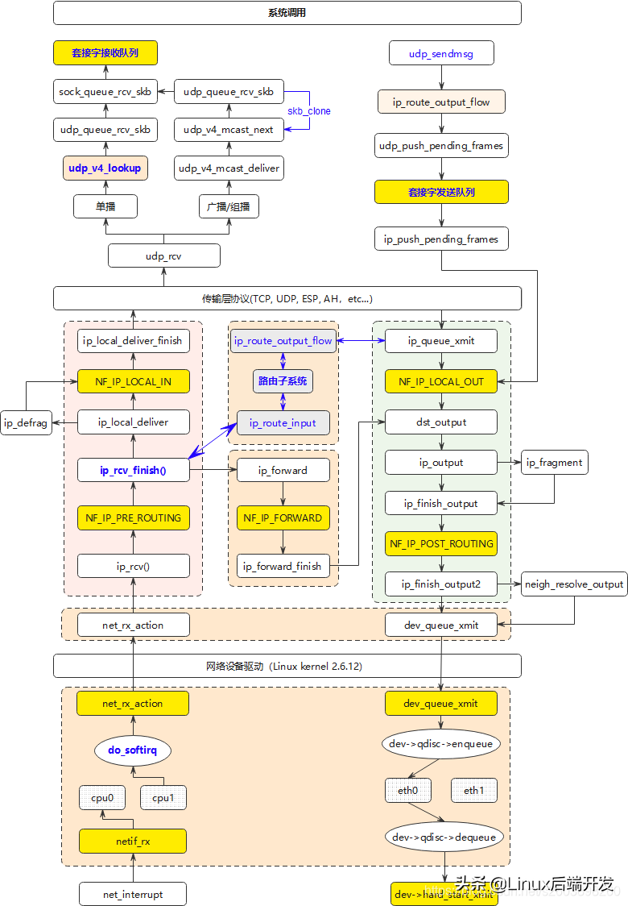
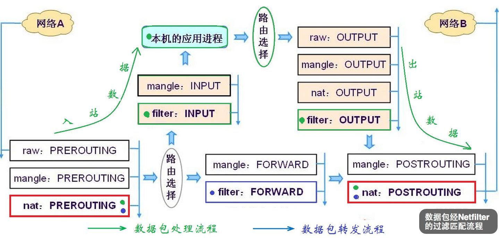

# 一、iptables的规则链

参考 [Linux-iptables 防火墙、四表五链及SNAT与DNAT的原理与应用](https://www.cnblogs.com/yhtweirdo/p/15092477.html)

## 1. 规则链图



## 2. 每个表对应的链

- 表匹配顺序: `raw -> mangle -> nat -> filter`

|        | 说明                       | PREROUTING | INPUT | FORWARD | OUTPUT | POSTROUTING |
| ------ | -------------------------- | ---------- | ----- | ------- | ------ | ----------- |
| raw    | 确定是否跟踪数据包状态     | 1          |       |         | 1      |             |
| mangle | 修改数据包内容，如设置标记 | 1          | 1     | 1       | 1      | 1           |
| nat    | 网络地址转换               | 1          | 1     |         | 1      | 1           |
| filter | 数据包是否放行             |            | 1     | 1       | 1      |             |

## 3. 规则匹配顺序



- 路由选择确实是在OUTPUT链前面，但是如果OUTPUT链里面做了nat或设置了mark，在netfilter里面会重新走一遍路由

## 4. 常用控制类型

- `ACCEPT`: 允许数据包通过
- `DROP`: 直接丢弃数据包，不给出任何回应信息
- `REJECT`: 拒绝数据包通过，会给数据发送端一个响应信息
- `SNAT`: 修改数据包的源地址
- `DNAT`: 修改数据包的目的地址
- `MASQUERADE`: 伪装成一个非固定公网IP地址
- `LOG`: 在`/var/log/messages`文件中记录日志信息，然后将数据包传递给下一条规则。LOG只是一种辅助动作，并没有真正处理数据包
  - 当前测试只能在filter表上才能加LOG，其他表加LOG没生效

## 5. 常用的管理选项

- `-t`: 指定表，也就是raw、mangle、nat、filter，不指定默认是filter
- `-A`: 在指定链的末尾追加(--append) 一条新的规则
- `-I`: 在指定链的开头插入(--insert)一条新的规则，未指定序号时默认作为第一条规则
- `-R`: 修改、替换(--replace) 指定链中的某一条规则，可指定规则序号或具体内容
- `-P`: 设置指定链的默认策略(--policy)
- `-D`: 删除(--delete)指定链中的某一条规则，可指定规则序号或具体内容
- `-F`: 清空(--flush)指定链中的所有规则，若未指定链名，则清空表中的所有链
- `-L`：列出(--list) 指定链中所有的规则，若未指定链名，则列出表中的所有链
- `-n`: 使用数字形式(--numeric)显示输出结果，如显示IP地址而不是主机名
- `-v`: 显示详细信息，包括每条规则的匹配包数量和匹配字节数
- `--line-numbers`: 查看规则时，显示规则的序号

# 二、mark

- linux内核中网络相关的mark有三个，socket中的mark、netfilter的mark、`sk_buff`的mark
- 分别在下面三个位置

```cpp
// include/net/sock.h
/**
  *	struct sock - network layer representation of sockets
  ...
  *	@sk_mark: generic packet mark
  ...
  */
struct sock {
  ...
	__u32			sk_mark;
	...
};

// include/net/netfilter/nf_conntrack.h
struct nf_conn {
  ...
#if defined(CONFIG_NF_CONNTRACK_MARK)
	u_int32_t mark;
#endif
  ...
};

// include/linux/skbuff.h
/**
 *	struct sk_buff - socket buffer
  ...
 *	@mark: Generic packet mark
  ...
 */
struct sk_buff {
	...
	union {
		__u32		mark;
		__u32		reserved_tailroom;
	};
  ...
};
```

## 1. socket的mark

- socket的mark使用setsockopt来进行设置

```cpp
int mark = 100
setsockopt(fd, SOL_SOCKET, SO_MARK, &mark, sizeof(mark));
```

- 在使用此socket发包时，会自动添加mark到sk_buff的mark中，代码在下面

```cpp
// net/ipv4/ip_output.c
/*
 *		Add an ip header to a skbuff and send it out.
 *
 */
int ip_build_and_send_pkt(struct sk_buff *skb, const struct sock *sk,
			  __be32 saddr, __be32 daddr, struct ip_options_rcu *opt,
			  u8 tos)
{
  ...
	if (!skb->mark)
		skb->mark = sk->sk_mark;

	/* Send it out. */
	return ip_local_out(net, skb->sk, skb);
}
EXPORT_SYMBOL_GPL(ip_build_and_send_pkt);
```

## 2. sk_buff的mark

- 使用iptables规则可以将数据包的mark保存到连接跟踪中，然后在回包时将连接跟踪的mark恢复到数据包上
- 策略路由只能匹配sk_buff的mark
- 下面使用iptables实现一个转发的需求，虚拟网卡来的发给物理网卡，物理网卡来的转回虚拟网卡

```shell
# 从虚拟网卡来的包，要转发给物理网卡，在走路由前给连接跟踪添加mark
# --set-mark 设置mark到连接跟踪上
iptables -t mangle -A PREROUTING -j CONNMARK -i tun0 --set-mark 1000 -m comment --comment "from tun"
# 物理网卡回包时，连接跟踪有mark，写到sk_buff中
# -m connmark --mark 1000   connmark上的mark为1000的包
# --restore-mark            连接跟踪的mark写到sk_buff上
iptables -t mangle -A PREROUTING -j CONNMARK -m connmark --mark 1000 ! -i tun+ --restore-mark -m comment --comment "need to tun"
# 策略路由添加mark为1000的给到1000路由表，fwmark匹配的是sk_buff的mark
ip rule add fwmark 1000 table 1000
# 1000的路由表直接把所有流量路由到tun0上去
ip route add default dev tun0 table 1000
```
