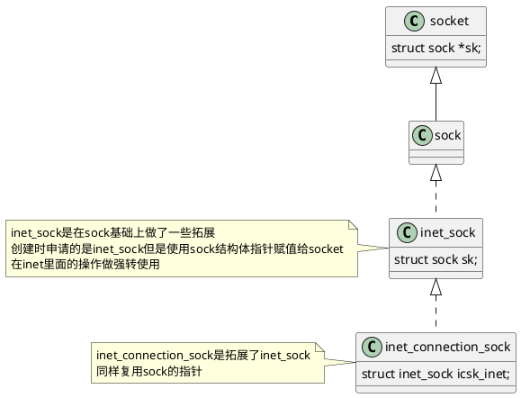

# 一、总述

## 1. 关键结构体关系



# 二、socket创建过程 `inet6_create`

- 初始化注册`inet6_family_ops`

```cpp
// net/ipv6/af_inet6.c

static const struct net_proto_family inet6_family_ops = {
	.family = PF_INET6,
	.create = inet6_create,
	.owner	= THIS_MODULE,
};

static int __init inet6_init(void)
{
    ...
	/* Register the family here so that the init calls below will
	 * be able to create sockets. (?? is this dangerous ??)
	 */
	err = sock_register(&inet6_family_ops);
	if (err)
		goto out_sock_register_fail;
    ...
}
module_init(inet6_init);
```

- 创建调用`pf->create`也就是`inet6_create`

```cpp
// net/ipv6/af_inet6.c
static int inet6_create(struct net *net, struct socket *sock, int protocol,
			int kern)
{
	struct inet_sock *inet;
	struct ipv6_pinfo *np;
	struct sock *sk;
	struct inet_protosw *answer;
	struct proto *answer_prot;
	unsigned char answer_flags;
	int try_loading_module = 0;
	int err;

	if (protocol < 0 || protocol >= IPPROTO_MAX)
		return -EINVAL;

	/* Look for the requested type/protocol pair. */
lookup_protocol:
	err = -ESOCKTNOSUPPORT;
	rcu_read_lock();
    // 从inetsw6中找到对应协议的结构体，赋值给answer变量
	list_for_each_entry_rcu(answer, &inetsw6[sock->type], list) {

		err = 0;
		/* Check the non-wild match. */
		if (protocol == answer->protocol) {
			if (protocol != IPPROTO_IP)
				break;
		} else {
			/* Check for the two wild cases. */
			if (IPPROTO_IP == protocol) {
				protocol = answer->protocol;
				break;
			}
			if (IPPROTO_IP == answer->protocol)
				break;
		}
		err = -EPROTONOSUPPORT;
	}

	if (err) {
		if (try_loading_module < 2) {
			rcu_read_unlock();
			/*
			 * Be more specific, e.g. net-pf-10-proto-132-type-1
			 * (net-pf-PF_INET6-proto-IPPROTO_SCTP-type-SOCK_STREAM)
			 */
			if (++try_loading_module == 1)
				request_module("net-pf-%d-proto-%d-type-%d",
						PF_INET6, protocol, sock->type);
			/*
			 * Fall back to generic, e.g. net-pf-10-proto-132
			 * (net-pf-PF_INET6-proto-IPPROTO_SCTP)
			 */
			else
				request_module("net-pf-%d-proto-%d",
						PF_INET6, protocol);
			goto lookup_protocol;
		} else
			goto out_rcu_unlock;
	}

	err = -EPERM;
	if (sock->type == SOCK_RAW && !kern &&
	    !ns_capable(net->user_ns, CAP_NET_RAW))
		goto out_rcu_unlock;

    // 将对应协议的操作放到sock里面
	sock->ops = answer->ops;
	answer_prot = answer->prot;
	answer_flags = answer->flags;
	rcu_read_unlock();

	WARN_ON(!answer_prot->slab);

	err = -ENOBUFS;
    // 给struct sock *sk申请内存
    // 同时把sk->sk_prot = answer_prot也就是对应的inetsw6[proto]->prot
	sk = sk_alloc(net, PF_INET6, GFP_KERNEL, answer_prot, kern);
	if (!sk)
		goto out;

	sock_init_data(sock, sk);

	err = 0;
	if (INET_PROTOSW_REUSE & answer_flags)
		sk->sk_reuse = SK_CAN_REUSE;

	inet = inet_sk(sk);
	inet->is_icsk = (INET_PROTOSW_ICSK & answer_flags) != 0;

	if (SOCK_RAW == sock->type) {
		inet->inet_num = protocol;
		if (IPPROTO_RAW == protocol)
			inet->hdrincl = 1;
	}

	sk->sk_destruct		= inet_sock_destruct;   // sk设置析构函数
	sk->sk_family		= PF_INET6;
	sk->sk_protocol		= protocol;

	sk->sk_backlog_rcv	= answer->prot->backlog_rcv;

	inet_sk(sk)->pinet6 = np = inet6_sk_generic(sk);
	np->hop_limit	= -1;
	np->mcast_hops	= IPV6_DEFAULT_MCASTHOPS;
	np->mc_loop	= 1;
	np->mc_all	= 1;
	np->pmtudisc	= IPV6_PMTUDISC_WANT;
	np->repflow	= net->ipv6.sysctl.flowlabel_reflect & FLOWLABEL_REFLECT_ESTABLISHED;
	sk->sk_ipv6only	= net->ipv6.sysctl.bindv6only;

	/* Init the ipv4 part of the socket since we can have sockets
	 * using v6 API for ipv4.
	 */
	inet->uc_ttl	= -1;

	inet->mc_loop	= 1;
	inet->mc_ttl	= 1;
	inet->mc_index	= 0;
	RCU_INIT_POINTER(inet->mc_list, NULL);
	inet->rcv_tos	= 0;

	if (READ_ONCE(net->ipv4.sysctl_ip_no_pmtu_disc))
		inet->pmtudisc = IP_PMTUDISC_DONT;
	else
		inet->pmtudisc = IP_PMTUDISC_WANT;
	/*
	 * Increment only the relevant sk_prot->socks debug field, this changes
	 * the previous behaviour of incrementing both the equivalent to
	 * answer->prot->socks (inet6_sock_nr) and inet_sock_nr.
	 *
	 * This allows better debug granularity as we'll know exactly how many
	 * UDPv6, TCPv6, etc socks were allocated, not the sum of all IPv6
	 * transport protocol socks. -acme
	 */
	sk_refcnt_debug_inc(sk);

	if (inet->inet_num) {
		/* It assumes that any protocol which allows
		 * the user to assign a number at socket
		 * creation time automatically shares.
		 */
		inet->inet_sport = htons(inet->inet_num);
		err = sk->sk_prot->hash(sk);
		if (err) {
			sk_common_release(sk);
			goto out;
		}
	}
    // 找对应传输层协议调用init
	if (sk->sk_prot->init) {
		err = sk->sk_prot->init(sk);
		if (err) {
			sk_common_release(sk);
			goto out;
		}
	}

	if (!kern) {
		err = BPF_CGROUP_RUN_PROG_INET_SOCK(sk);
		if (err) {
			sk_common_release(sk);
			goto out;
		}
	}
out:
	return err;
out_rcu_unlock:
	rcu_read_unlock();
	goto out;
}
```

- inetsw6的定义

```cpp
// net/ipv6/af_inet6.c
/* The inetsw6 table contains everything that inet6_create needs to
 * build a new socket.
 */
static struct list_head inetsw6[SOCK_MAX];
static DEFINE_SPINLOCK(inetsw6_lock);
// 使用下面函数注册inetsw6
int inet6_register_protosw(struct inet_protosw *p)
{
	struct list_head *lh;
	struct inet_protosw *answer;
	struct list_head *last_perm;
	int protocol = p->protocol;
	int ret;

	spin_lock_bh(&inetsw6_lock);

	ret = -EINVAL;
	if (p->type >= SOCK_MAX)
		goto out_illegal;

	/* If we are trying to override a permanent protocol, bail. */
	answer = NULL;
	ret = -EPERM;
	last_perm = &inetsw6[p->type];
	list_for_each(lh, &inetsw6[p->type]) {
		answer = list_entry(lh, struct inet_protosw, list);

		/* Check only the non-wild match. */
		if (INET_PROTOSW_PERMANENT & answer->flags) {
			if (protocol == answer->protocol)
				break;
			last_perm = lh;
		}

		answer = NULL;
	}
	if (answer)
		goto out_permanent;

	/* Add the new entry after the last permanent entry if any, so that
	 * the new entry does not override a permanent entry when matched with
	 * a wild-card protocol. But it is allowed to override any existing
	 * non-permanent entry.  This means that when we remove this entry, the
	 * system automatically returns to the old behavior.
	 */
	list_add_rcu(&p->list, last_perm);
	ret = 0;
out:
	spin_unlock_bh(&inetsw6_lock);
	return ret;

out_permanent:
	pr_err("Attempt to override permanent protocol %d\n", protocol);
	goto out;

out_illegal:
	pr_err("Ignoring attempt to register invalid socket type %d\n",
	       p->type);
	goto out;
}
EXPORT_SYMBOL(inet6_register_protosw);
```

- 注册地方

```cpp
// net/ipv6/tcp_ipv6.c
int __init tcpv6_init(void)
{
    ...
	/* register inet6 protocol */
	ret = inet6_register_protosw(&tcpv6_protosw);
	if (ret)
		goto out_tcpv6_protocol;
    ...
}

// net/ipv6/udp.c
int __init udpv6_init(void)
{
    ...
	ret = inet6_register_protosw(&udpv6_protosw);
	if (ret)
		goto out_udpv6_protocol;
    ...
}
```
