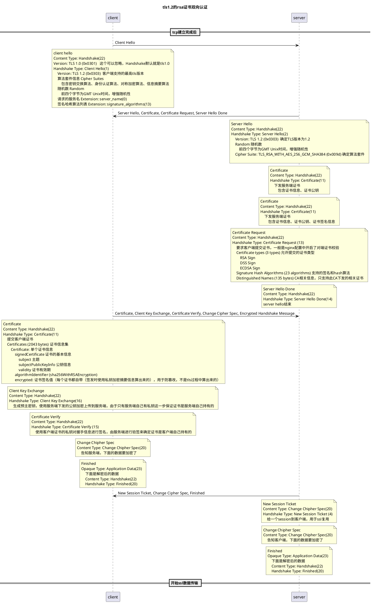

# 一、首先先看rsa的证书认证过程

## 1. tls1.2的rsa证书双向认证 `Cipher Suite: TLS_RSA_WITH_AES_256_GCM_SHA384 (0x009d)`

```shell
# 服务端命令
openssl s_server -accept 7777 -state -debug -key domain.key -cert domain.crt -CAfile cacert.pem -Verify 1
# 客户端命令
openssl s_client -connect 127.0.0.1:7777 -cipher RSA -tls1_2 -debug -keylogfile test.log -cert domain.crt -key domain.key
```




从上面的过程中，我们知道有几个关键点

1. 证书主体内容作为`Certificate`发出去
2. `Client Verify`需要使用证书的私钥对握手信息进行签名

# 二、如何开发一个引擎

## 1. 证书双向认证引擎

- 从上面的流程可以得出，证书认证中需要使用客户端证书的部分只有`Certificate`和`Certificate Verify`两个请求
- 一般使用ukey进行双向认证的话，私钥是无法导出的，所以需要实现一下证书导出和私钥签名函数

### 1.1. 引擎基础设置

```cpp
/******************** 这个函数是引擎设置的最基础的函数 ********************/
/* Constants used when creating the ENGINE */
static const char* engine_id = "skf";
static const char* engine_name = "skf hardware engine support";
static RSA_METHOD* skf_rsa_method = nullptr;
/* Prepare the ENGINE structure for registration */
static int skf_bind_helper(ENGINE* e) {
    LOG_DEBUG("skf_bind_helper");

    // set skf rsa engine method, use default method and diy some function
    if ((skf_rsa_method = RSA_meth_dup(RSA_get_default_method())) == NULL ||
        // 私钥加密函数
        RSA_meth_set_priv_enc(skf_rsa_method, skf_rsa_priv_enc) == 0) {
        return 0;
    }

    if (!ENGINE_set_id(e, engine_id) ||                     // 引擎id
        !ENGINE_set_name(e, engine_name) ||                 // 引擎名字
        !ENGINE_set_init_function(e, engine_init) ||        // 初始化函数，握手前调用
        !ENGINE_set_finish_function(e, engine_finish) ||    // 结束函数，连接完成不再需要引擎时调用
        !ENGINE_set_destroy_function(e, engine_destroy) ||  // 销毁函数，结束时调用，只会被调用一次
        !ENGINE_set_RSA(e, skf_rsa_method) ||               // 设置rsa算法结构体
        // if not set, sdf will load by default if possible
        !ENGINE_set_flags(e, ENGINE_FLAGS_NO_REGISTER_ALL) ||
        !ENGINE_set_load_ssl_client_cert_function(e, skf_load_ssl_client_cert)  // 设置客户端证书加载函数
    ) {
        return 0;
    }

    return 1;
}

/* This stuff is needed if this ENGINE is being compiled into a self-contained
 * shared-library. */
#include <openssl/engine.h>
#ifndef OPENSSL_NO_DYNAMIC_ENGINE

extern "C" {
static int bind_helper(ENGINE* e, const char* id) {
    if (id && (strcmp(id, engine_id) != 0)) return 0;

    if (!skf_bind_helper(e)) return 0;

    return 1;
}

IMPLEMENT_DYNAMIC_CHECK_FN()
IMPLEMENT_DYNAMIC_BIND_FN(bind_helper)
}
#else
static ENGINE* engine_skf(void) {
    ENGINE* eng = ENGINE_new();
    if (!eng) return NULL;
    if (!skf_bind_helper(eng)) {
        ENGINE_free(eng);
        return NULL;
    }

    return eng;
}

void engine_load_skf_int(void) {
    ENGINE* toadd = engine_skf();
    if (!toadd) return;
    ENGINE_add(toadd);
    ENGINE_free(toadd);
    ERR_clear_error();
}
#endif /* OPENSSL_NO_DYNAMIC_ENGINE */
```

### 1.2. 导出证书的函数

- 注册证书的加载函数到openssl

```cpp
static int skf_bind_helper(ENGINE* e) {
    ...
    if (...
        !ENGINE_set_load_ssl_client_cert_function(e, skf_load_ssl_client_cert)  // 设置客户端证书加载函数
    ) {
        return 0;
    }

    return 1;
}
```

- 函数原型为

```cpp
static int skf_load_ssl_client_cert(ENGINE* e, SSL* ssl, STACK_OF(X509_NAME) * ca_dn, X509** pcert, EVP_PKEY** ppkey,
                                    STACK_OF(X509) * *pother, UI_METHOD* ui_method, void* callback_data);
```

- 一个简单的软件实现代码如下，从文件中读取证书给到引擎
- 使用ukey的话，这里就只能到处证书和公钥，私钥无法导出

```cpp
/**
 * @brief 导出客户端证书函数
 *
 * @param[in] e 引擎指针
 * @param[in] ssl ssl结构体
 * @param[in] ca_dn ca相关信息，一般是服务端下发的用于匹配证书
 * @param[out] pcert 证书指针，内部申请空间，外部会进行释放
 * @param[out] ppkey 算法key结构体，里面其实是只需要公钥的
 * @param[out] pother
 * @param[in] ui_method
 * @param[in] callback_data
 * @return int 1成功，0失败
 */
static int skf_load_ssl_client_cert(ENGINE* e, SSL* ssl, STACK_OF(X509_NAME) * ca_dn, X509** pcert, EVP_PKEY** ppkey,
                                    STACK_OF(X509) * *pother, UI_METHOD* ui_method, void* callback_data) {
    const char* operation = "skf_load_ssl_client_cert";
    LOG_DEBUG("%s", operation);
    int iResult = 0;
    // 读取PEM格式证书文件
    FILE* fp = fopen("/path/to/domain.crt", "r");
    *pcert = PEM_read_X509(fp, NULL, NULL, NULL);
    fclose(fp);
    if (*pcert == NULL) {
        LOG_ERROR("[%s], PEM_read_X509 failed", operation);
        return 0;
    }
    // 直接从证书读取公钥放这里最省事，外面会进行校验公钥和证书是否匹配
    // ukey只能导出公钥，如果是其他可以导出私钥的，这里也可以将私钥放进去，这样可以直接软件实现私钥加密函数
    // 这里要增加引用计数，对外部来说，ppkey和pcert是分开释放的
    *ppkey = X509_get_pubkey(*pcert);
    LOG_INFO("%s success", operation);
    return 1;
}
```

## 3. 私钥签名

- ukey中的私钥不可以导出，所以要注册私钥签名函数到openssl中

```cpp
/* Prepare the ENGINE structure for registration */
static int skf_bind_helper(ENGINE* e) {
    LOG_DEBUG(Tag, "skf_bind_helper");

    // set skf rsa engine method, use default method and diy some function
    if ((skf_rsa_method = RSA_meth_dup(RSA_get_default_method())) == NULL ||
        // 提供私钥加密函数
        RSA_meth_set_priv_enc(skf_rsa_method, skf_rsa_priv_enc) == 0) {
        return 0;
    }
    ...
    return 1;
}
```

- 这里实现一个从文件读出私钥然后调用默认的openssl的rsa私钥签名函数

```cpp
int skf_rsa_priv_enc(int flen, const unsigned char* from, unsigned char* to, RSA* rsa, int padding) {
    LOG_DEBUG("skf_rsa_priv_enc from len %d, padding %d", flen, padding);

    // 读取PEM格式私钥文件
    FILE* fp = fopen("/home/wangyubo/work/src/local/openssl/20230418/ssl_diy/domain.key", "r");
    auto evkey = PEM_read_PrivateKey(fp, NULL, NULL, NULL);
    fclose(fp);
    if (evkey == NULL) {
        LOG_ERROR("d2i_PrivateKey_fp failed");
        return 0;
    }

    auto newRsa = EVP_PKEY_get0_RSA(evkey);
    int ret = RSA_meth_get_priv_enc(RSA_get_default_method())(flen, from, to, newRsa, padding);

    LOG_DEBUG("rsaDoSign ret %d", ret);
    return ret;
}
```


# 三、握手过程的调用栈

## 1. `Certificate`中证书信息的获取

### 1.1. 在收到服务端下发的`Certificate Request`的时候，就先加载证书到ssl的上下文中

```cpp
WORK_STATE tls_prepare_client_certificate(SSL *s, WORK_STATE wst)
{
    X509 *x509 = NULL;
    EVP_PKEY *pkey = NULL;
    int i;

    if (wst == WORK_MORE_A) {
        // 这里一般是证书已经通过命令行设置好了才进来的
        /* Let cert callback update client certificates if required */
        if (s->cert->cert_cb) {
            i = s->cert->cert_cb(s, s->cert->cert_cb_arg);
            if (i < 0) {
                s->rwstate = SSL_X509_LOOKUP;
                return WORK_MORE_A;
            }
            if (i == 0) {
                SSLfatal(s, SSL_AD_INTERNAL_ERROR, SSL_R_CALLBACK_FAILED);
                return WORK_ERROR;
            }
            s->rwstate = SSL_NOTHING;
        }
        if (ssl3_check_client_certificate(s)) {
            if (s->post_handshake_auth == SSL_PHA_REQUESTED) {
                return WORK_FINISHED_STOP;
            }
            return WORK_FINISHED_CONTINUE;
        }

        /* Fall through to WORK_MORE_B */
        wst = WORK_MORE_B;
    }

    /* We need to get a client cert */
    if (wst == WORK_MORE_B) {
        // 通过引擎设置证书会走到这个逻辑
        /*
         * If we get an error, we need to ssl->rwstate=SSL_X509_LOOKUP;
         * return(-1); We then get retied later
         */
        // 这里调用到引擎的处理函数中
        i = ssl_do_client_cert_cb(s, &x509, &pkey);
        if (i < 0) {
            s->rwstate = SSL_X509_LOOKUP;
            return WORK_MORE_B;
        }
        s->rwstate = SSL_NOTHING;
        if ((i == 1) && (pkey != NULL) && (x509 != NULL)) {
            // 证书设置到ssl结构体
            // 验证pkey和x509是否匹配，pkey中只需要公钥匹配即可
            if (!SSL_use_certificate(s, x509) || !SSL_use_PrivateKey(s, pkey))
                i = 0;
        } else if (i == 1) {
            i = 0;
            ERR_raise(ERR_LIB_SSL, SSL_R_BAD_DATA_RETURNED_BY_CALLBACK);
        }

        X509_free(x509);
        EVP_PKEY_free(pkey);
        if (i && !ssl3_check_client_certificate(s))
            i = 0;
        if (i == 0) {
            if (s->version == SSL3_VERSION) {
                s->s3.tmp.cert_req = 0;
                ssl3_send_alert(s, SSL3_AL_WARNING, SSL_AD_NO_CERTIFICATE);
                return WORK_FINISHED_CONTINUE;
            } else {
                s->s3.tmp.cert_req = 2;
                if (!ssl3_digest_cached_records(s, 0)) {
                    /* SSLfatal() already called */
                    return WORK_ERROR;
                }
            }
        }

        if (s->post_handshake_auth == SSL_PHA_REQUESTED)
            return WORK_FINISHED_STOP;
        return WORK_FINISHED_CONTINUE;
    }

    /* Shouldn't ever get here */
    SSLfatal(s, SSL_AD_INTERNAL_ERROR, ERR_R_INTERNAL_ERROR);
    return WORK_ERROR;
}
```

- 从引擎获取证书

```cpp
/*
libssl.so.3!tls_engine_load_ssl_client_cert(SSL *s, X509 **px509, EVP_PKEY **ppkey) (ssl/tls_depr.c:69)
libssl.so.3!ssl_do_client_cert_cb(SSL *s, X509 **px509, EVP_PKEY **ppkey) (ssl/statem/statem_clnt.c:3663)
libssl.so.3!tls_prepare_client_certificate(SSL * s, WORK_STATE wst) (ssl/statem/statem_clnt.c:3460)
libssl.so.3!ossl_statem_client_post_process_message(SSL * s, WORK_STATE wst) (ssl/statem/statem_clnt.c:1089)
libssl.so.3!read_state_machine(SSL * s) (ssl/statem/statem.c:675)
libssl.so.3!state_machine(SSL * s, int server) (ssl/statem/statem.c:442)
libssl.so.3!ossl_statem_connect(SSL * s) (ssl/statem/statem.c:265)
libssl.so.3!ssl3_write_bytes(SSL * s, int type, const void * buf_, size_t len, size_t * written) (ssl/record/rec_layer_s3.c:398)
libssl.so.3!ssl3_write(SSL * s, const void * buf, size_t len, size_t * written) (ssl/s3_lib.c:4449)
libssl.so.3!ssl_write_internal(SSL * s, const void * buf, size_t num, size_t * written) (ssl/ssl_lib.c:2062)
libssl.so.3!SSL_write(SSL * s, const void * buf, int num) (ssl/ssl_lib.c:2140)
s_client_main(int argc, char ** argv) (apps/s_client.c:2841)
do_cmd(struct lhash_st_FUNCTION * prog, int argc, char ** argv) (apps/openssl.c:418)
main(int argc, char ** argv) (apps/openssl.c:298)
 */
#ifndef OPENSSL_NO_ENGINE
int tls_engine_load_ssl_client_cert(SSL *s, X509 **px509, EVP_PKEY **ppkey)
{
    return ENGINE_load_ssl_client_cert(s->ctx->client_cert_engine, s,
                                       SSL_get_client_CA_list(s),
                                       px509, ppkey, NULL, NULL, NULL);
}
#endif
```

- pkey中为什么只需要公钥即可，看下面的调用栈，从`SSL_use_PrivateKey`进来
- 检查`ppkey`就是使用证书的公钥去匹配

```cpp
/*
libcrypto.so.3!X509_check_private_key(const X509 * x, const EVP_PKEY * k) (crypto/x509/x509_cmp.c:403)
libssl.so.3!ssl_set_pkey(CERT * c, EVP_PKEY * pkey) (ssl/ssl_rsa.c:128)
libssl.so.3!SSL_use_PrivateKey(SSL * ssl, EVP_PKEY * pkey) (ssl/ssl_rsa.c:146)
libssl.so.3!tls_prepare_client_certificate(SSL * s, WORK_STATE wst) (ssl/statem/statem_clnt.c:3467)
libssl.so.3!ossl_statem_client_post_process_message(SSL * s, WORK_STATE wst) (ssl/statem/statem_clnt.c:1089)
libssl.so.3!read_state_machine(SSL * s) (ssl/statem/statem.c:675)
libssl.so.3!state_machine(SSL * s, int server) (ssl/statem/statem.c:442)
libssl.so.3!ossl_statem_connect(SSL * s) (ssl/statem/statem.c:265)
libssl.so.3!ssl3_write_bytes(SSL * s, int type, const void * buf_, size_t len, size_t * written) (ssl/record/rec_layer_s3.c:398)
libssl.so.3!ssl3_write(SSL * s, const void * buf, size_t len, size_t * written) (ssl/s3_lib.c:4449)
libssl.so.3!ssl_write_internal(SSL * s, const void * buf, size_t num, size_t * written) (ssl/ssl_lib.c:2062)
libssl.so.3!SSL_write(SSL * s, const void * buf, int num) (ssl/ssl_lib.c:2140)
s_client_main(int argc, char ** argv) (apps/s_client.c:2841)
do_cmd(struct lhash_st_FUNCTION * prog, int argc, char ** argv) (apps/openssl.c:418)
main(int argc, char ** argv) (apps/openssl.c:298)
 */
int X509_check_private_key(const X509 *x, const EVP_PKEY *k)
{
    const EVP_PKEY *xk;
    int ret;

    xk = X509_get0_pubkey(x);
    if (xk == NULL) {
        ERR_raise(ERR_LIB_X509, X509_R_UNABLE_TO_GET_CERTS_PUBLIC_KEY);
        return 0;
    }

    switch (ret = EVP_PKEY_eq(xk, k)) {
    case 0:
        ERR_raise(ERR_LIB_X509, X509_R_KEY_VALUES_MISMATCH);
        break;
    case -1:
        ERR_raise(ERR_LIB_X509, X509_R_KEY_TYPE_MISMATCH);
        break;
    case -2:
        ERR_raise(ERR_LIB_X509, X509_R_UNKNOWN_KEY_TYPE);
        break;
    }

    return ret > 0;
}
```

### 1.2. 构造`Certificate`请求时，把证书信息放到包里面

```cpp
/*
libssl.so.3!tls_construct_client_certificate(SSL * s, WPACKET * pkt) (ssl/statem/statem_clnt.c:3504)
libssl.so.3!write_state_machine(SSL * s) (ssl/statem/statem.c:855)
libssl.so.3!state_machine(SSL * s, int server) (ssl/statem/statem.c:451)
libssl.so.3!ossl_statem_connect(SSL * s) (ssl/statem/statem.c:265)
libssl.so.3!ssl3_write_bytes(SSL * s, int type, const void * buf_, size_t len, size_t * written) (ssl/record/rec_layer_s3.c:398)
libssl.so.3!ssl3_write(SSL * s, const void * buf, size_t len, size_t * written) (ssl/s3_lib.c:4449)
libssl.so.3!ssl_write_internal(SSL * s, const void * buf, size_t num, size_t * written) (ssl/ssl_lib.c:2062)
libssl.so.3!SSL_write(SSL * s, const void * buf, int num) (ssl/ssl_lib.c:2140)
s_client_main(int argc, char ** argv) (apps/s_client.c:2841)
do_cmd(struct lhash_st_FUNCTION * prog, int argc, char ** argv) (apps/openssl.c:418)
main(int argc, char ** argv) (apps/openssl.c:298)
 */
int tls_construct_client_certificate(SSL *s, WPACKET *pkt)
{
    if (SSL_IS_TLS13(s)) {
        if (s->pha_context == NULL) {
            /* no context available, add 0-length context */
            if (!WPACKET_put_bytes_u8(pkt, 0)) {
                SSLfatal(s, SSL_AD_INTERNAL_ERROR, ERR_R_INTERNAL_ERROR);
                return 0;
            }
        } else if (!WPACKET_sub_memcpy_u8(pkt, s->pha_context, s->pha_context_len)) {
            SSLfatal(s, SSL_AD_INTERNAL_ERROR, ERR_R_INTERNAL_ERROR);
            return 0;
        }
    }
    if (!ssl3_output_cert_chain(s, pkt,
                                (s->s3.tmp.cert_req == 2) ? NULL
                                                           : s->cert->key)) {
        /* SSLfatal() already called */
        return 0;
    }

    if (SSL_IS_TLS13(s)
            && SSL_IS_FIRST_HANDSHAKE(s)
            && (!s->method->ssl3_enc->change_cipher_state(s,
                    SSL3_CC_HANDSHAKE | SSL3_CHANGE_CIPHER_CLIENT_WRITE))) {
        /*
         * This is a fatal error, which leaves enc_write_ctx in an inconsistent
         * state and thus ssl3_send_alert may crash.
         */
        SSLfatal(s, SSL_AD_NO_ALERT, SSL_R_CANNOT_CHANGE_CIPHER);
        return 0;
    }

    return 1;
}
```

## 2. `certificate verify`中的签名信息的生成

- 签名信息是将一段信息使用rsa私钥签名后的结果，先算hash后签名
- 这里的`rsa_sign`进来的数据已经做了hash，只需要进行签名即可

```cpp
/*
libcrypto.so.3!rsa_sign(void * vprsactx, unsigned char * sig, size_t * siglen, size_t sigsize, const unsigned char * tbs, size_t tbslen) (providers/implementations/signature/rsa_sig.c:647)
libcrypto.so.3!rsa_digest_sign_final(void * vprsactx, unsigned char * sig, size_t * siglen, size_t sigsize) (providers/implementations/signature/rsa_sig.c:942)
libcrypto.so.3!EVP_DigestSignFinal(EVP_MD_CTX * ctx, unsigned char * sigret, size_t * siglen) (crypto/evp/m_sigver.c:481)
libcrypto.so.3!EVP_DigestSign(EVP_MD_CTX * ctx, unsigned char * sigret, size_t * siglen, const unsigned char * tbs, size_t tbslen) (crypto/evp/m_sigver.c:582)
libssl.so.3!tls_construct_cert_verify(SSL * s, WPACKET * pkt) (ssl/statem/statem_lib.c:354)
libssl.so.3!write_state_machine(SSL * s) (ssl/statem/statem.c:855)
libssl.so.3!state_machine(SSL * s, int server) (ssl/statem/statem.c:451)
libssl.so.3!ossl_statem_connect(SSL * s) (ssl/statem/statem.c:265)
libssl.so.3!ssl3_write_bytes(SSL * s, int type, const void * buf_, size_t len, size_t * written) (ssl/record/rec_layer_s3.c:398)
libssl.so.3!ssl3_write(SSL * s, const void * buf, size_t len, size_t * written) (ssl/s3_lib.c:4449)
libssl.so.3!ssl_write_internal(SSL * s, const void * buf, size_t num, size_t * written) (ssl/ssl_lib.c:2062)
libssl.so.3!SSL_write(SSL * s, const void * buf, int num) (ssl/ssl_lib.c:2140)
s_client_main(int argc, char ** argv) (apps/s_client.c:2841)
do_cmd(struct lhash_st_FUNCTION * prog, int argc, char ** argv) (apps/openssl.c:418)
main(int argc, char ** argv) (apps/openssl.c:298)
 */
static int rsa_sign(void *vprsactx, unsigned char *sig, size_t *siglen,
                    size_t sigsize, const unsigned char *tbs, size_t tbslen)
{
    PROV_RSA_CTX *prsactx = (PROV_RSA_CTX *)vprsactx;
    int ret;
    size_t rsasize = RSA_size(prsactx->rsa);
    size_t mdsize = rsa_get_md_size(prsactx);

    if (!ossl_prov_is_running())
        return 0;

    if (sig == NULL) {
        *siglen = rsasize;
        return 1;
    }

    if (sigsize < rsasize) {
        ERR_raise_data(ERR_LIB_PROV, PROV_R_INVALID_SIGNATURE_SIZE,
                       "is %zu, should be at least %zu", sigsize, rsasize);
        return 0;
    }

    if (mdsize != 0) {
        if (tbslen != mdsize) {
            ERR_raise(ERR_LIB_PROV, PROV_R_INVALID_DIGEST_LENGTH);
            return 0;
        }

#ifndef FIPS_MODULE
        if (EVP_MD_is_a(prsactx->md, OSSL_DIGEST_NAME_MDC2)) {
            unsigned int sltmp;

            if (prsactx->pad_mode != RSA_PKCS1_PADDING) {
                ERR_raise_data(ERR_LIB_PROV, PROV_R_INVALID_PADDING_MODE,
                               "only PKCS#1 padding supported with MDC2");
                return 0;
            }
            ret = RSA_sign_ASN1_OCTET_STRING(0, tbs, tbslen, sig, &sltmp,
                                             prsactx->rsa);

            if (ret <= 0) {
                ERR_raise(ERR_LIB_PROV, ERR_R_RSA_LIB);
                return 0;
            }
            ret = sltmp;
            goto end;
        }
#endif

        // 根据不同的padding算法进行不同的计算
        switch (prsactx->pad_mode) {
        case RSA_X931_PADDING:
            if ((size_t)RSA_size(prsactx->rsa) < tbslen + 1) {
                ERR_raise_data(ERR_LIB_PROV, PROV_R_KEY_SIZE_TOO_SMALL,
                               "RSA key size = %d, expected minimum = %d",
                               RSA_size(prsactx->rsa), tbslen + 1);
                return 0;
            }
            if (!setup_tbuf(prsactx)) {
                ERR_raise(ERR_LIB_PROV, ERR_R_MALLOC_FAILURE);
                return 0;
            }
            memcpy(prsactx->tbuf, tbs, tbslen);
            prsactx->tbuf[tbslen] = RSA_X931_hash_id(prsactx->mdnid);
            ret = RSA_private_encrypt(tbslen + 1, prsactx->tbuf,
                                      sig, prsactx->rsa, RSA_X931_PADDING);
            clean_tbuf(prsactx);
            break;

        case RSA_PKCS1_PADDING:
            {
                unsigned int sltmp;

                ret = RSA_sign(prsactx->mdnid, tbs, tbslen, sig, &sltmp,
                               prsactx->rsa);
                if (ret <= 0) {
                    ERR_raise(ERR_LIB_PROV, ERR_R_RSA_LIB);
                    return 0;
                }
                ret = sltmp;
            }
            break;

        case RSA_PKCS1_PSS_PADDING:
            /* Check PSS restrictions */
            if (rsa_pss_restricted(prsactx)) {
                switch (prsactx->saltlen) {
                case RSA_PSS_SALTLEN_DIGEST:
                    if (prsactx->min_saltlen > EVP_MD_get_size(prsactx->md)) {
                        ERR_raise_data(ERR_LIB_PROV,
                                       PROV_R_PSS_SALTLEN_TOO_SMALL,
                                       "minimum salt length set to %d, "
                                       "but the digest only gives %d",
                                       prsactx->min_saltlen,
                                       EVP_MD_get_size(prsactx->md));
                        return 0;
                    }
                    /* FALLTHRU */
                default:
                    if (prsactx->saltlen >= 0
                        && prsactx->saltlen < prsactx->min_saltlen) {
                        ERR_raise_data(ERR_LIB_PROV,
                                       PROV_R_PSS_SALTLEN_TOO_SMALL,
                                       "minimum salt length set to %d, but the"
                                       "actual salt length is only set to %d",
                                       prsactx->min_saltlen,
                                       prsactx->saltlen);
                        return 0;
                    }
                    break;
                }
            }
            if (!setup_tbuf(prsactx))
                return 0;
            if (!RSA_padding_add_PKCS1_PSS_mgf1(prsactx->rsa,
                                                prsactx->tbuf, tbs,
                                                prsactx->md, prsactx->mgf1_md,
                                                prsactx->saltlen)) {
                ERR_raise(ERR_LIB_PROV, ERR_R_RSA_LIB);
                return 0;
            }
            // 一般tls1.2的rsa证书双向认证会调用到这个私钥签名函数
            ret = RSA_private_encrypt(RSA_size(prsactx->rsa), prsactx->tbuf,
                                      sig, prsactx->rsa, RSA_NO_PADDING);
            clean_tbuf(prsactx);
            break;

        default:
            ERR_raise_data(ERR_LIB_PROV, PROV_R_INVALID_PADDING_MODE,
                           "Only X.931, PKCS#1 v1.5 or PSS padding allowed");
            return 0;
        }
    } else {
        ret = RSA_private_encrypt(tbslen, tbs, sig, prsactx->rsa,
                                  prsactx->pad_mode);
    }

#ifndef FIPS_MODULE
 end:
#endif
    if (ret <= 0) {
        ERR_raise(ERR_LIB_PROV, ERR_R_RSA_LIB);
        return 0;
    }

    *siglen = ret;
    return 1;
}
```

- 私钥签名函数会调用到引擎里面的`rsa_priv_enc`函数，也就是上面注册的函数

```cpp
int RSA_private_encrypt(int flen, const unsigned char *from,
                        unsigned char *to, RSA *rsa, int padding)
{
    return rsa->meth->rsa_priv_enc(flen, from, to, rsa, padding);
}
```
